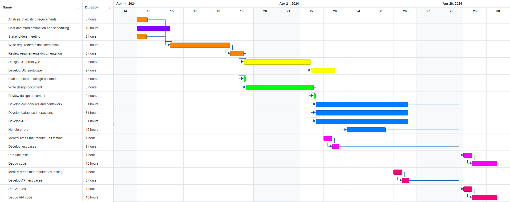

# Project Estimation - CURRENT
Date: 28/04/2024

Version: 1.1

# Estimation approach
Consider the EZElectronics  project in CURRENT version (as given by the teachers), assume that you are going to develop the project INDEPENDENT of the deadlines of the course, and from scratch
# Estimate by size
### 
|             | Estimate                        |             
| ----------- | ------------------------------- |  
| NC =  Estimated number of classes to be developed   |             3                |             
|  A = Estimated average size per class, in LOC       |             360               | 
| S = Estimated size of project, in LOC (= NC * A) | 1080 |
| E = Estimated effort, in person hours (here use productivity 10 LOC per person hour)  |                 108                     |   
| C = Estimated cost, in euro (here use 1 person hour cost = 30 euro) | 3240 | 
| Estimated calendar time, in calendar weeks (Assume team of 4 people, 8 hours per day, 5 days per week ) |         0,675 (~1)          |               

# Estimate by product decomposition
### 
|         component name    | Estimated effort (person hours)   |             
| ----------- | ------------------------------- | 
|requirement document | 32 |
| GUI prototype | 15 |
|design document | 10 |
|code | 108 |
| unit tests | 18 |
| api tests | 18 |
| management documents | 10 |

# Estimate by activity decomposition
### 
|         Activity name    | Estimated effort (person hours)   |             
| ----------- | ------------------------------- | 
| Analysis of existing requirements | 3 |
| Stakeholders meeting | 2 |
| Write requirements documentation | 22 |
| Review requirements documentation | 5 |
| Design GUI prototype | 6 |
| Develop GUI prototype | 9 |
| Plan structure of design document | 2 |
| Write design document | 6 |
| Review design document | 2 |
| Develop components and controllers | 31 |
| Develop database interactions | 31 |
| Handle errors | 15 |
| Develop API | 31 |
| Identify areas that require unit testing | 1 |
| Develop test cases | 6 |
| Run unit tests | 1 |
| Debug code | 10 |
| Identify areas that require API testing | 1 |
| Develop API test cases | 6 |
| Run API tests | 1 |
| Debug API code | 10 |
| Cost and effort estimation and scheduling | 10 |

###

# Summary

|             | Estimated effort                        |   Estimated duration |          
| ----------- | ------------------------------- | ---------------|
| estimate by size | 108 ph | ~1 week |
| estimate by product decomposition | 211 ph | 25 days |
| estimate by activity decomposition | 211 ph | 12 days |

Estimating by size can be really unreliable because LOC depends on several factors (like programming language) and we are considering only the coding part of the project.
Estimating by product decomposition is slightly better because we add non-coding activities too, but we don't use time in an efficient way in this case.
Estimating by activity decomposition allowed us to parallelize tasks using the Gantt chart (assuming 4 people as resources) and save precious time, despite having the same ph amount as the previous approach.

