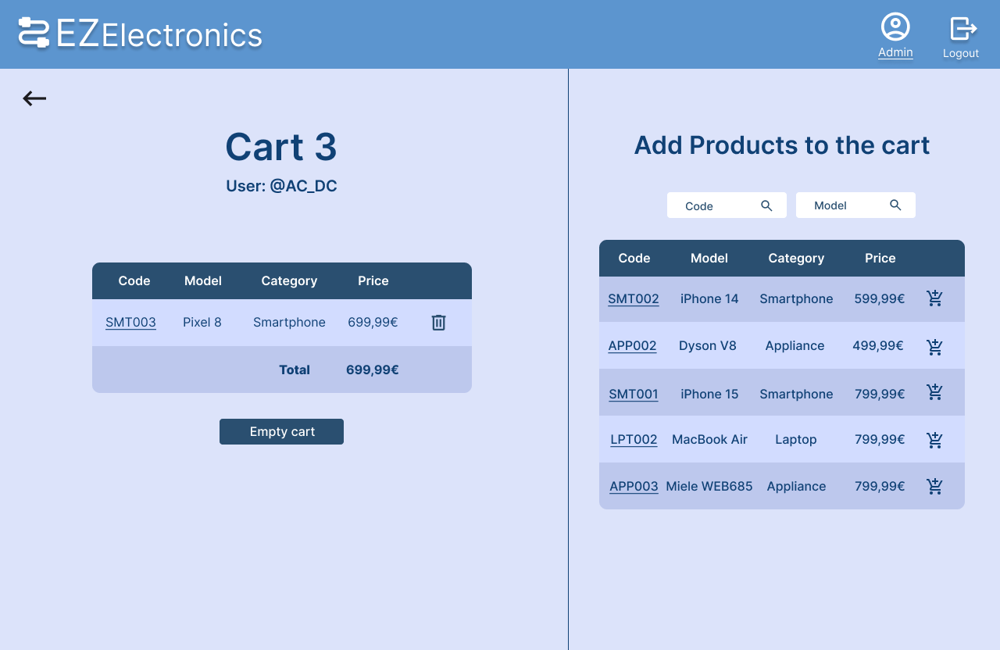

# Graphical User Interface Prototype - FUTURE

Authors: Avantaggiato Vincenzo

Date: 04/05/2024

Version: 1.0

### [Figma GUI (Admin)](https://www.figma.com/proto/zPI5M5jgQZGsoHqS7o1wBt/Untitled?type=design&node-id=0-1&t=yutd5aRjadeAYgUr-0&scaling=scale-down&starting-point-node-id=307%3A2452&show-proto-sidebar=1)
### [Figma GUI (Manager)](https://www.figma.com/proto/zPI5M5jgQZGsoHqS7o1wBt/Untitled?type=design&node-id=0-1&t=yutd5aRjadeAYgUr-0&scaling=scale-down&starting-point-node-id=307%3A3123&show-proto-sidebar=1)
### [Figma GUI (Customer)](https://www.figma.com/proto/zPI5M5jgQZGsoHqS7o1wBt/Untitled?type=design&node-id=0-1&t=yutd5aRjadeAYgUr-0&scaling=scale-down&starting-point-node-id=307%3A2769&show-proto-sidebar=1)
### [Figma GUI (Error examples)](https://www.figma.com/proto/zPI5M5jgQZGsoHqS7o1wBt/Untitled?type=design&node-id=0-1&t=yutd5aRjadeAYgUr-0&scaling=scale-down&starting-point-node-id=331%3A1130&show-proto-sidebar=1)

# Authentication
### Register

### Login

### Logout

# Admin

### Manage users
Admin can see the user list.
Admin can accept or reject pending registration requests
Admin can create a new user, the password is auto-generated and sent by mail 
Admin can delete single/all user/s
Admin can search a user by its username
Admin can filter users by their role

### Manage products
Admin can see the product list
Admin can filter this list, by model, category, sold/unsold, deals (discount!=0)
Admin can search for a product by its code
Admin can delete single/all product/s
Admin can create add new product/s (code is auto-generated, discount is 0)
Admin can edit the discount

Admin can mark products as sold

### Manage carts
Admin can see the cart list
Admin can filter carts by cart owner username, paid/unpaid
Admin can search for a cart by its code

Clicking on cart code, admin can see more details of the cart
Admin can add products to unsold carts
Admin can empty unsold carts

### Manage orders
Admin can see order list
Admin can filter orders by orderer username
Admin can search for a order by its code
Admin can see the associated cart by clicking on the cart code

# Manager 

### Registration
After registration, manager needs to be approved by another manager or by the admin

### Manage products
Manager can see the product list
Manager can filter this list, by model, category, sold/unsold, deals (discount!=0)
Manager can search for a product by its code
Manager can delete single/all product/s
Manager can create add new product/s (code is auto-generated, discount is 0)
Manager can edit the discount

Manager can mark products as sold

### Pending managers
Manager can accept or reject pending registration requests

### Profile
Manager can see his profile

# Customer
### Products
Customer can see all the products as soon as he logs in
Customer can filter products by model, category, sold/unsold, deals (discount!=0)
Customer can add products to favorites/cart (clicking on the icons)
Customer cannot click on sold products

Customer can open a product to see more details
Customer can add product to favorites/cart

### Favorites
Customer can see his favorites 
Customer can remove all favorites

### Cart
Customer can see his cart
Customer can remove single/all product/s from cart

#### Checkout
Customer can checkout his cart (if not empty)
Customer can choose his payment method

Customer can choose the shipping address (or create a new one)

### Orders
Customer can see order list

By clicking on order code, customer can see order details

### Profile
Customer can see his profile
Customer can manage his addresses

# Errors
Some errors

