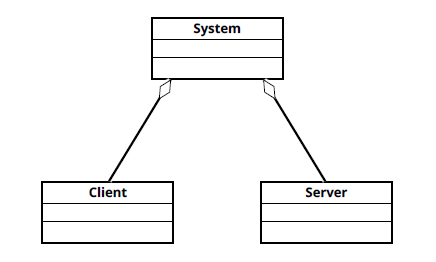

# Requirements Document - current EZElectronics

Date:

Version: V1 - description of EZElectronics in CURRENT form (as received by teachers)

| Version number | Change |
| :------------: | :----: |
|                |        |

# Contents

- [Requirements Document - current EZElectronics](#requirements-document---current-ezelectronics)
- [Contents](#contents)
- [Informal description](#informal-description)
- [Stakeholders](#stakeholders)
- [Context Diagram and interfaces](#context-diagram-and-interfaces)
  - [Context Diagram](#context-diagram)
  - [Interfaces](#interfaces)
- [Stories and personas](#stories-and-personas)
- [Functional and non functional requirements](#functional-and-non-functional-requirements)
  - [Functional Requirements](#functional-requirements)
  - [Non Functional Requirements](#non-functional-requirements)
- [Use case diagram and use cases](#use-case-diagram-and-use-cases)
  - [Use case diagram](#use-case-diagram)
    - [Use case 1, Login (UC1)](#use-case-1-login-uc1)
      - [Scenario 1.1](#scenario-11)
      - [Scenario 1.2](#scenario-12)
      - [Scenario 1.3](#scenario-13)
    - [Use case 2, Logout (UC2)](#use-case-2-logout-uc2)
      - [Scenario 2.1](#scenario-21)
    - [Use case 3, Register (UC3)](#use-case-3-register-uc3)
      - [Scenario 3.1](#scenario-31)
      - [Scenario 3.2](#scenario-32)
    - [Use case 4, Retrieve logged user information (UC4)](#use-case-4-retrieve-logged-user-information-uc4)
      - [Scenario 4.1](#scenario-41)
    - [Use case 5, Retrieve product list (UC5)](#use-case-5-retrieve-product-list-uc5)
      - [Scenario 5.1](#scenario-51)
      - [Scenario 5.2](#scenario-52)
    - [Use case 6, Retrieve products by category (UC6)](#use-case-6-retrieve-products-by-category-uc6)
      - [Scenario 6.1](#scenario-61)
      - [Scenario 6.2](#scenario-62)
      - [Scenario 6.3](#scenario-63)
    - [Use case 7, Retrieve products by model (UC7)](#use-case-7-retrieve-products-by-model-uc7)
      - [Scenario 7.1](#scenario-71)
      - [Scenario 7.2](#scenario-72)
      - [Scenario 7.3](#scenario-73)
    - [Use case 8, Retrieve a specific product (UC8)](#use-case-8-retrieve-a-specific-product-uc8)
      - [Scenario 8.1](#scenario-81)
      - [Scenario 8.2](#scenario-82)
    - [Use case 9, Create product (UC9)](#use-case-9-create-product-uc9)
      - [Scenario 9.1](#scenario-91)
      - [Scenario 9.2](#scenario-92)
      - [Scenario 9.3](#scenario-93)
    - [Use case 10, Add new arrival of products (UC10)](#use-case-10-add-new-arrival-of-products-uc10)
      - [Scenario 10.1](#scenario-101)
      - [Scenario 10.2](#scenario-102)
    - [Use case 11, Mark product as sold (UC11)](#use-case-11-mark-product-as-sold-uc11)
      - [Scenario 11.1](#scenario-111)
      - [Scenario 11.2](#scenario-112)
      - [Scenario 11.3](#scenario-113)
      - [Scenario 11.4](#scenario-114)
    - [Use case 12, Delete single product (UC12)](#use-case-12-delete-single-product-uc12)
      - [Scenario 12.1](#scenario-121)
      - [Scenario 12.2](#scenario-122)
    - [Use case 13, Retrieve the current cart (UC13)](#use-case-13-retrieve-the-current-cart-uc13)
      - [Scenario 13.1](#scenario-131)
    - [Use case 14, Add product to cart (UC14)](#use-case-14-add-product-to-cart-uc14)
      - [Scenario 14.1](#scenario-141)
      - [Scenario 14.2](#scenario-142)
      - [Scenario 14.3](#scenario-143)
    - [Use case 15, Remove product from cart (UC15)](#use-case-15-remove-product-from-cart-uc15)
      - [Scenario 15.1](#scenario-151)
      - [Scenario 15.2](#scenario-152)
      - [Scenario 15.3](#scenario-153)
      - [Scenario 15.4](#scenario-154)
      - [Scenario 15.5](#scenario-155)
    - [Use case 16, Delete current cart (UC16)](#use-case-16-delete-current-cart-uc16)
      - [Scenario 16.1](#scenario-161)
      - [Scenario 16.2](#scenario-162)
    - [Use case 17, Retrieve cart history (UC17)](#use-case-17-retrieve-cart-history-uc17)
      - [Scenario 17.1](#scenario-171)
    - [Use case 18, Check-out current cart (UC18)](#use-case-18-check-out-current-cart-uc18)
      - [Scenario 18.1](#scenario-181)
      - [Scenario 18.2](#scenario-182)
      - [Scenario 18.3](#scenario-183)
- [Glossary](#glossary)
- [System Design](#system-design)
- [Deployment Diagram](#deployment-diagram)

# Informal description

EZElectronics (read EaSy Electronics) is a software application designed to help managers of electronics stores to manage their products and offer them to customers through a dedicated website. Managers can assess the available products, record new ones, and confirm purchases. Customers can see available products, add them to a cart and see the history of their past purchases.

# Stakeholders

| Stakeholder name | Description |
| :--------------: | :---------: |
| Manager          |  Manager of an electronics store  |
| Customer          |  Individual interested in buying electronics  |

# Context Diagram and interfaces

## Context Diagram

## Interfaces

|   Actor   | Logical Interface | Physical Interface |
| :-------: | :---------------: | :----------------: |
| Manager |         GUI          |         PC           |
| Customer |         GUI          |         PC           |
| Not logged-in User | GUI  | PC  |

# Stories and personas

Mario Rossi is a middle-aged man with a burning passion for electronics. He has a wife and he's a father of two children while working as a high school ICT teacher. Mario found EZElectronics casually surfing the web and he seized the opportunity to buy new electronic devices for his home and his hobbies.

Arianna Bianchi is a young woman who studies software engineering at university. She really likes playing videogames in her free time and she's saving money to build a new desktop pc to play her favourite games. One of Arianna's friend told her about EZElectronics, so she decided to give the website a try and purchased some components for her dream pc.

Giuseppe Verdi is a young man who has been working for EZElectronics for three years. His task is to manage products for sale on the website, along with other colleagues.

# Functional and non functional requirements

## Functional Requirements

|  ID   | Description |
| :---: | :---------: |
|  FR1  | Handle authentication |
|  FR1.1  | Register |
|  FR1.2  | Login |
|  FR1.3  | Logout |
|  FR1.4  | Retrieve logged user information |
|  FR2  | Manage users |
|  FR2.1  | Retrieve user list (only testing) |
|  FR2.2  | Retrieve user list given the role (only testing) |
|  FR2.3  | Retrieve a specific user (only testing) |
|  FR2.4  | Delete a specific user (only testing) |
|  FR2.5  | Delete all users (only testing) |
|  FR3  | Manage products |
|  FR3.1  | Create product |
|  FR3.2  | Add new arrival of products |
|  FR3.3  | Mark product as sold |
|  FR3.4  | Retrieve product list |
|  FR3.5  | Retrieve a specific product |
|  FR3.6  | Retrieve products by category |
|  FR3.7  | Retrieve products by model |
|  FR3.8  | Delete single product |
|  FR3.9  | Delete all products (only testing)|
|  FR4  | Manage carts of the logged user |
|  FR4.1  | Retrieve the current cart |
|  FR4.2  | Add a product to the current cart |
|  FR4.3  | Pay for the current cart |
|  FR4.4  | Retrieve history of the paid carts |
|  FR4.5  | Delete a product from the current cart |
|  FR4.6  | Delete the current cart |
|  FR4.7  | Delete all carts (only testing) |

## Access rights
| Function        | Customer  | Manager | Not logged-in user |
| :------------- |:-------------:|:---:|:---:|
| Register |X|X|X|
| Login |X|X|X|
| Logout |X|X||
| Retrieve logged user information | X | X ||
| Retrieve user list (only testing) |X |X|X|
| Retrieve user list given the role (only testing) |X |X |X|
| Retrieve a specific user (only testing) |X |X|X|
| Delete a specific user (only testing) | X | X |X|
| Delete all users (only testing)| X | X |X|
| Create product| | X  ||
| Add new arrival of products|  | X  ||
| Mark product as sold| | X ||
| Retrieve product list| X | X ||
|Retrieve a specific product| X| X||
| Retrieve products by category| X | X||
| Retrieve products by model| X | X ||
| Delete single product|  | X||
| Delete all products (only testing)|  X  | X |X|
| Retrieve the current cart|   X  | ||
| Add a product to the current cart| X | ||
| Pay for the current cart| X | ||
| Retrieve history of the paid carts| X | ||
|  Delete a product from the current cart| X | ||
| Delete the current cart| X | ||
| Delete all carts (only testing) | X | X|X|

## Non Functional Requirements

|   ID    | Type (efficiency, reliability, ..) | Description | Refers to |
| :-----: | :--------------------------------: | :---------: | :-------: |
|  NFR1   |  Security     |      Passwords are encrypted       |     FR1      |

No other NFRs can be found in the given code

# Use case diagram and use cases

## Use case diagram

### Use case 1, Login (UC1)

| Actors Involved  |  Not logged-in user, Manager, Customer                                                                    |
| :--------------: | :------------------------------------------------------------------: |
|   Precondition   | None |
|  Post condition  |  User logged in   |
| Nominal Scenario |         Scenario 1.1         |
|     Variants     |              None             |
|    Exceptions    |        Scenario 1.2, 1.3   |

##### Scenario 1.1
|  Scenario 1.1  |         Login                                         |
| :------------: | :------------------------------------------------------------------------: |
|  Precondition  | User registered |
| Post condition |  User logged in   |
|     Step#      |                                Description                                 |
|       1        |    System: Ask username, password                                                   |
|       2        |    User: Provide username, password                                               |
|      3         |      System: Read username, password. Check cookie, user is not logged in.|
|      4         | System: Given username, find the user      |
|      5         | System: Retrieve password, compare with the one provided. Passwords match, user is authorized|

##### Scenario 1.2
|  Scenario 1.2  |         Wrong password                                   |
| :------------: | :------------------------------------------------------------------------: |
|  Precondition  | User registered |
| Post condition |  User not logged in   |
|     Step#      |                                Description                                 |
|       1        |    System: Ask username, password                                                   |
|       2        |    User: Provide username, password                                               |
|      3       |      System: Read username, password. Check cookie, user is not logged in.|
|      4         | System: Given username, find the user      |
|      5         | System: Retrieve password, compare with the one provided. Passwords do not match, user is not authorized|

##### Scenario 1.3
|  Scenario 1.3  |         User not registered                    |
| :------------: | :------------------------------------------------------------------------: |
|  Precondition  | User not registered |
| Post condition |  User not logged in   |
|     Step#      |                                Description                                 |
|       1        |    System: Ask username, password                                                   |
|       2        |    User: Provide username, password                                               |
|      3       |      System: Read username, password. Check cookie, user is not logged in  |
|      4         | System: Given username, find the user. User is not found. User not authorized      |

### Use case 2, Logout (UC2)
| Actors Involved  |              Manager, Customer                             |
| :--------------: | :------------------------------------------------------------------: |
|   Precondition   | User logged in |
|  Post condition  |  User not logged in   |
| Nominal Scenario |         Scenario 2.1         |
|     Variants     |              None             |
|    Exceptions    |     None     |

##### Scenario 2.1
|  Scenario 2.1  |         Logout                                    |
| :------------: | :------------------------------------------------------------------------: |
|  Precondition  | User logged in |
| Post condition |  User not logged in   |
|     Step#      |                                Description                                 |
|       1        |    User: Ask to logout                       |
|       2        |    System: Find user, check  cookie, the user is logged in |
|       3        |    System: the user is logged out          |

### Use case 3, Register (UC3)
| Actors Involved  |               Not logged-in user, Manager, Customer                              |
| :--------------: | :------------------------------------------------------------------: |
|   Precondition   | None |
|  Post condition  |  User registered   |
| Nominal Scenario |         Scenario 3.1         |
|     Variants     |              None             |
|    Exceptions    |     Scenario 3.2     |

##### Scenario 3.1
|  Scenario 3.1  |         Register                                    |
| :------------: | :------------------------------------------------------------------------: |
|  Precondition  | User not registered |
| Post condition |  User registered   |
|     Step#      |                                Description                                 |
|       1        |    System: Ask name, surname, username, password, role [Manager, Customer]       |
|       2        |   User: Provide name, surname, username, password, role          |
|      3       |      System: Read name, surname, username, password, role |
|      4         | System: Check that the provided username is not associated with any existing account. The username has not been used      |
|      5         | System: Create a new user with the provided fields  |

##### Scenario 3.2
|  Scenario 3.2  |         User already registered                 |
| :------------: | :------------------------------------------------------------------------: |
|  Precondition  | User registered |
| Post condition |  Registration failed   |
|     Step#      |                                Description                                 |
|       1        |    System: Ask name, surname, username, password, role [Manager, Customer]                         |
|       2        |   User: Provide name, surname, username, password, role          |
|      3         |      System: Read name, surname, username, password, role. |
|      4         | System: Check that the provided username is not associated with any existing account. The username has been used before.     |
|      5        |       System: Provide an error message       |

### Use case 4, Retrieve logged user information (UC4)
| Actors Involved  |              Manager, Customer                              |
| :--------------: | :------------------------------------------------------------------: |
|   Precondition   | User logged in |
|  Post condition  |  User information shown   |
| Nominal Scenario |         Scenario 4.1         |
|     Variants     |              None             |
|    Exceptions    |    None     |

##### Scenario 4.1
|  Scenario 4.1  |         Show User information                          |
| :------------: | :------------------------------------------------------------------------: |
|  Precondition  | User logged in |
| Post condition |  User information shown   |
|     Step#      |                                Description                                 |
|       1        |    User: Ask information about its account       |
|       2        |       System: Show user information      |

### Use case 5, Retrieve product list (UC5)

| Actors Involved  |  Manager, Customer   |
| :--------------: | :------------------------------------------------------------------: |
|   Precondition   | User is logged in |
|  Post condition  | Product list retrieved   |
| Nominal Scenario | Scenario 5.1         |
|     Variants     | Scenario 5.2, 5.3    |
|    Exceptions    |          None               |

##### Scenario 5.1
|  Scenario 5.1  |  Retrieve all products  |
| :------------: | :------------------------------------------------------------------------: |
|  Precondition  | User is logged in |
| Post condition | Product list retrieved   |
|     Step#      |                                Description                                 |
|       1        | User: ask to get all products |
|       2        | System: retrieve all products and show them to the user ||

##### Scenario 5.2
|  Scenario 5.2  |  Retrieve sold products  |
| :------------: | :------------------------------------------------------------------------: |
|  Precondition  | User is logged in |
| Post condition | Product list retrieved   |
|     Step#      |                                Description                                 |
|       1        | User: ask to get sold products |
|       2        | System: retrieve all sold products and show them to the user |

##### Scenario 5.3
|  Scenario 5.3  |  Retrieve unsold products  |
| :------------: | :------------------------------------------------------------------------: |
|  Precondition  | User is logged in |
| Post condition | Product list retrieved   |
|     Step#      |                                Description                                 |
|       1        | User: ask to get unsold products |
|       2        | System: retrieve all unsold products and show them to the user |

### Use case 6, Retrieve products by category (UC6)

| Actors Involved  |  Manager, Customer   |
| :--------------: | :------------------------------------------------------------------: |
|   Precondition   | User is logged in |
|  Post condition  | Product list retrieved   |
| Nominal Scenario | Scenario 6.1         |
|     Variants     | Scenario 6.2, 6.3      |
|    Exceptions    | Scenario 6.4 |

##### Scenario 6.1
|  Scenario 6.1  |  Retrieve products by category |
| :------------: | :------------------------------------------------------------------------: |
|  Precondition  | User is logged in |
| Post condition | Product list retrieved   |
|     Step#      |                                Description                                 |
|       1        | User: ask to get products of a specific category |
|       2        | System: ask category from three options |
|       3        | User: select category |
|       4        | System: retrieve all products of the given category and show them to the user |

##### Scenario 6.2
|  Scenario 6.2  |  Retrieve sold products by category |
| :------------: | :------------------------------------------------------------------------: |
|  Precondition  | User is logged in |
| Post condition | Product list retrieved   |
|     Step#      |                                Description                                 |
|       1        | User: ask to get sold products of a specific category |
|       2        | System: ask category from three option |
|       3        | User: select category |
|       4        | System: retrieve all sold products of the given category and show them to the user |

##### Scenario 6.3
|  Scenario 6.3  |  Retrieve unsold products by category |
| :------------: | :------------------------------------------------------------------------: |
|  Precondition  | User is logged in |
| Post condition | Product list retrieved   |
|     Step#      |                                Description                                 |
|       1        | User: ask to get unsold products of a specific category |
|       2        | System: ask category from three option |
|       3        | User: select category |
|       4        | System: retrieve all unsold products of the given category and show them to the user |

##### Scenario 6.4
|  Scenario 6.4  |  Invalid category |
| :------------: | :------------------------------------------------------------------------: |
|  Precondition  | User is logged in |
| Post condition | Retrival failed   |
|     Step#      |                                Description                                 |
|       1        | User: modify the URL with a non existent category |
|       2        | System: Check if category exists. Category doesn't exist. Provide error message | 

### Use case 7, Retrieve products by model (UC7)

| Actors Involved  |  Manager, Customer   |
| :--------------: | :------------------------------------------------------------------: |
|   Precondition   | User is logged in |
|  Post condition  | Product list retrieved   |
| Nominal Scenario | Scenario 7.1         |
|     Variants     | Scenario 7.2, 7.3      |
|    Exceptions    | None |

##### Scenario 7.1
|  Scenario 7.1  |  Retrieve products by model |
| :------------: | :------------------------------------------------------------------------: |
|  Precondition  | User is logged in |
| Post condition | Product list retrieved   |
|     Step#      |                                Description                                 |
|       1        | User: ask to get products of a specific model |
|       2        | System: ask model |
|       3        | User: insert model |
|       4        | System: retrieve all products of the given model and show them to the user |

##### Scenario 7.2
|  Scenario 7.2  |  Retrieve sold products by model |
| :------------: | :------------------------------------------------------------------------: |
|  Precondition  | User is logged in |
| Post condition | Product list retrieved   |
|     Step#      |                                Description                                 |
|       1        | User: ask to get sold products of a specific model |
|       2        | System: ask model |
|       3        | User: insert model |
|       4        | System: retrieve all sold products of the given model and show them to the user |

##### Scenario 7.3
|  Scenario 7.3  |  Retrieve unsold products by model |
| :------------: | :------------------------------------------------------------------------: |
|  Precondition  | User is logged in |
| Post condition | Product list retrieved   |
|     Step#      |                                Description                                 |
|       1        | User: ask to get unsold products of a specific model |
|       2        | System: ask model |
|       3        | User: insert model |
|       4        | System: retrieve all unsold products of the given model and show them to the user |

### Use case 8, Retrieve a specific product (UC8)

| Actors Involved  |  Manager, Customer   |
| :--------------: | :------------------------------------------------------------------: |
|   Precondition   | User is logged in |
|  Post condition  | Product retrieved   |
| Nominal Scenario | Scenario 8.1         |
|     Variants     | None      |
|    Exceptions    | Scenario 8.2 |

##### Scenario 8.1
|  Scenario 8.1  |  Retrieve a specific product |
| :------------: | :------------------------------------------------------------------------: |
|  Precondition  | User is logged in |
| Post condition | Product retrieved   |
|     Step#      |                                Description                                 |
|       1        | User: ask to get a product |
|       2        | System: ask code |
|       3        | User: insert code |
|       4        | System: retrieve the product and show it to the user |

##### Scenario 8.2
|  Scenario 8.2  |  Invalid code |
| :------------: | :------------------------------------------------------------------------: |
|  Precondition  | User is logged in |
| Post condition | Product not retrieved   |
|     Step#      |                                Description                                 |
|       1        | User: ask to get a product |
|       2        | System: ask product code |
|       3        | User: insert code |
|       4        | System: Check if code represents a product that already exists. Product code doesn't exist in the database. Provide error message |

### Use case 9, Create product (UC9)

| Actors Involved  |  Manager  |
| :--------------: | :------------------------------------------------------------------: |
|   Precondition   | User is logged in |
|  Post condition  | Product created   |
| Nominal Scenario | Scenario 9.1         |
|     Variants     | None                      |
|    Exceptions    | Scenario 9.2, 9.3                        |

|  Scenario 9.1  |  Create product  |
| :------------: | :------------------------------------------------------------------------: |
|  Precondition  | User is logged in, user is a manager |
| Post condition | Product created   |
|     Step#      |                                Description                                 |
|       1        | User: ask to register a product |
|       2        | System: ask code (6 characters), selling price, model, category (three options), details and arrival date |
|      3       | User: insert code, selling price, model, category, details and arrival date |
|      4       | System: Create a new product and store it |

##### Scenario 9.2
|  Scenario 9.2  |  Product already exists  |
| :------------: | :------------------------------------------------------------------------: |
|  Precondition  | User is logged in, user is a manager, product already exists |
| Post condition | Product not created   |
|     Step#      |                                Description                                 |
|       1        | User: ask to register a product |
|       2        | System: ask code (6 characters), selling price, model, category (three options), details and arrival date |
|      3       | User: insert code, selling price, model, category, details and arrival date |
|      4       | System: Check if code doesn't represent a product that already exists. Product code already exists. Provide error message |

##### Scenario 9.3
|  Scenario 9.3  |  Invalid arrival date  |
| :------------: | :------------------------------------------------------------------------: |
|  Precondition  | User is logged in, user is a manager, arrival date is after the current date |
| Post condition | Product not created   |
|     Step#      |                                Description                                 |
|       1        | User: ask to register a product |
|       2        | System: ask code (6 characters), selling price, model, category (three options), details and arrival date |
|      3       | User: insert code, selling price, model, category, details and arrival date |
|      4       | System: Check if arrival date is not after the current date. Arrival date is after the current date. Provide error message |

### Use case 10, Add new arrival of products (UC10)

| Actors Involved  |  Manager  |
| :--------------: | :------------------------------------------------------------------: |
|   Precondition   | User is logged in, user is a manager |
|  Post condition  | Arrival registered   |
| Nominal Scenario | Scenario 10.1         |
|     Variants     | None                      |
|    Exceptions    | Scenario 10.2                        |

##### Scenario 10.1
|  Scenario 10.1  |  Add new arrival of products  |
| :------------: | :------------------------------------------------------------------------: |
|  Precondition  | User is logged in, user is a manager |
| Post condition | Arrival registered   |
|     Step#      |                                Description                                 |
|       1        | User: ask to register a new arrival |
|       2        | System: ask model, category (three options), details, quantity, arrival date and selling price |
|      3       | User: insert model, category, details, quantity, arrival date and selling price |
|      4       | System: Create new products (each with an auto-generated code) and store them |

##### Scenario 10.2
|  Scenario 10.2  |  Invalid arrival date  |
| :------------: | :------------------------------------------------------------------------: |
|  Precondition  | User is logged in, user is a manager, arrival date is after the current date |
| Post condition | Arrival not registered   |
|     Step#      |                                Description                                 |
|       1        | User: ask to register a new arrival |
|       2        | System: ask model, category (three options), details, quantity, arrival date and selling price |
|      3       | User: insert model, category, details, quantity, arrival date and selling price |
|      4       | System: Check if arrival date is not after the current date. Arrival date is after the current date. Provide error message |

### Use case 11, Mark product as sold (UC11)

| Actors Involved  |  Manager  |
| :--------------: | :------------------------------------------------------------------: |
|   Precondition   | User is logged in, user is a manager |
|  Post condition  | Product marked as sold   |
| Nominal Scenario | Scenario 11.1         |
|     Variants     | None                      |
|    Exceptions    | Scenario 11.2, 11.3, 11.4                        |

##### Scenario 11.1
|  Scenario 11.1  |  Mark product as sold  |
| :------------: | :------------------------------------------------------------------------: |
|  Precondition  | User is logged in, user is a manager |
| Post condition | Product marked as sold   |
|     Step#      |                                Description                                 |
|       1        | User: ask to mark a product as sold |
|       2        | System: ask code and selling date (default: current date) |
|      3       | User: insert code and selling date |
|      4       | System: Retrieve the product and update selling date |

##### Scenario 11.2
|  Scenario 11.2  |  Invalid code  |
| :------------: | :------------------------------------------------------------------------: |
|  Precondition  | User is logged in, user is a manager, code does not represent a product |
| Post condition | Selling failed   |
|     Step#      |                                Description                                 |
|       1        | User: ask to mark a product as sold |
|       2        | System: ask code and selling date (default: current date) |
|      3       | User: insert code and selling date |
|      4       | System: Check if code represents a product that already exists. Product code doesn't exists in the database. Provide error message |

##### Scenario 11.3
|  Scenario 11.3  |  Invalid selling date  |
| :------------: | :------------------------------------------------------------------------: |
|  Precondition  | User is logged in, user is a manager, selling date is after the current date/is before the product's arrival date |
| Post condition | Product not marked as sold   |
|     Step#      |                                Description                                 |
|       1        | User: ask to mark a product as sold |
|       2        | System: ask code and selling date (default: current date) |
|      3       | User: insert code and selling date |
|      4       | System: Check if selling date isn't after the current date/isn't before the product's arrival date. Selling date is after the current date/is before the product's arrival date. Provide error message |

##### Scenario 11.4
|  Scenario 11.4  |  Product already sold  |
| :------------: | :------------------------------------------------------------------------: |
|  Precondition  | User is logged in, user is a manager, product is already marked as sold |
| Post condition | Selling failed   |
|     Step#      |                                Description                                 |
|       1        | User: ask to mark a product as sold |
|       2        | System: ask code and selling date (default: current date) |
|      3       | User: insert code and selling date |
|      4       | System: Check if product is already marked as sold. Product is already marked as sold. Provide error message |

### Use case 12, Delete single product (UC12)

| Actors Involved  |  Manager  |
| :--------------: | :------------------------------------------------------------------: |
|   Precondition   | User is logged in, user is a manager |
|  Post condition  | Product deleted   |
| Nominal Scenario | Scenario 12.1         |
|     Variants     | None                      |
|    Exceptions    | Scenario 12.2                        |

##### Scenario 12.1
|  Scenario 12.1  |  Mark product as sold  |
| :------------: | :------------------------------------------------------------------------: |
|  Precondition  | User is logged in, user is a manager |
| Post condition | Product deleted   |
|     Step#      |                                Description                                 |
|       1        | User: ask to delete a product |
|       2        | System: ask code |
|      3       | User: insert code |
|      4       | System: Retrieve the product and delete it |

##### Scenario 12.2
|  Scenario 12.2  |  Invalid code  |
| :------------: | :------------------------------------------------------------------------: |
|  Precondition  | User is logged in, user is a manager, code does not represent a product |
| Post condition | Deletion failed   |
|     Step#      |                                Description                                 |
|       1        | User: ask to delete a product |
|       2        | System: ask code |
|      3       | User: insert code |
|      4       | System: Check if code represents a product that exists. Product code doesn't exist in the database. Provide error message |

### Use case 13, Retrieve the current cart (UC13)
| Actors Involved  |              Customer                             |
| :--------------: | :------------------------------------------------------------------: |
|   Precondition   | User logged in and Customer |
|  Post condition  |  User cart retrieved   |
| Nominal Scenario |         Scenario 13.1         |
|     Variants     |              None             |
|    Exceptions    |    None     |

##### Scenario 13.1
|  Scenario 13.1  |         User cart retrieved                         |
| :------------: | :------------------------------------------------------------------------: |
|  Precondition  | User logged in and Customer |
| Post condition |  User cart retrieved   |
|     Step#      |                                Description                                 |
|       1        |    User: Ask to get his current cart       |
|       2        | System: Retrieve the current cart    |

### Use case 14, Add product to cart (UC14)

| Actors Involved  |   Customer                                                               |
| :--------------: | :------------------------------------------------------------------: |
|   Precondition   | User logged in as Customer                                           |
|  Post condition  | Product added to cart                                                |
| Nominal Scenario | Scenario 14.1                                                       |
|     Variants     | None                                                                 |
|    Exceptions    | Scenario   14.2, 14.3, 14.4                                          |

##### Scenario 14.1

|  Scenario 14.1 |  Add product to cart                                                            |
| :------------: | :-----------------------------------------------------------------------------: |
|  Precondition  | User logged in as Customer                                                      |
| Post condition | Product added to cart                                                           |
|     Step#      |                                Description                                      |
|       1        |  User: Ask to add a product to cart                                             |
|       2        |  System: Ask productID                                                          |
|       3        |  User: Insert productID                                                         |
|       4        |  System: Check that productID is at least 6 characters long                     |
|       5        |  System: Check that productID exists. ProductID exists                          |
|       6        |  System: Check that current product, with productID, isn't inside another cart  |
|       7        |  System: Verify that current product, with productID, hasn't been sold          |
|       8        |  System: Add product to cart                                                    |

##### Scenario 14.2

|  Scenario 14.2 | Nonexistent product                                                        |
| :------------: | :------------------------------------------------------------------------: |
|  Precondition  | User logged in as Customer                                                 |
| Post condition | Product not added to cart                                                  |
|     Step#      |                                Description                                 |
|       1        |  User: Ask to add a product to cart                                        |
|       2        |  System: Ask productID                                                     |
|       3        |  User: Insert productID                                                    |
|       4        |  System: Check that productID is at least 6 characters long                |
|       5        |  System: Check that productID exists. ProductID doesn't exist              |
|       6        |  System: Product is not added to cart. Provide error message               |

##### Scenario 14.3

|  Scenario 14.3 |  Product already existing in another cart                                                |
| :------------: | :--------------------------------------------------------------------------------------: |
|  Precondition  | User logged in as Customer                                                               |
| Post condition | Product not added to cart                                                                |
|     Step#      |                                Description                                               |
|       1        |  User: Ask to add a product to cart                                                      |
|       2        |  System: Ask productID                                                                   |
|       3        |  User: Insert productID                                                                  |
|       4        |  System: Check that productID is at least 6 characters long                              |
|       5        |  System: Check that productID exists. ProductID exists                                   |
|       6        |  System: Check that current product, with productID, isn't inside another cart. It does  |
|       7        |  System: Product is not added to cart. Provide error message                             |

##### Scenario 14.4

|  Scenario 14.4 | Sold product                                                                    |
| :------------: | :---------------------------------------------------------------------------:   |
|  Precondition  | User logged in as Customer                                                      |
| Post condition | Product not added to cart                                                       |
|     Step#      |                                Description                                      |
|       1        |  User: Ask to add a product to cart                                             |
|       2        |  System: Ask productID                                                          |
|       3        |  User: Insert productID                                                         |
|       4        |  System: Check that productID is at least 6 characters long                     |
|       5        |  System: Check that productID exists. ProductID exists                          |
|       6        |  System: Check that current product, with productID, isn't inside another cart  |
|       7        |  System: Verify that current product, with productID, hasn't been sold. It does |
|       7        |  System: Product is not added to cart. Provide error message                             |

### Use case 15, Remove product from cart (UC15)

| Actors Involved  | Customer                                                                 |
| :--------------: | :------------------------------------------------------------------: |
|   Precondition   | User logged in as Customer                                           |
|  Post condition  | Product removed from cart                                            |
| Nominal Scenario | Scenario 15.1                                                       |
|     Variants     | None                                                                 |
|    Exceptions    | Scenario   15.2,15.3,15.4,15.5                                       |

##### Scenario 15.1

|  Scenario 15.1 |  Remove product                                                                    |
| :------------: | :-------------------------------------------------------------------------------:  |
|   Precondition | User logged in as Customer                                                         |
| Post condition | Product removed from cart                                                          |
|     Step#      |                                Description                                         |
|       1        |  User: Ask to remove a product from cart                                           |
|       2        |  System: Ask productID                                                             |
|       3        |  User: Insert productID                                                            |
|       4        |  System: Check that productID is at least 6 characters long                        |
|       5        |  System: Check that productID exists                                               |
|       6        |  System: Verify that current product, with productID, hasn't been sold             |
|       7        |  System: Check that cart exist for the logged user                                 |
|       8        |  System: Check that product with productID is inside logged user cart              |
|       9        |  System: Product removed from cart                                                 |

##### Scenario 15.2

|  Scenario 15.2 | Nonexisting product                                                        |
| :------------: | :------------------------------------------------------------------------: |
|  Precondition  | User logged in as Customer                                                 |
| Post condition | Product not removed from cart                                              |
|     Step#      |                                Description                                 |
|       1        |  User: Ask to remove a product from cart                                   |
|       2        |  System: Ask productID                                                     |
|       3        |  User: Insert productID                                                    |
|       4        |  System: Check that productID is at least 6 characters long                |
|       5        |  System: Check that productID exists. It doesn't                           |
|       6        |  System: Product is not removed from cart. Provide error message           |

##### Scenario 15.3

|  Scenario 15.3 | Sold product                                                                       |
| :------------: | :----------------------------------------------------------------------------:     |
|  Precondition  | User logged in as Customer                                                         |
| Post condition | Product not removed from cart                                                      |
|     Step#      |                                Description                                         |
|       1        |  User: Ask to remove a product from cart                                           |
|       2        |  System: Ask productID                                                             |
|       3        |  User: Insert productID                                                            |
|       4        |  System: Check that productID is at least 6 characters long                        |
|       5        |  System: Check that productID exists                                               |
|       6        |  System: Verify that current product, with productID, hasn't been sold. It does    |
|       7        |  System: Product is not removed from cart. Provide error message                   |

##### Scenario 15.4

|  Scenario 15.4 |  Nonexisting cart                                                                  |
| :------------: | :------------------------------------------------------------------------:         |
|  Precondition  | User logged in as Customer                                                         |
| Post condition | Product not removed from cart                                                      |
|     Step#      | Description                                                                        |
|       1        |  User: Ask to remove a product from cart                                           |
|       2        |  System: Ask productID                                                             |
|       3        |  User: Insert productID                                                            |
|       4        |  System: Check that productID is at least 6 characters long                        |
|       5        |  System: Check that productID exists                                               |
|       6        |  System: Verify that current product, with productID, hasn't been sold.            |
|       7        |  System: Check that cart exist for the logged user. It does't                      |
|       8        |  System: Product is not removed from cart. Provide error message                   |

##### Scenario 15.5

|  Scenario 15.5 |  Product not inside cart                                                                      |
| :------------: | :-------------------------------------------------------------------------------------------: |
|  Precondition  | User logged in as Customer                                                                    |
| Post condition | Product not removed from cart                                                                 |
|     Step#      |                                Description                                                    |
|       1        |  User: Ask to remove a product from cart                                                      |
|       2        |  System: Ask productID                                                                        |
|       3        |  User: Insert productID                                                                       |
|       4        |  System: Check that productID is at least 6 characters long                                   |
|       5        |  System: Check that productID exists                                                          |
|       6        |  System: Verify that current product, with productID, hasn't been sold.                       |
|       7        |  System: Check that cart exist for the logged user                                            |
|       8        |  System: Check that product with productID is inside logged user cart. It doesn't             |
|       9        |  System: Product is not removed from cart. Provide error message                              |

### Use case 16, Delete current cart (UC16)

| Actors Involved  | Customer                                                              |
| :--------------: | :---------------------------------------------------------------: |
|  Precondition    | User logged in as Customer                                        |
|  Post condition  | Current cart deleted                                              |
| Nominal Scenario | Scenario 16.1                                                     |
|     Variants     | None                                                              |
|    Exceptions    | Scenario   16.2                                                   |

##### Scenario 16.1
|  Scenario 16.1 | Current cart delete                                                 |
| :------------: | :-----------------------------------------------------------------: |
|  Precondition  | User logged in as Customer                                          |
| Post condition | Current cart deleted                                                |
|     Step#      |                                Description                          |
|       1        | User:  ask to delete current cart                                   |
|       2        | System: Check that current cart exist for the logged user           |
|       3        | System: current cart deleted                                        |

##### Scenario 16.2

|  Scenario 16.2 | Nonexisting current cart                                            |
| :------------: | :-----------------------------------------------------------------: |
|  Precondition  | User logged in as Customer                                          |
| Post condition | Current cart not deleted                                            |
|     Step#      |                                Description                          |
|       1        | User:  ask to delete current cart                                   |
|       4        | System: Check that current cart exist for the logged user. It doesn't     |
|       5        | System: Current cart is not deleted. Provide error message          |

### Use case 17, Retrieve cart history (UC17)

| Actors Involved  | Customer                                                                 |
| :--------------: | :------------------------------------------------------------------: |
|  Precondition    | User logged in as Customer                                           |
|  Post condition  | Cart history retrieved                                               |
| Nominal Scenario | Scenario 17.1                                                       |
|     Variants     | None                                                                 |
|    Exceptions    | None                                                                 |

##### Scenario 17.1

|  Scenario 17.1   |  Retrieve cart history                                               |
| :------------:   | :------------------------------------------------------------------: |
|  Precondition    | User logged in as Customer                                           |
|  Post condition  | Cart history retrieved                                               |
|     Step#        |                                Description                           |
|       1          | User: Ask to retrieve cart history                                   |
|       2          | System: Provide cart history                                         |

### Use case 18, Check-out current cart (UC18)

| Actors Involved  | Customer                                                                 |
| :--------------: | :------------------------------------------------------------------: |
|  Precondition    | User logged in as Customer                                           |
|  Post condition  | Check-out completed                                                  |
| Nominal Scenario | Scenario 18.1                                                        |
|     Variants     | None                                                                 |
|    Exceptions    | Scenario 18.2, 18.3                                                  |

##### Scenario 18.1

|  Scenario 18.1  |  Check-out completed                                                  |
| :------------:  | :-------------------------------------------------------------------: |
|  Precondition   | User logged in as Customer                                            |
|  Post condition | Check-out completed                                                   |
|     Step#       |                                Description                            |
|       1         | User: Ask to check-out cart                                           |
|       2         | System: Check that logged user has a cart                             |
|       3         | System: Check that cart isn't empty                                   |
|       4         | System: Complete check-out                                            |

##### Scenario 18.2

|  Scenario 18.2 | Nonexsisting cart                                                      |
| :------------: | :--------------------------------------------------------------------: |
|  Precondition  | User logged in as Customer                                             |
| Post condition | Check-out fail                                                         |
|     Step#      |                                Description                             |
|       1        | User: Ask to check-out cart                                            |
|       2        | System: Check that logged user has a cart. It doesn't                  |
|       3        | System: Check-out fail. Provide error message                          |

##### Scenario 18.3

|  Scenario 18.3 | Empty cart                                                              |
| :------------: | :---------------------------------------------------------------------: |
|  Precondition  | User logged in as Customer                                              |
| Post condition | Check-out fail                                                          |
|     Step#      |                                Description                              |
|       1        | User: Ask to check-out cart                                             |
|       2        | System: Check that logged user has a cart                               |
|       3        | System: Check that cart isn't empty. It doesn't                         |
|       4        | System: Check-out fail. Provide error message                           |

# Glossary

**User**: generic user of the website, characterized by username, name, surname, role {Customer, Manager} and a password. 
**Product**: product for sale on the website, characterized by code, selling price, model, category {Smartphone, Laptop, Appliance}, arrival date, selling date and details. 
**Cart**: cart of a specific customer, characterized by a unique ID, paid status, payment date (if it has been paid), total price and the products it contains.

# System Design

# Deployment Diagram

