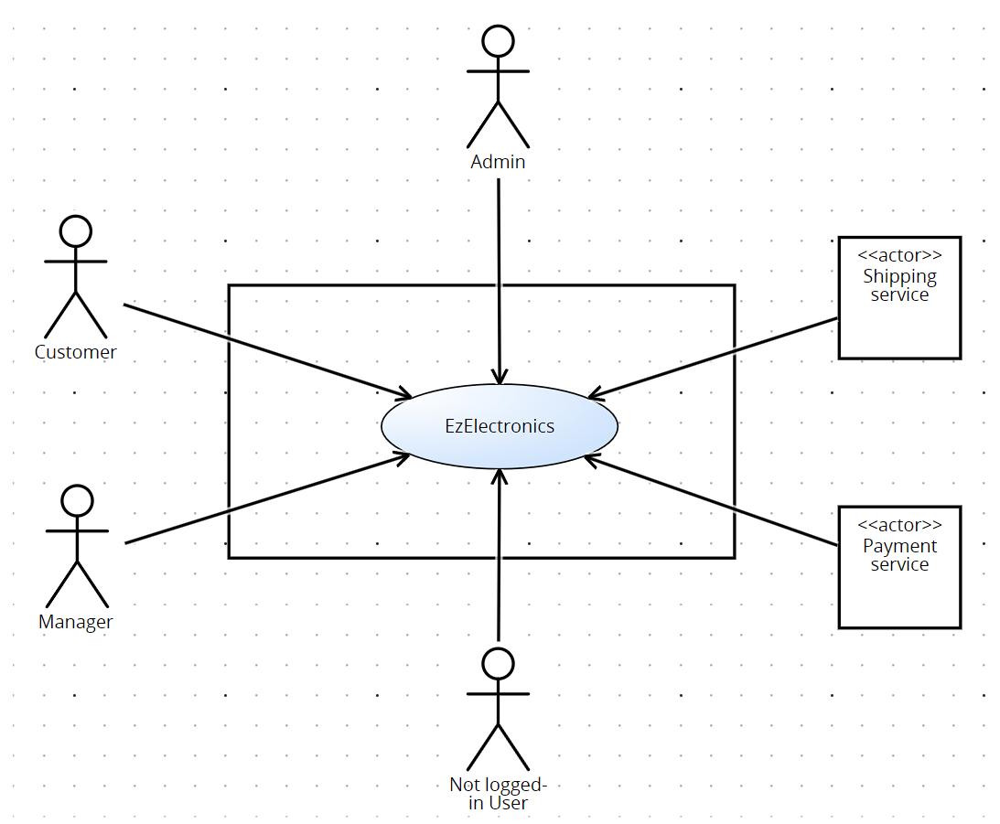
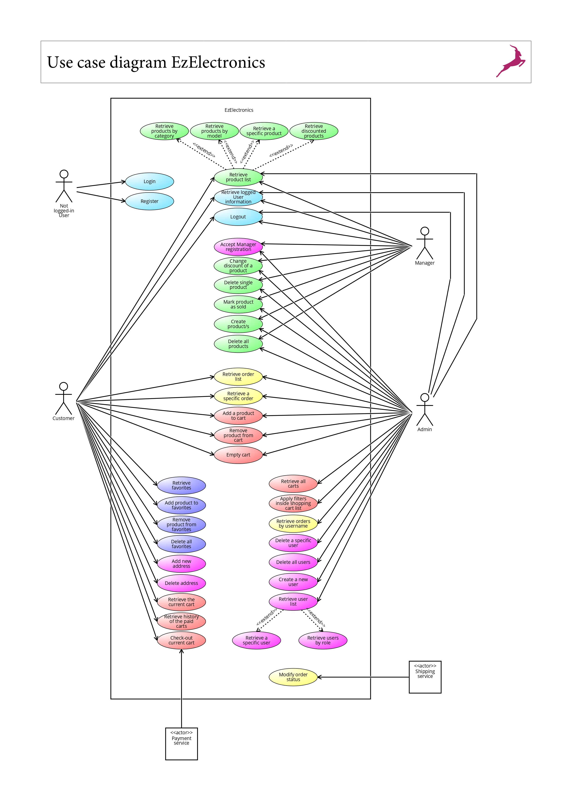
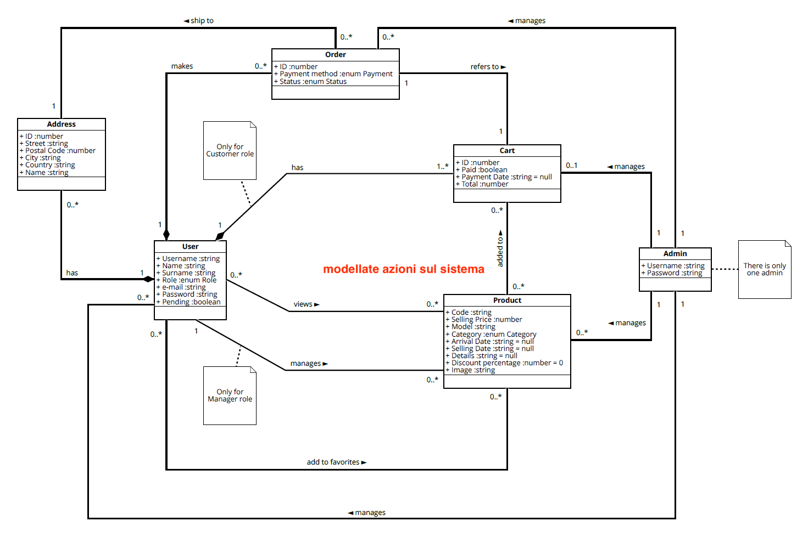
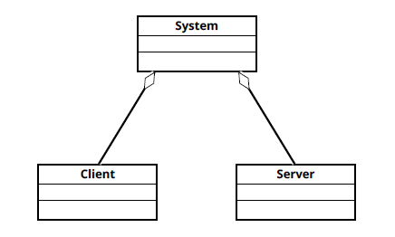
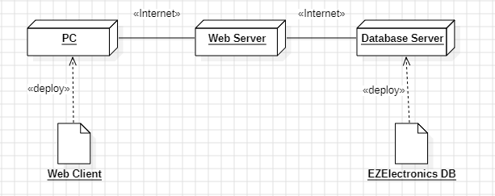

# Requirements Document - future EZElectronics

Date:

Version: V2 - description of EZElectronics in FUTURE form (as proposed by the team)

| Version number | Change |
| :------------: | :----: |
|                |        |

# Contents

- [Requirements Document - current EZElectronics](#requirements-document---current-ezelectronics)
- [Contents](#contents)
- [Informal description](#informal-description)
- [Stakeholders](#stakeholders)
- [Context Diagram and interfaces](#context-diagram-and-interfaces)
  - [Context Diagram](#context-diagram)
  - [Interfaces](#interfaces)
- [Stories and personas](#stories-and-personas)
- [Functional and non functional requirements](#functional-and-non-functional-requirements)
  - [Functional Requirements](#functional-requirements)
  - [Non Functional Requirements](#non-functional-requirements)
- [Use case diagram and use cases](#use-case-diagram-and-use-cases)
  - [Use case diagram](#use-case-diagram)
    - [Use case 1, Login (UC1)](#use-case-1-login-uc1)
      - [Scenario 1.1](#scenario-11)
      - [Scenario 1.2](#scenario-12)
      - [Scenario 1.3](#scenario-13)
      - [Scenario 1.4](#scenario-14)
    - [Use case 2, Logout (UC2)](#use-case-2-logout-uc2)
      - [Scenario 2.1](#scenario-21)
    - [Use case 3, Register (UC3)](#use-case-3-register-uc3)
      - [Scenario 3.1](#scenario-31)
      - [Scenario 3.2](#scenario-32)
      - [Scenario 3.3](#scenario-33)
    - [Use case 4, Retrieve logged user information (UC4)](#use-case-4-retrieve-logged-user-information-uc4)
      - [Scenario 4.1](#scenario-41)
    - [Use case 5, Retrieve product list (UC5)](#use-case-5-retrieve-product-list-uc5)
      - [Scenario 5.1](#scenario-51)
      - [Scenario 5.2](#scenario-52)
      - [Scenario 5.3](#scenario-53)
    - [Use case 6, Retrieve products by category (UC6)](#use-case-6-retrieve-products-by-category-uc6)
      - [Scenario 6.1](#scenario-61)
      - [Scenario 6.2](#scenario-62)
      - [Scenario 6.3](#scenario-63)
      - [Scenario 6.4](#scenario-64)
    - [Use case 7, Retrieve products by model (UC7)](#use-case-7-retrieve-products-by-model-uc7)
      - [Scenario 7.1](#scenario-71)
      - [Scenario 7.2](#scenario-72)
      - [Scenario 7.3](#scenario-73)
    - [Use case 8, Retrieve a specific product (UC8)](#use-case-8-retrieve-a-specific-product-uc8)
      - [Scenario 8.1](#scenario-81)
      - [Scenario 8.2](#scenario-82)
    - [Use case 9, Create product/s (UC9)](#use-case-9-create-products-uc9)
      - [Scenario 9.1](#scenario-91)
      - [Scenario 9.2](#scenario-92)
    - [Use case 10, Mark product as sold (UC10)](#use-case-10-mark-product-as-sold-uc10)
      - [Scenario 10.1](#scenario-101)
      - [Scenario 10.2](#scenario-102)
      - [Scenario 10.3](#scenario-103)
      - [Scenario 10.4](#scenario-104)
    - [Use case 11, Delete single product (UC11)](#use-case-11-delete-single-product-uc11)
      - [Scenario 11.1](#scenario-111)
      - [Scenario 11.2](#scenario-112)
    - [Use case 12, Retrieve the current cart (UC12)](#use-case-12-retrieve-the-current-cart-uc12)
      - [Scenario 12.1](#scenario-121)
    - [Use case 13, Add product to cart (UC13)](#use-case-13-add-product-to-cart-uc13)
      - [Scenario 13.1](#scenario-131)
      - [Scenario 13.2](#scenario-132)
      - [Scenario 13.3](#scenario-133)
    - [Use case 14, Remove product from cart (UC14)](#use-case-14-remove-product-from-cart-uc14)
      - [Scenario 14.1](#scenario-141)
      - [Scenario 14.2](#scenario-142)
      - [Scenario 14.3](#scenario-143)
    - [Use case 15, Empty cart (UC15)](#use-case-15-empty-cart-uc15)
      - [Scenario 15.1](#scenario-151)
    - [Use case 16, Check-out current cart (UC16)](#use-case-16-check-out-current-cart-uc16)
      - [Scenario 16.1](#scenario-161)
      - [Scenario 16.2](#scenario-162)
      - [Scenario 16.3](#scenario-163)
    - [Use case 17, Retrieve all carts (UC17)](#use-case-17-retrieve-all-carts-uc17)
      - [Scenario 17.1](#scenario-171)
    - [Use case 18, Retrieve user list (UC18)](#use-case-18-retrieve-user-list-uc18)
      - [Scenario 18.1](#scenario-181)
    - [Use case 19, Retrieve users by role (UC19)](#use-case-19-retrieve-users-by-role-uc19)
      - [Scenario 19.1](#scenario-191)
      - [Scenario 19.2](#scenario-192)
      - [Scenario 19.3](#scenario-193)
    - [Use case 20, Retrieve a specific user (UC20)](#use-case-20-retrieve-a-specific-user-uc20)
      - [Scenario 20.1](#scenario-201)
      - [Scenario 20.2](#scenario-202)
    - [Use case 21, Delete a specific user (UC21)](#use-case-21-delete-a-specific-user-uc21)
      - [Scenario 21.1](#scenario-211)
      - [Scenario 21.2](#scenario-212)
    - [Use case 22, Delete all users (UC22)](#use-case-22-delete-all-users-uc22)
      - [Scenario 22.1](#scenario-221)
      - [Scenario 22.2](#scenario-222)
    - [Use case 23, Create a new user (UC23)](#use-case-23-create-a-new-user-uc23)
      - [Scenario 23.1](#scenario-231)
      - [Scenario 23.2](#scenario-232)
    - [Use case 24, Retrieve favorites (UC24)](#use-case-24-retrieve-favorites-uc24)
      - [Scenario 24.1](#scenario-241)
    - [Use case 25, Add product to favorites (UC25)](#use-case-25-add-product-to-favorites-uc25)
      - [Scenario 25.1](#scenario-251)
      - [Scenario 25.2](#scenario-252)
      - [Scenario 25.3](#scenario-253)
    - [Use case 26, Remove product from the favorites (UC26)](#use-case-26-remove-product-from-favorites-uc26)
      - [Scenario 26.1](#scenario-261)
      - [Scenario 26.2](#scenario-262)
      - [Scenario 26.3](#scenario-263)
    - [Use case 27, Delete all favorites (UC27)](#use-case-27-delete-all-favorites-uc27)
      - [Scenario 27.1](#scenario-271)
      - [Scenario 27.2](#scenario-272)
    - [Use case 28, Accept Manager registration (UC28)](#use-case-28-accept-manager-registration-uc28)
      - [Scenario 28.1](#scenario-281)
      - [Scenario 28.2](#scenario-282)
    - [Use case 29, Add new address (UC29)](#use-case-29-add-new-address-uc29)
      - [Scenario 29.1](#scenario-291)
      - [Scenario 29.2](#scenario-292)
    - [Use case 30, Delete address (UC30)](#use-case-30-delete-address-uc30)
      - [Scenario 30.1](#scenario-301)
    - [Use case 31, Change discount of a product (UC31)](#use-case-31-change-discount-of-a-product-uc31)
      - [Scenario 31.1](#scenario-311)
      - [Scenario 31.2](#scenario-312)
    - [Use case 32, Apply filters inside shopping cart list (UC32)](#use-case-32-apply-filters-inside-shopping-cart-list-uc32)
      - [Scenario 32.1](#scenario-321)
      - [Scenario 32.2](#scenario-322)
      - [Scenario 32.3](#scenario-323)
      - [Scenario 32.4](#scenario-324)
    - [Use case 33, Retrieve order list (UC33)](#use-case-33-retrieve-order-list-uc33)
      - [Scenario 33.1](#scenario-331)
    - [Use case 34, Retrieve a specific order (UC34)](#use-case-34-retrieve-a-specific-order-uc34)
      - [Scenario 34.1](#scenario-341)
      - [Scenario 34.2](#scenario-342)
    - [Use case 35, Modify order status (UC35)](#use-case-35-modify-order-status-uc35)
      - [Scenario 35.1](#scenario-351)
    - [Use case 36, Retrieve orders by username (UC36)](#use-case-36-retrieve-orders-by-username-uc36)
      - [Scenario 36.1](#scenario-361)
      - [Scenario 36.2](#scenario-362)
    - [Use case 37, Retrieve discounted products (UC37)](#use-case-37-retrieve-discounted-products-uc37)
      - [Scenario 37.1](#scenario-371)
    - [Use case 38, Delete all products (UC38)](#use-case-38-delete-all-products-uc38)
      - [Scenario 38.1](#scenario-381)
      - [Scenario 38.2](#scenario-382)

- [Glossary](#glossary)
- [System Design](#system-design)
- [Deployment Diagram](#deployment-diagram)

# Informal description

EZElectronics (read EaSy Electronics) is a software application designed to help managers of electronics stores to manage their products and offer them to customers through a dedicated website. Managers can assess the available products, record new ones, and confirm purchases. Customers can see available products, add them to a cart and see the history of their past purchases.

# Stakeholders

| Stakeholder name | Description |
| :--------------: | :---------: |
| Manager          |  Manager of an electronics store  |
| Customer         |  Individual interested in buying electronics  |

# Context Diagram and interfaces

## Context Diagram

## Interfaces

|   Actor   | Logical Interface | Physical Interface |
| :-------: | :---------------: | :----------------: |
| Manager |         GUI          |         PC           |
| Customer |         GUI          |         PC           |
| Not logged-in User | GUI  | PC  |
| Admin | GUI | PC |
| Payment Service | https://www.paypal.com, https://pay.google.com, https://www.apple.com/it/apple-pay/, https://www.visaitalia.com, https://www.mastercard.it | Internet |
| Shipping Service | https://www.ups.com | Internet |

# Stories and personas

Mario Rossi is a middle-aged man with a burning passion for electronics. He has a wife and he's a father of two children while working as a high school ICT teacher. Mario found EZElectronics casually surfing the web and he seized the opportunity to buy new electronic devices for his home and his hobbies.

Arianna Bianchi is a young woman who studies software engineering at university. She really likes playing videogames in her free time and she's saving money to build a new desktop pc to play her favourite games. One of Arianna's friend told her about EZElectronics, so she decided to give the website a try and purchased some components for her dream pc.

Giuseppe Verdi is a young man who has been working for EZElectronics for three years. His task is to manage products for sale on the website, along with other colleagues.

# Functional and non functional requirements

## Functional Requirements

|  ID   | Description |
| :---: | :---------: |
|  **FR1**  | **Handle authentication** |
|  FR1.1  | Register |
|  FR1.2  | Login |
|  FR1.3  | Logout |
|  FR1.4  | Retrieve logged user information |
|  **FR2**  | **Manage users** |
|  FR2.1  | Retrieve user list |
|  FR2.2  | Retrieve users by role |
|  FR2.3  | Retrieve a specific user |
|  FR2.4  | Delete a specific user |
|  FR2.5  | Delete all users |
|  FR2.6  | Create a new user |
|  FR2.7  | Accept Manager registration |
|  FR2.8  | Add new address |
|  FR2.9  | Delete address |
|  **FR3**  | **Manage products** |
|  FR3.1  | Create product/s |
|  FR3.2  | Mark product as sold |
|  FR3.3  | Retrieve product list |
|  FR3.4  | Retrieve a specific product |
|  FR3.5  | Retrieve products by category |
|  FR3.6  | Retrieve products by model |
|  FR3.7  | Retrieve discounted products |
|  FR3.8  | Delete single product |
|  FR3.9  | Change discount of a product |
|  FR3.10  | Delete all products |
|  **FR4**  | **Manage carts of the logged user** |
|  FR4.1  | Retrieve the current cart |
|  FR4.2  | Add a product to cart |
|  FR4.3  | Check-out current cart |
|  FR4.4  | Remove product from cart |
|  FR4.5  | Empty cart |
|  FR4.6  | Retrieve all carts |
|  FR4.7  | Apply filters inside shopping cart list |
|  **FR5**  | **Manage favorites** |
|  FR5.1  | Retrieve favorites |
|  FR5.2  | Add product to favorites |
|  FR5.3  | Remove product from favorites |
|  FR5.4  | Delete all favorites |
|  **FR6**  | **Manage orders** |
|  FR6.1  | Retrieve order list |
|  FR6.2  | Retrieve a specific order |
|  FR6.3  | Modify order status |
|  FR6.4  | Retrieve orders by username |

## Access rights
| Function        | Customer  | Manager | Not logged-in user | Admin |
| :------------- |:-------------:|:---:|:---:| :----:|
| Register | ||X||
| Login |||X||
| Logout |X|X||X|
| Retrieve logged user information | X | X ||X|
| Retrieve user list  | |||X|
| Retrieve users by role  | |||X|
| Retrieve a specific user  | |||X|
| Delete a specific user  |  |  ||X|
| Delete all users |  |  ||X|
| Create new user ||||X|
| Accept Manager registration ||X||X|
| Add new address |X||||
| Delete address |X||||
| Create product/s | | X  ||X|
| Mark product as sold| | X ||X|
| Retrieve product list| X | X ||X|
| Retrieve a specific product| X| X||X|
| Retrieve products by category| X | X||X|
| Retrieve products by model|X|X||X|
| Retrieve discounted products |X|X||X|
| Delete single product|  | X||X|
| Change discount of a product ||X||X|
| Delete all products || X ||X|
| Retrieve the current cart|   X  | |||
| Add product to cart| X | ||X|
| Check-out current cart | X | |||
| Apply filters inside shopping cart list  |  | ||X|
| Remove product from cart| X | ||X|
| Empty cart |X|||X|
| Retrieve all carts |  | ||X|
| Retrieve favorites |X||||
| Add product to favorites |X||||
| Remove product from favorites |X||||
| Delete all favorites |X||||
| Retrieve order list |X|||X|
| Retrieve a specific order |X|||X|
| Retrieve orders by username ||||X|

## Non Functional Requirements

|   ID    | Type  | Description | Refers to |
| :-----: | :--------------------------------: | :---------: | :-------: |
|  NFR1   |  Security     |      Passwords are encrypted       |     FR1      |
| NFR2 | Usability | Manager can use the app after a brief tutorial (~10 minutes) |FR2.7, FR3.1-FR3.10|
| NFR3 | Usability | Customer can use the app without any tutorial |FR2.8, FR2.9, FR4.1-FR4.5|
| NFR4 | Efficiency | The website should have response time lower than 1ms |FR1, FR2, FR3, FR4, FR5, FR6|
| NFR5 | Efficiency | The website should support 500 concurrent users without significant performance loss |FR1, FR2, FR3, FR4, FR5, FR6|
| NFR6 | Reliability | The website should have an uptime of ~99.5% |FR1, FR2, FR3, FR4, FR5, FR6|
| Domain1 | Domain | Currency is Euro - IVA (Imposta sul valore aggiunto) computed at 22% |FR4.3|

# Use case diagram and use cases

## Use case diagram

### Use case 1, Login (UC1)

| Actors Involved  |  Not logged-in user                                                  |
| :--------------: | :------------------------------------------------------------------: |
|   Precondition   | User not logged in                                                   |
|  Post condition  | User logged in                                                       |
| Nominal Scenario | Scenario 1.1                                                         |
|     Variants     | None                                                                 |
|    Exceptions    | Scenario 1.2, 1.3, 1.4                                                    |

##### Scenario 1.1
|  Scenario 1.1  |         Login                                                              |
| :------------: | :------------------------------------------------------------------------: |
|  Precondition  | User not logged in, user registered                                        |
| Post condition | User logged in                                                             |
|     Step#      |                                Description                                 |
|      1         | System: Ask username, password                                             |
|      2         | User: Provide username, password                                           |
|      3         | System: Read username, password. Check cookie, user is not logged in       |
|      4         | System: Given username, find the user                                      |
|      5         | System: Retrieve password, compare with the one provided. Passwords match, user is authorized|

##### Scenario 1.2
|  Scenario 1.2  |         Wrong password                                                        |
| :------------: | :---------------------------------------------------------------------------: |
|  Precondition  | User not logged in, user registered                                           |
| Post condition | User not logged in                                                            |
|     Step#      |                                Description                                    |
|      1         | System: Ask username, password                                                |
|      2         | User: Provide username, password                                              |
|      3         | System: Read username, password. Check cookie, user is not logged in          |
|      4         | System: Given username, find the user                                         |
|      5         | System: Retrieve password, compare with the one provided. Passwords do not match, user is not authorized   |

##### Scenario 1.3
|  Scenario 1.3  |        User not registered                                                     |
| :------------: | :----------------------------------------------------------------------------: |
|  Precondition  | User not logged in, user not registered                                        |
| Post condition | User not logged in                                                             |
|     Step#      |                                Description                                     |
|       1        | System: Ask username, password                                                 |
|       2        | User: Provide username, password                                               |
|      3         | System: Read username, password. Check cookie, user is not logged in           |
|      4         | System: Given username, find the user. User is not found. User not authorized  |

##### Scenario 1.4
|  Scenario 1.4  |        Manager not yet approved                                                     |
| :------------: | :----------------------------------------------------------------------------: |
|  Precondition  | User not logged in, user registration not yet approved                                         |
| Post condition | User not logged in                                                             |
|     Step#      |                                Description                                     |
|       1        | System: Ask username, password                                                 |
|       2        | User: Provide username, password                                               |
|      3         | System: Read username, password. Check cookie, user is not logged in           |
|      4         | System: Given username, find the user. User registration request is still pending. User not authorized |

### Use case 2, Logout (UC2)
| Actors Involved  |              Manager, Customer, Admin                                |
| :--------------: | :------------------------------------------------------------------: |
|   Precondition   | User logged in                                                       |
|  Post condition  | User not logged in                                                   |
| Nominal Scenario | Scenario 2.1                                                         |
|     Variants     | None                                                                 |
|    Exceptions    | None                                                                 |

##### Scenario 2.1
|  Scenario 2.1  |         Logout                                                         |
| :------------: | :--------------------------------------------------------------------: |
|  Precondition  | User logged in                                                         |
| Post condition | User not logged in                                                     |
|     Step#      |                                Description                             |
|       1        | User: Ask to logout                                                    |
|       2        | System: Find user, check  cookie, the user is logged in                |
|       3        | System: the user is logged out                                         |

### Use case 3, Register (UC3)
| Actors Involved  |               Not logged-in user                                     |
| :--------------: | :------------------------------------------------------------------: |
|   Precondition   | User not logged in                                                   |
|  Post condition  | User registered                                                      |
| Nominal Scenario | Scenario 3.1                                                         |
|     Variants     | None                                                                 |
|    Exceptions    | Scenario 3.2                                                         |

##### Scenario 3.1
|  Scenario 3.1  |         Customer Register                                                           |
| :------------: | :------------------------------------------------------------------------: |
|  Precondition  | User not logged in, user not registered                                    |
| Post condition | User registered                                                            |
|     Step#      |                                Description                                 |
|       1        | System: Ask name, surname, username, email, password, role [Manager, Customer]    |
|       2        | User: Provide name, surname, username, email, password and select Customer role                     |
|       3        | System: Read name, surname, username, email, password, role                       |
|       4        | System: Check that the provided username is not associated with any existing account. The username has not been used      |
|       5        | System: Create a new user with the provided fields                         |

##### Scenario 3.2
|  Scenario 3.2  |         Register Manager                                                         |
| :------------: | :------------------------------------------------------------------------: |
|  Precondition  | User not logged in, user not registered                                    |
| Post condition | User registration is pending                                                            |
|     Step#      |                                Description                                 |
|       1        | System: Ask name, surname, username, email, password, role [Manager, Customer]    |
|       2        | User: Provide name, surname, username, email, password and select Manager role                     |
|       3        | System: Read name, surname, username, email, password, role                       |
|       4        | System: Check that the provided username is not associated with any existing account. The username has not been used      |
|       5        | System: Create new user with the provided fields and set pending status                      |
|       6        | System: Ask Admin and other Managers to validate user data                     |

##### Scenario 3.3
|  Scenario 3.3  |         User already registered                                            |
| :------------: | :------------------------------------------------------------------------: |
|  Precondition  | User not logged in, user registered                                        |
| Post condition |  Registration failed                                                       |
|     Step#      |                                Description                                 |
|       1        | System: Ask name, surname, username, email, password, role [Manager, Customer]    |
|       2        | User: Provide name, surname, username, email, password, role                      |
|       3        | System: Read name, surname, username, email, password, role.                      |
|       4        | System: Check that the provided username is not associated with any existing account. The username has been used before. |
|       5        | System: Provide an error message                                           |

### Use case 4, Retrieve logged user information (UC4)
| Actors Involved  |              Manager, Customer, Admin                                |
| :--------------: | :------------------------------------------------------------------: |
|   Precondition   | User logged in                                                       |
|  Post condition  | User information shown                                               |
| Nominal Scenario | Scenario 4.1                                                         |
|     Variants     | None                                                                 |
|    Exceptions    | None                                                                 |

##### Scenario 4.1
|  Scenario 4.1  |         Show User information                                           |
| :------------: | :---------------------------------------------------------------------: |
|  Precondition  | User logged in                                                          |
| Post condition | User information shown                                                  |
|     Step#      |                                Description                              |
|       1        | User: Ask information about its account                                 |
|       2        | System: Show user information                                           |

### Use case 5, Retrieve product list (UC5)

| Actors Involved  |  Manager, Customer, Admin                                              |
| :--------------: | :--------------------------------------------------------------------: |
|   Precondition   | User is logged in                                                      |
|  Post condition  | Product list retrieved                                                 |
| Nominal Scenario | Scenario 5.1                                                           |
|     Variants     | Scenario 5.2, 5.3                                                      |
|    Exceptions    | None                                                                   |

##### Scenario 5.1
|  Scenario 5.1  |  Retrieve all products                                                   |
| :------------: | :----------------------------------------------------------------------: |
|  Precondition  | User is logged in                                                        |
| Post condition | Product list retrieved                                                   |
|     Step#      |                                Description                               |
|       1        | User: ask to get all products                                            |
|       2        | System: retrieve all products and show them to the user                  |

##### Scenario 5.2
|  Scenario 5.2  |  Retrieve sold products                                                   |
| :------------: | :-----------------------------------------------------------------------: |
|  Precondition  | User is logged in                                                         |
| Post condition | Product list retrieved                                                    |
|     Step#      |                                Description                                |
|       1        | User: ask to get sold products                                            |
|       2        | System: retrieve all sold products and show them to the user              |

##### Scenario 5.3
|  Scenario 5.3  |  Retrieve unsold products                                                 |
| :------------: | :-----------------------------------------------------------------------: |
|  Precondition  | User is logged in                                                         |
| Post condition | Product list retrieved                                                    |
|     Step#      |                                Description                                |
|       1        | User: ask to get unsold products                                          |
|       2        | System: retrieve all unsold products and show them to the user            |

### Use case 6, Retrieve products by category (UC6)

| Actors Involved  |  Manager, Customer, Admin                                            |
| :--------------: | :------------------------------------------------------------------: |
|   Precondition   | User is logged in                                                    |
|  Post condition  | Product list retrieved                                               |
| Nominal Scenario | Scenario 6.1                                                         |
|     Variants     | Scenario 6.2, 6.3                                                    |
|    Exceptions    | Scenario 6.4                                                         |

##### Scenario 6.1
|  Scenario 6.1  |  Retrieve products by category                                                |
| :------------: | :---------------------------------------------------------------------------: |
|  Precondition  | User is logged in                                                             |
| Post condition | Product list retrieved                                                        |
|     Step#      |                                Description                                    |
|       1        | User: ask to get products of a specific category                              |
|       2        | System: ask category from three options                                       |
|       3        | User: select category                                                         |
|       4        | System: retrieve all products of the given category and show them to the user |

##### Scenario 6.2
|  Scenario 6.2  |  Retrieve sold products by category                                                |
| :------------: | :--------------------------------------------------------------------------------: |
|  Precondition  | User is logged in                                                                  |
| Post condition | Product list retrieved                                                             |
|     Step#      |                                Description                                         |
|       1        | User: ask to get sold products of a specific category                              |
|       2        | System: ask category from three option                                             |
|       3        | User: select category                                                              |
|       4        | System: retrieve all sold products of the given category and show them to the user |

##### Scenario 6.3
|  Scenario 6.3  |  Retrieve unsold products by category                                                |
| :------------: | :----------------------------------------------------------------------------------: |
|  Precondition  | User is logged in                                                                    |
| Post condition | Product list retrieved                                                               |
|     Step#      |                                Description                                           |
|       1        | User: ask to get unsold products of a specific category                              |
|       2        | System: ask category from three option                                               |
|       3        | User: select category                                                                |
|       4        | System: retrieve all unsold products of the given category and show them to the user |

##### Scenario 6.4
|  Scenario 6.4  |  Invalid category                                                               |
| :------------: | :-----------------------------------------------------------------------------: |
|  Precondition  | User is logged in                                                               |
| Post condition | Retrival failed                                                                 |
|     Step#      |                                Description                                      |
|       1        | User: modify the URL with a non existent category                               |
|       2        | System: Check if category exists. Category doesn't exist. Provide error message |

### Use case 7, Retrieve products by model (UC7)

| Actors Involved  |  Manager, Customer, Admin                                            |
| :--------------: | :------------------------------------------------------------------: |
|   Precondition   | User is logged in                                                    |
|  Post condition  | Product list retrieved                                               |
| Nominal Scenario | Scenario 7.1                                                         |
|     Variants     | Scenario 7.2, 7.3                                                    |
|    Exceptions    | None                                                                 |

##### Scenario 7.1
|  Scenario 7.1  |  Retrieve products by model |
| :------------: | :------------------------------------------------------------------------: |
|  Precondition  | User is logged in                                                          |
| Post condition | Product list retrieved                                                     |
|     Step#      |                                Description                                 |
|       1        | User: ask to get products of a specific model                              |
|       2        | System: ask model                                                          |
|       3        | User: insert model                                                         |
|       4        | System: retrieve all products of the given model and show them to the user |

##### Scenario 7.2
|  Scenario 7.2  |  Retrieve sold products by model |
| :------------: | :-----------------------------------------------------------------------------: |
|  Precondition  | User is logged in                                                               |
| Post condition | Product list retrieved                                                          |
|     Step#      |                                Description                                      |
|       1        | User: ask to get sold products of a specific model                              |
|       2        | System: ask model                                                               |
|       3        | User: insert model                                                              |
|       4        | System: retrieve all sold products of the given model and show them to the user |

##### Scenario 7.3
|  Scenario 7.3  |  Retrieve unsold products by model                                                |
| :------------: | :-------------------------------------------------------------------------------: |
|  Precondition  | User is logged in                                                                 |
| Post condition | Product list retrieved                                                            |
|     Step#      |                                Description                                        |
|       1        | User: ask to get unsold products of a specific model                              |
|       2        | System: ask model                                                                 |
|       3        | User: insert model                                                                |
|       4        | System: retrieve all unsold products of the given model and show them to the user |

### Use case 8, Retrieve a specific product (UC8)

| Actors Involved  |  Manager, Customer, Admin                                            |
| :--------------: | :------------------------------------------------------------------: |
|   Precondition   | User is logged in                                                    |
|  Post condition  | Product retrieved                                                    |
| Nominal Scenario | Scenario 8.1                                                         |
|     Variants     | None                                                                 |
|    Exceptions    | Scenario 8.2                                                         |

##### Scenario 8.1
|  Scenario 8.1  |  Retrieve a specific product                                               |
| :------------: | :------------------------------------------------------------------------: |
|  Precondition  | User is logged in                                                          |
| Post condition | Product retrieved                                                          |
|     Step#      |                                Description                                 |
|       1        | User: ask to get a product                                                 |
|       2        | System: retrieve the product and show it to the user                       |

##### Scenario 8.2
|  Scenario 8.2  |  Invalid code                                                              |
| :------------: | :------------------------------------------------------------------------: |
|  Precondition  | User is logged in                                                          |
| Post condition | Product not retrieved                                                      |
|     Step#      |                                Description                                 |
|       1        | User: modifies URL with a non-existent product code                                                |
|       2        | System: Check if code represents a product that already exists. Product code doesn't exist in the database. Provide error message     |

### Use case 9, Create product/s (UC9)

| Actors Involved  |  Manager, Admin                                                          |
| :--------------: | :----------------------------------------------------------------------: |
|   Precondition   | User is logged in, user is manager or admin                              |
|  Post condition  | Product created                                                          |
| Nominal Scenario | Scenario 9.1                                                             |
|     Variants     | None                                                                     |
|    Exceptions    | Scenario 9.2                                                       |

##### Scenario 9.1
|  Scenario 9.1  |  Create product                                                             |
| :------------: | :-------------------------------------------------------------------------: |
|  Precondition  | User is logged in, user is manager or admin                                 |
| Post condition | Product/s created                                                             |
|     Step#      |                                Description                                  |
|       1        | User: ask to register product/s                                             |
|       2        | System: ask quantity, selling price, model, category (three options), details, arrival date and product image            |
|       3        | User: insert quantity, selling price, model, category, details, arrival date and product image |
|       4        | System: generate code/s, set discount to 0, create new product/s and store it/them                                   |

##### Scenario 9.2
|  Scenario 9.2  |  Invalid arrival date                                                                  |
| :------------: | :------------------------------------------------------------------------------------: |
|  Precondition  | User is logged in, user is manager or admin, arrival date is after the current date    |
| Post condition | Product/s not created                                                                    |
|     Step#      |                                Description                                             |
|       1        | User: ask to register product/s                                             |
|       2        | System: ask quantity, selling price, model, category (three options), details and arrival date             |
|       3        | User: insert quantity, selling price, model, category, details and arrival date |
|       4        | System: Check if arrival date is not after the current date. Arrival date is after the current date. Provide error message                                                                       |

### Use case 10, Mark product as sold (UC10)

| Actors Involved  |  Manager, Admin                                                      |
| :--------------: | :------------------------------------------------------------------: |
|   Precondition   | User is logged in, user is manager or admin                          |
|  Post condition  | Product marked as sold                                               |
| Nominal Scenario | Scenario 10.1                                                        |
|     Variants     | None                                                                 |
|    Exceptions    | Scenario 10.2, 10.3, 10.4                                            |

##### Scenario 10.1
|  Scenario 10.1 |  Mark product as sold                                                      |
| :------------: | :------------------------------------------------------------------------: |
|  Precondition  | User is logged in, user is a manager or admin                              |
| Post condition | Product marked as sold                                                     |
|     Step#      |                                Description                                 |
|       1        | User: ask to mark a product as sold                                        |
|       2        | System: ask code and selling date (default: current date)                  |
|       3        | User: insert code and selling date                                         |
|       4        | System: Retrieve the product and update selling date                       |

##### Scenario 10.2
|  Scenario 10.2 |  Invalid code                                                                  |
| :------------: | :----------------------------------------------------------------------------: |
|  Precondition  | User is logged in, user is manager or admin, code does not represent a product |
| Post condition | Selling failed                                                                 |
|     Step#      |                                Description                                     |
|       1        | User: ask to mark a product as sold                                            |
|       2        | System: ask code and selling date (default: current date)                      |
|       3        | User: insert code and selling date                                             |
|       4        | System: Check if code represents a product that already exists. Product code doesn't exists in the database. Provide error message |

##### Scenario 10.3
|  Scenario 10.3 |  Invalid selling date                                                      |
| :------------: | :------------------------------------------------------------------------: |
|  Precondition  | User is logged in, user is manager or admin, selling date is after the current date/is before the product's arrival date                                                             |
| Post condition | Product not marked as sold                                                 |
|     Step#      |                                Description                                 |
|       1        | User: ask to mark a product as sold                                        |
|       2        | System: ask code and selling date (default: current date)                  |
|       3        | User: insert code and selling date                                         |
|       4        | System: Check if selling date isn't after the current date/isn't before the product's arrival date. Selling date is after the current date/is before the product's arrival date. Provide error message          |

##### Scenario 10.4
|  Scenario 10.4 |  Product already sold                                                          |
| :------------: | :----------------------------------------------------------------------------: |
|  Precondition  | User is logged in, user is manager or admin, product is already marked as sold |
| Post condition | Selling failed                                                                 |
|     Step#      |                                Description                                     |
|       1        | User: ask to mark a product as sold                                            |
|       2        | System: ask code and selling date (default: current date)                      |
|       3        | User: insert code and selling date                                             |
|       4        | System: Check if product is already marked as sold. Product is already marked as sold. Provide error message |

### Use case 11, Delete single product (UC11)

| Actors Involved  |  Manager, Admin                                                      |
| :--------------: | :------------------------------------------------------------------: |
|   Precondition   | User is logged in, user is manager or admin                          |
|  Post condition  | Product deleted                                                      |
| Nominal Scenario | Scenario 11.1                                                        |
|     Variants     | None                                                                 |
|    Exceptions    | Scenario 11.2                                                        |

##### Scenario 11.1
|  Scenario 11.1 | Delete single product                                                      |
| :------------: | :------------------------------------------------------------------------: |
|  Precondition  | User is logged in, user is a manager or admin                              |
| Post condition | Product deleted                                                            |
|     Step#      |                                Description                                 |
|       1        | User: ask to retrieve a product / product list                                             |
|       2        | System: show product/s                                                           |
|       3        | User: ask to delete the product                                                          |
|       4        | System: Retrieve the product and delete it                                 |

##### Scenario 11.2
|  Scenario 11.2 |  Invalid code                                                                  |
| :------------: | :----------------------------------------------------------------------------: |
|  Precondition  | User is logged in, user is manager or admin, code does not represent a product |
| Post condition | Deletion failed                                                                |
|     Step#      |                                Description                                     |
|       1        | User: ask to retrieve a product / product list                                             |
|       2        | System: show product/s                                                           |
|       3        | User: ask to delete the product                                                          |
|       4        | System: Check that product exists (e.g. product deleted after the page has been loaded). Product code doesn't exist in the database. Provide error message |

### Use case 12, Retrieve the current cart (UC12)
| Actors Involved  |              Customer                                                |
| :--------------: | :------------------------------------------------------------------: |
|   Precondition   | User logged in and Customer                                          |
|  Post condition  | User cart retrieved                                                  |
| Nominal Scenario | Scenario 12.1                                                        |
|     Variants     | None                                                                 |
|    Exceptions    | None                                                                 |

##### Scenario 12.1
|  Scenario 12.1 |         User cart retrieved                                                |
| :------------: | :------------------------------------------------------------------------: |
|  Precondition  | User logged in and Customer                                                |
| Post condition | User cart retrieved                                                        |
|     Step#      |                                Description                                 |
|       1        | User: Ask to get his current cart                                          |
|       2        | System: Retrieve the current cart                                          |

### Use case 13, Add product to cart (UC13)

| Actors Involved  |   Customer, Admin                                                    |
| :--------------: | :------------------------------------------------------------------: |
|   Precondition   | User logged in as Customer or Admin                                  |
|  Post condition  | Product added to cart                                                |
| Nominal Scenario | Scenario 13.1                                                        |
|     Variants     | None                                                                 |
|    Exceptions    | Scenario 13.2, 13.3              |

##### Scenario 13.1

|  Scenario 13.1 |  Add product to cart                                                            |
| :------------: | :-----------------------------------------------------------------------------: |
|  Precondition  | User logged in as Customer or Admin                                             |
| Post condition | Product added to cart                                                           |
|     Step#      |                                Description                                      |
|       1        |  User: Ask to add a product to cart                                             |
|       2        |  System: Add product to cart                                                    |

##### Scenario 13.2

|  Scenario 13.2 | Nonexistent product                                                        |
| :------------: | :------------------------------------------------------------------------: |
|  Precondition  | User logged in as Customer or Admin                                        |
| Post condition | Product not added to cart                                                  |
|     Step#      |                                Description                                 |
|       1        |  User: Ask to add a product to cart                                        |
|       2        |  System: Check that productID exists. ProductID doesn't exist (e.g. product deleted after the page has been loaded)              |
|       3        |  System: Product is not added to cart. Provide error message               |

##### Scenario 13.3

|  Scenario 13.3 | Sold product                                                                    |
| :------------: | :---------------------------------------------------------------------------:   |
|  Precondition  | User logged in as Customer                                                      |
| Post condition | Product not added to cart                                                       |
|     Step#      |                                Description                                      |
|       1        |  User: Ask to add a product to cart                                             |
|       2        |  System: Verify that current product, with productID, hasn't been sold (e.g. product sold after the page has been loaded). It does |
|       3        |  System: Product is not added to cart. Provide error message                             |

### Use case 14, Remove product from cart (UC14)

| Actors Involved  | Customer, Admin                                                      |
| :--------------: | :------------------------------------------------------------------: |
|   Precondition   | User logged in as Customer or Admin                                  |
|  Post condition  | Product removed from cart                                            |
| Nominal Scenario | Scenario 14.1                                                        |
|     Variants     | None                                                                 |
|    Exceptions    | Scenario   14.2, 14.3      |

##### Scenario 14.1

|  Scenario 14.1 |  Remove product                                                                    |
| :------------: | :-------------------------------------------------------------------------------:  |
|   Precondition | User logged in as Customer or Admin                                                |
| Post condition | Product removed from cart                                                          |
|     Step#      |                                Description                                         |
|       1        |  User: Ask to remove a product from cart                                           |
|       2        |  System: Product removed from cart                                                 |

##### Scenario 14.2

|  Scenario 14.2 | Nonexisting product                                                        |
| :------------: | :------------------------------------------------------------------------: |
|  Precondition  | User logged in as Customer or Admin                                        |
| Post condition | Product not removed from cart                                              |
|     Step#      |                                Description                                 |
|       1        |  User: Ask to remove a product from cart |
|       2        |  System: Check that productID exists (e.g. product deleted after the page has been loaded). It doesn't          |
|       3        |  System: Product is not removed from cart. Provide error message           |

##### Scenario 14.3

|  Scenario 14.4 |  Product not inside cart                                                           |
| :------------: | :-----------------------------------------------------------------------------:    |
|  Precondition  | User logged in as Customer or Admin                                                |
| Post condition | Product not removed from cart                                                      |
|     Step#      |                                Description                                         |
|       1        |  User: Ask to remove a product from cart                                           |
|       2        |  System: Check that product with productID is inside customer cart (e.g. product removed by the admin after the page has been loaded ). It doesn't  |
|       3        |  System: Product is not removed from cart. Provide error message                   |

### Use case 15, Empty cart (UC15)

| Actors Involved  | Customer, Admin                                                   |
| :--------------: | :---------------------------------------------------------------: |
|  Precondition    | User logged in as Customer or Admin                               |
|  Post condition  | Cart emptied                                                      |
| Nominal Scenario | Scenario 15.1                                                     |
|     Variants     | None                                                              |
|    Exceptions    | Scenario 15.2                                                   |

##### Scenario 15.1
|  Scenario 15.1 | Empty cart                                                        |
| :------------: | :-----------------------------------------------------------------: |
|  Precondition  | User logged in as Customer or Admin                                 |
| Post condition | Cart emptied                                                        |
|     Step#      |                                Description                          |
|       1        | User:  ask to empty cart                                           |
|       2        | System: all products removed from the cart                                                |

### Use case 16, Check-out current cart (UC16)

| Actors Involved  | Customer, Payment Service                                                             |
| :--------------: | :------------------------------------------------------------------: |
|  Precondition    | User logged in as Customer                                           |
|  Post condition  | Check-out completed                                                  |
| Nominal Scenario | Scenario 16.1                                                        |
|     Variants     | Scenario 16.2                                                        |
|    Exceptions    | Scenario 16.3                                                        |

##### Scenario 16.1

|  Scenario 16.1  |  Check-out with credit/debit card                                     |
| :------------:  | :-------------------------------------------------------------------: |
|  Precondition   | User logged in as Customer                                            |
|  Post condition | Check-out completed                                                   |
|     Step#       |                                Description                            |
|       1         | User: Ask to check-out cart                                           |
|       2         | System: Check that cart isn't empty                                   |
|       3         | System: Ask to provide shipment address and payment method (credit/debit card, PayPal, Google Pay, Apple Pay)           |
|       4         | User: Provide shipment address and insert credit/debit card details                     |
|       5         | System: Provide data to Payment Service |
|       6         | Payment Service: Elaborate payment |
|       7         | System: Create order with status="processing" and given details                                               |

##### Scenario 16.2

|  Scenario 16.2  |  Check-out with PayPal, Google Pay, Apple Pay                                                |
| :------------:  | :-------------------------------------------------------------------: |
|  Precondition   | User logged in as Customer                                            |
|  Post condition | Check-out completed                                                   |
|     Step#       |                                Description                            |
|       1         | User: Ask to check-out cart                                           |
|       2         | System: Check that cart isn't empty                                   |
|       3         | System: Ask to provide shipment address and payment method (credit/debit card, PayPal, Google Pay, Apple Pay)           |
|       4         | User: Provide shipment address and select Paypal/Google Pay/Apple Pay                     |
|       5         | System: Link to payment service website in order to manage sell                |
|       6         | User: Provide payment method details on PayPal website                |
|       7         | Payment Service: Elaborate payment |
|       8         | System: Create order with status="processing" and given details                                                 |

##### Scenario 16.3

|  Scenario 16.3  |  Empty cart                                                           |
| :------------:  | :-------------------------------------------------------------------: |
|  Precondition   | User logged in as Customer                                            |
|  Post condition | Check-out fail                                                        |
|     Step#       |                                Description                            |
|       1         | User: Ask to check-out cart                                           |
|       2         | System: Check that cart isn't empty. It is                            |
|       3         | System: Check-out fail. Provide error message                         |

### Use case 17, Retrieve all carts (UC17)

| Actors Involved  | Admin                                                                |
| :--------------: | :------------------------------------------------------------------: |
|  Precondition    | User logged in as Admin                                              |
|  Post condition  | All carts retrieved                                                  |
| Nominal Scenario | Scenario 17.1                                                        |
|     Variants     | None                                                                 |
|    Exceptions    | None                                                                 |

##### Scenario 17.1

|  Scenario 17.1 | Retrieve all carts                                                       |
| :------------: | :---------------------------------------------------------------------: |
|  Precondition  | User logged in as Admin                                                 |
| Post condition | All cart retrieved                                                      |
|     Step#      |                                Description                              |
|       1        | User: Ask to get all carts                                              |
|       2        | System: Retrieve and show all carts                                               |

### Use case 18, Retrieve user list (UC18)
| Actors Involved  |        Admin                     |
| :--------------: | :------------------------------------------------------------------: |
|   Precondition   | User is logged in |
|  Post condition  |  User list retrieved   |
| Nominal Scenario |         Scenario 18.1         |
|     Variants     |              None             |
|    Exceptions    |    None     |

##### Scenario 18.1
|  Scenario 18.1  |         Retrieve user list                |
| :------------: | :------------------------------------------------------------------------: |
|  Precondition  | User logged in |
| Post condition |  User list retrieved   |
|     Step#      |                                Description                                 |
|       1        |    User: Ask to manage users       |
|       2        |       System: Retrieve and show all users      |

### Use case 19, Retrieve users by role (UC19)
| Actors Involved  |       Admin                             |
| :--------------: | :------------------------------------------------------------------: |
|   Precondition   | User logged in |
|  Post condition  |  User list retrieved   |
| Nominal Scenario |         Scenario 19.1         |
|     Variants     |              None             |
|    Exceptions    |    Scenario 19.2     |

##### Scenario 19.1
|  Scenario 19.1  |         Retrieve users by role              |
| :------------: | :------------------------------------------------------------------------: |
|  Precondition  | User logged in |
| Post condition |  User list retrieved   |
|     Step#      |                                Description                                 |
|       1        |    User: Ask to get users of a specific role       |
|       2        |       System: Ask role from two options [Manager, Customer]      |
|       3       |     User: select role   |
|       4       |     System: retrieve and show the selected users  |

##### Scenario 19.2
|  Scenario 19.2  |         Invalid role              |
| :------------: | :------------------------------------------------------------------------: |
|  Precondition  | User logged in |
| Post condition |  User list retrieved   |
|     Step#      |                                Description                                 |
|       1        |    User: modify the URL with a non existent role       |
|       2        |       System: Check if role exists. Role doesn't exist. Provide error message |

### Use case 20, Retrieve a specific user (UC20)
| Actors Involved  |       Admin                             |
| :--------------: | :------------------------------------------------------------------: |
|   Precondition   | User logged in |
|  Post condition  |  Specific user retrieved   |
| Nominal Scenario |         Scenario 20.1         |
|     Variants     |              None             |
|    Exceptions    |    Scenario 20.2     |

##### Scenario 20.1
|  Scenario 20.1  |         Retrieve a specific user              |
| :------------: | :------------------------------------------------------------------------: |
|  Precondition  | User logged in |
| Post condition |  Specific user retrieved   |
|     Step#      |                                Description                                 |
|       1        |    User: Ask to get a specific user       |
|       2        |       System: Ask username      |
|       3       |     User: Insert username   |
|       4       |     System: retrieve and show the specific user  |

##### Scenario 20.2
|  Scenario 20.2  |         Invalid username              |
| :------------: | :------------------------------------------------------------------------: |
|  Precondition  | User logged in |
| Post condition |  Specific user not retrieved   |
|     Step#      |                                Description                                 |
|       1        |    User: Ask to get a specific user       |
|       2        |       System: Ask username      |
|       3       |     User: Insert username   |
|       4       |     System: Check if username exist. Username doesn't exist. Provide error message  |

### Use case 21, Delete a specific user (UC21)
| Actors Involved  |       Admin                             |
| :--------------: | :------------------------------------------------------------------: |
|   Precondition   | User logged in |
|  Post condition  |  Specific user deleted   |
| Nominal Scenario |         Scenario 21.1         |
|     Variants     |              None             |
|    Exceptions    |    Scenario 21.2     |

##### Scenario 21.1
|  Scenario 21.1  |         Delete a specific user              |
| :------------: | :------------------------------------------------------------------------: |
|  Precondition  | User logged in |
| Post condition |  Specific user deleted   |
|     Step#      |                                Description                                 |
|       1        |    User: Ask to delete a specific user       |
|       2        |       System: delete the specific user      |

##### Scenario 21.2
|  Scenario 21.2  |         Invalid username              |
| :------------: | :------------------------------------------------------------------------: |
|  Precondition  | User logged in |
| Post condition |  Specific user not deleted   |
|     Step#      |                                Description                                 |
|       1        |    User: modify the URL with a non existent username       |
|       2       |     System: Check if username exist. Username doesn't exist. Provide error message  |

### Use case 22, Delete all users (UC22)
| Actors Involved  |       Admin                             |
| :--------------: | :------------------------------------------------------------------: |
|   Precondition   | User logged in |
|  Post condition  |  All users deleted   |
| Nominal Scenario |         Scenario 22.1         |
|     Variants     |              None             |
|    Exceptions    |    Scenario 22.2     |

##### Scenario 22.1
|  Scenario 22.1  |         Delete all users              |
| :------------: | :------------------------------------------------------------------------: |
|  Precondition  | User logged in |
| Post condition |  All deleted   |
|     Step#      |                                Description                                 |
|       1        |    User: Ask to delete all users       |
|       2        |       System: delete all users      |

##### Scenario 22.2
|  Scenario 22.2  |         Users list void              |
| :------------: | :------------------------------------------------------------------------: |
|  Precondition  | User logged in |
| Post condition |  Specific user not deleted   |
|     Step#      |                                Description                                 |
|       1        |    User: Ask to delete all users       |
|       2        |    System: Check if the list of user is not void. The users list is void. Provide error message       |

### Use case 23, Create a new user (UC23)
| Actors Involved  |       Admin                             |
| :--------------: | :------------------------------------------------------------------: |
|   Precondition   | User logged in |
|  Post condition  |  User created   |
| Nominal Scenario |         Scenario 23.1         |
|     Variants     |              None             |
|    Exceptions    |    Scenario 23.2     |

##### Scenario 23.1
|  Scenario 23.1  |    Create a new user                  |
| :------------: | :------------------------------------------------------------------------: |
|  Precondition  | User logged in |
| Post condition |  User created   |
|     Step#      |                                Description                                 |
|       1        |    System: Ask name, surname, username, email, role [Manager, Customer]       |
|       2        |   User: Provide name, surname, username, email,role          |
|      3       |      System: Read name, surname, username, email, role |
|      4         | System: Check that the provided username is not associated with any existing account. The username has not been used      |
|      5         | System: Create a new user with the provided fields. The password is generated and sent to the user by mail |

##### Scenario 23.2
|  Scenario 23.2  |         User already created                 |
| :------------: | :------------------------------------------------------------------------: |
|  Precondition  | User logged in |
| Post condition |  User not created   |
|     Step#      |                                Description                                 |
|       1        |    System: Ask name, surname, username, email, role [Manager, Customer]                         |
|       2        |   User: Provide name, surname, username, email, role          |
|      3         |      System: Read name, surname, username, email, role. |
|      4         | System: Check that the provided username is not associated with any existing account. The username has been used before.     |
|      5        |       System: Provide an error message       |

### Use case 24, Retrieve favorites (UC24)
| Actors Involved  |              Customer                                                |
| :--------------: | :------------------------------------------------------------------: |
|   Precondition   | User logged in and Customer                                          |
|  Post condition  | Favorites products retrieved                                 |
| Nominal Scenario | Scenario 24.1                             |
|     Variants     | None                                                                 |
|    Exceptions    | None                                                                 |

##### Scenario 24.1
|  Scenario 24.1 |         Favorites retrieved                 |
| :------------: | :------------------------------------------------------------------------: |
|  Precondition  | User logged in and Customer                      |
| Post condition | Favorites retrieved                     |
|     Step#      |                                Description                                 |
|       1        | User: Ask to get favorites            |
|       2        | System: Retrieve favorites            |

### Use case 25, Add product to favorites (UC25)
| Actors Involved  |   Customer                                       |
| :--------------: | :------------------------------------------------------------------: |
|   Precondition   | User logged in as Customer   |
|  Post condition  | Product added to the favorites               |
| Nominal Scenario | Scenario 25.1                                                        |
|     Variants     | None                                                                 |
|    Exceptions    | Scenario 25.2, 25.3              |

##### Scenario 25.1
|  Scenario 25.1 |  Add product to the favorites   |
| :------------: | :-----------------------------------------------------------------------------: |
|  Precondition  | User logged in as Customer                   |
| Post condition | Product added to the favorites        |
|     Step#      |                                Description                                      |
|       1        |  User: Ask to add a product to favorites  |
|       2        |  System: Add product to favorites     |

##### Scenario 25.2
|  Scenario 25.2 | Nonexistent product                                                        |
| :------------: | :------------------------------------------------------------------------: |
|  Precondition  | User logged in as Customer                      |
| Post condition | Product not added to favorites       |
|     Step#      |                                Description                                 |
|       1        |  User: Ask to add a product to favorites |
|       2        |  System: Check that productID exists. ProductID doesn't exist (e.g. product deleted after the page has been loaded)              |
|       3        |  System: Product is not added to favorites. Provide error message               |

##### Scenario 25.3
|  Scenario 25.3 | Sold product                                                                    |
| :------------: | :---------------------------------------------------------------------------:   |
|  Precondition  | User logged in as Customer                                                      |
| Post condition | Product not added to favorites    |
|     Step#      |                                Description                                      |
|       1        |  User: Ask to add a product to favorites   |
|       2        |  System: Verify that current product, with productID, hasn't been sold (e.g. product sold after the page has been loaded). It does |
|       3        |  System: Product is not added to favorites. Provide error message                             |

### Use case 26, Remove product from favorites (UC26)
| Actors Involved  | Customer                                       |
| :--------------: | :------------------------------------------------------------------: |
|   Precondition   | User logged in as Customer   |
|  Post condition  | Product removed from favorites                |
| Nominal Scenario | Scenario 26.1                                                        |
|     Variants     | None                                                                 |
|    Exceptions    | Scenario   26.2, 26.3      |

##### Scenario 26.1
|  Scenario 26.1 |  Remove product                                                                    |
| :------------: | :-------------------------------------------------------------------------------:  |
|   Precondition | User logged in as Customer      |
| Post condition | Product removed from favorites              |
|     Step#      |                                Description                                         |
|       1        |  User: Ask to remove a product from favorites     |
|       2        |  System: Product removed from favorites  |

##### Scenario 26.2
|  Scenario 26.2 | Nonexisting product                                                        |
| :------------: | :------------------------------------------------------------------------: |
|  Precondition  | User logged in as Customer       |
| Post condition | Product not removed from favorites      |
|     Step#      |                                Description                                 |
|       1        |  User: Ask to remove a product from favorites |
|       2        |  System: Check that productID exists (e.g. product deleted after the page has been loaded). It doesn't                           |
|       3        |  System: Product is not removed from favorites . Provide error message           |

##### Scenario 26.3
|  Scenario 26.3 |  Product not inside favorites     |
| :------------: | :-----------------------------------------------------------------------------:    |
|  Precondition  | User logged in as Customer            |
| Post condition | Product not removed from favorites   |
|     Step#      |                                Description                                         |
|       1        |  User: Ask to remove a product from favorites     |
|       2        |  System: Check that product with productID is inside logged user cart (e.g. product deleted by the admin after the page has been loaded ). It doesn't  |
|       3        |  System: Product is not removed from favorites. Provide error message                   |

### Use case 27, Delete all favorites (UC27)
| Actors Involved  | Customer                 |
| :--------------: | :---------------------------------------------------------------: |
|  Precondition    | User logged in as Customer      |
|  Post condition  | All favorites products deleted                                                      |
| Nominal Scenario | Scenario 29.1                                                     |
|     Variants     | None                                                             |
|    Exceptions    | Scenario   29.2                                                   |

##### Scenario 27.1
|  Scenario 27.1 | All favorites deleted             |
| :------------: | :-----------------------------------------------------------------: |
|  Precondition  | User logged in as Customer  |
| Post condition | All favorites deleted                        |
|     Step#      |                                Description                          |
|       1        | User: ask to retrieve favorites                                             |
|       2        | System: show favorites                                                        |
|       3        | User:  ask to delete all favorites |
|       4        | System: Check that some favorites products exist for the logged user                   |
|       5        | System: All favorites deleted                      |

##### Scenario 27.2
|  Scenario 27.2 | Nonexisting favorites     |
| :------------: | :-----------------------------------------------------------------: |
|  Precondition  | User logged in as Customer  |
| Post condition | Favorites not deleted                                |
|     Step#      |                                Description                          |
|       1        | User: ask to retrieve favorites                                             |
|       2        | System: show favorites                                                        |
|       3        | User:  ask to delete all favorites   |
|       4        | System: Check that some favorites products exist for the logged user. They don't       |
|       5        | System: favorites are not deleted. Provide error message                  |

### Use case 28, Accept Manager registration (UC28)

| Actors Involved  | Manager, Admin                                                                |
| :--------------: | :------------------------------------------------------------------: |
|  Precondition    | User logged in as Manager or Admin                                              |
|  Post condition  | Registration request accepted                                        |
| Nominal Scenario | Scenario 28.1                                                         |
|     Variants     | Scenario 28.2                                                                 |
|    Exceptions    | None                                                                 |

##### Scenario 28.1

|  Scenario 28.1 | Accept Manager registration                                               |
| :------------: | :---------------------------------------------------------------------: |
|  Precondition  | User logged in as Manager or Admin                                     |
| Post condition | Registration accepted                                                   |
|     Step#      |                                Description                              |
|       1        | User: Ask to accept a certain Manager registration request                    |
|       2        | System: Remove new Manager pending status  |

##### Scenario 28.2

|  Scenario 28.2 | Reject Manager registration                                               |
| :------------: | :---------------------------------------------------------------------: |
|  Precondition  | User logged in as Admin                                      |
| Post condition | Registration rejected                                                   |
|     Step#      |                                Description                              |
|       1        | User: Ask to refuse a certain Manager registration request                    |
|       2        | System: Cancel new user creation procedure and delete useless stored data |

### Use case 29, Add new address (UC29)

| Actors Involved  | Customer                                                                |
| :--------------: | :------------------------------------------------------------------: |
|  Precondition    | User logged in as Customer                                              |
|  Post condition  | Address added to account                                        |
| Nominal Scenario | Scenario 29.1                                                         |
|     Variants     | Scenario 29.2                                                                 |
|    Exceptions    | None                                                                 |

##### Scenario 29.1

|  Scenario 29.1 | Add new address from profile page                                              |
| :------------: | :---------------------------------------------------------------------: |
|  Precondition  | User logged in as Customer                                      |
| Post condition | Address added to account                                                   |
|     Step#      |                                Description                              |
|       1        | User: Ask to retrieve user information                    |
|       2        | System: Retrieve and show user information                    |
|       3        | User: Ask to add a new address to the account                    |
|       4        | System: Ask name, street, postal code, city and country  |
|       5        | User: Insert name, street, postal code, city and country                   |
|       6        | System: Generate ID, create new address and store it in user address list |

##### Scenario 29.2

|  Scenario 29.2 | Add new address from check-out page                                              |
| :------------: | :---------------------------------------------------------------------: |
|  Precondition  | User logged in as Customer                                      |
| Post condition | Address added to account                                                   |
|     Step#      |                                Description                              |
|       1        | User: Ask to check-out the current cart                    |
|       2        | System: Ask to provide shipment address and payment method                    |
|       3        | User: Ask to add a new address to the account                    |
|       4        | System: Ask name, street, postal code, city and country  |
|       5        | User: Insert name, street, postal code, city and country                   |
|       6        | System: Generate ID, create new address and store it in user address list |

### Use case 30, Delete address (UC30)

| Actors Involved  | Customer                                                                |
| :--------------: | :------------------------------------------------------------------: |
|  Precondition    | User logged in as Customer                                              |
|  Post condition  | Address deleted from account                                        |
| Nominal Scenario | Scenario 30.1                                                         |
|     Variants     | None                                                                 |
|    Exceptions    | None                                                                 |

##### Scenario 30.1

|  Scenario 30.1 | Delete address                                              |
| :------------: | :---------------------------------------------------------------------: |
|  Precondition  | User logged in as Customer                                      |
| Post condition | Address deleted from account                                                   |
|     Step#      |                                Description                              |
|       1        | User: Ask to retrieve user information                    |
|       2        | System: Retrieve and show user information                    |
|       3        | User: Ask to remove an address from their account                    |
|       4        | System: Delete address from user address list  |

### Use case 31, Change discount of a product (UC31)

| Actors Involved  | Manager, Admin                                                                |
| :--------------: | :------------------------------------------------------------------: |
|  Precondition    | User logged in as Manager or Admin                                              |
|  Post condition  | Discount changed                                       |
| Nominal Scenario | Scenario 31.1                                                         |
|     Variants     | None                                                                 |
|    Exceptions    | Scenario 31.2                                                                |

##### Scenario 31.1

|  Scenario 31.1 | Change discount of a product                                               |
| :------------: | :---------------------------------------------------------------------: |
|  Precondition  | User logged in as Manager or Admin                                      |
| Post condition | Product discount changed                                                   |
|     Step#      |                                Description                              |
|       1        | User: Ask to change discount percentage of a selected product                    |
|       2        | System: Ask discount percentage  |
|       3        | User: Insert discount percentage                   |
|       4        | System: Change selected product discount value |

##### Scenario 31.2

|  Scenario 31.2 | Nonexistent product                                              |
| :------------: | :---------------------------------------------------------------------: |
|  Precondition  | User logged in as Manager or Admin                                      |
| Post condition | Discount modification failed                                                   |
|     Step#      |                                Description                              |
|       1        | User: Ask to change discount percentage of a selected product                    |
|       2        | System: Check that product ID exists. Product ID doesn't exist (e.g. product deleted after the page has been loaded)  |
|       3        |  System: Product discount value is not modified. Provide error message               |

### Use case 32, Apply filters inside shopping cart list (UC32)

| Actors Involved  | Admin                                                                |
| :--------------: | :------------------------------------------------------------------: |
|  Precondition    | User logged in as Admin                                              |
|  Post condition  | Filter applied inside shopping cart list                             |
| Nominal Scenario | Scenario 32.1                                                         |
|     Variants     | Scenario 32.2, 32.3, 32.4,                                              |
|    Exceptions    | None                                                                 |

##### Scenario 32.1

|  Scenario 32.1 | Filter cart by username                                                 |
| :------------: | :---------------------------------------------------------------------: |
|  Precondition  | User logged in as Admin                                                 |
| Post condition | Username filter applied inside shopping cart list                       |
|     Step#      |                                Description                              |
|       1        | User: Ask to filter by username inside shopping cart list               |
|       2        | System: Filter by username inside shopping cart list                    |

##### Scenario 32.2

|  Scenario 32.2 | Filter cart by cartID                                                   |
| :------------: | :---------------------------------------------------------------------: |
|  Precondition  | User logged in as Admin                                                 |
| Post condition | CartID filter applied inside shopping cart list                         |
|     Step#      |                                Description                              |
|       1        | User: Ask to filter by cartID inside shopping cart list                 |
|       2        | System: Filter by cartID inside shopping cart list                      |

##### Scenario 32.3

|  Scenario 32.3 | Filter payed cart                                                       |
| :------------: | :---------------------------------------------------------------------: |
|  Precondition  | User logged in as Admin                                                 |
| Post condition | Payed cart filter applied inside shopping cart list                     |
|     Step#      |                                Description                              |
|       1        | User: Ask to filter payed carts inside shopping cart list               |
|       2        | System: Filter payed carts inside shopping cart list                    |

##### Scenario 32.4

|  Scenario 32.4 | Filter unpayed cart                                                     |
| :------------: | :---------------------------------------------------------------------: |
|  Precondition  | User logged in as Admin                                                 |
| Post condition | Unpayed cart filter applied inside shopping cart list                   |
|     Step#      |                                Description                              |
|       1        | User: Ask to filter unpayed carts inside shopping cart list             |
|       2        | System: Filter unpayed carts inside shopping cart list                  |

### Use case 33, Retrieve order list (UC33)
| Actors Involved  | Customer, Admin                                                      |
| :--------------: | :------------------------------------------------------------------: |
|  Precondition    | User logged in as Customer or Admin          |
|  Post condition  | Order list retrieved       |
| Nominal Scenario | Scenario 33.1  |
|     Variants     | None   |
|    Exceptions    | None   |

##### Scenario 33.1
|  Scenario 33.1  |  Retrieve all orders            |
| :------------: | :----------------------------------------------------------------------: |
|  Precondition  | User is logged in as Customer or Admin     |
| Post condition | Order list retrieved         |
|     Step#      |                                Description                               |
|       1        | User: ask to see all orders   |
|       2        | System: retrieve all orders and show them to the user      |

### Use case 34, Retrieve a specific order (UC34)

| Actors Involved  |  Customer, Admin                                            |
| :--------------: | :------------------------------------------------------------------: |
|   Precondition   | User is logged in as Customer or Admin                                                    |
|  Post condition  | Order retrieved                                                    |
| Nominal Scenario | Scenario 34.1                                                         |
|     Variants     | None                                                                 |
|    Exceptions    | Scenario 34.2                                                         |

##### Scenario 34.1
|  Scenario 34.1  |  Retrieve a specific order                                               |
| :------------: | :------------------------------------------------------------------------: |
|  Precondition  | User is logged in as Customer or Admin                                                          |
| Post condition | Order retrieved                                                          |
|     Step#      |                                Description                                 |
|       1        | User: ask to see a specific order         |
|       2        | System: retrieve the order and show it to the user                       |

##### Scenario 34.2
|  Scenario 34.2  |  Invalid code                                                              |
| :------------: | :------------------------------------------------------------------------: |
|  Precondition  | User is logged in as Customer                                                         |
| Post condition | Order not retrieved                                                      |
|     Step#      |                                Description                                 |
|       1        | User: modify the URL with a non existent code       |
|       2       |     System: Check if code represents an order that already exists. Order code doesn't exist in the database. Provide error message   |

### Use case 35, Modify order status (UC35)

| Actors Involved  |  Shipping Service            |
| :--------------: | :------------------------------------------------------------------: |
|   Precondition   | Order existent                  |
|  Post condition  | Order status modified      |
| Nominal Scenario | Scenario 35.1 |
|     Variants     | None                            |
|    Exceptions    | None         |

##### Scenario 35.1
|  Scenario 35.1  |  Modify order status   |
| :------------: | :------------------------------------------------------------------------: |
|  Precondition  | Order existent              |
| Post condition | Order status modified             |
|     Step#      |                                Description                                 |
|       1        | Shipping service: ask to change an order status giving the order code      |
|       2        | System: Modify the order status                       |

### Use case 36, Retrieve orders by username (UC36)

| Actors Involved  |  Admin                                            |
| :--------------: | :------------------------------------------------------------------: |
|   Precondition   | User is logged in                                                    |
|  Post condition  | Order list retrieved                                               |
| Nominal Scenario | Scenario 36.1                                                         |
|     Variants     | None                                                    |
|    Exceptions    | Scenario 36.2                                                         |

##### Scenario 36.1
|  Scenario 36.1  |  Retrieve orders by username                                                |
| :------------: | :---------------------------------------------------------------------------: |
|  Precondition  | User is logged in                                                             |
| Post condition | Order list retrieved                                                        |
|     Step#      |                                Description                                    |
|       1        | User: ask to get orders of a specific user             |
|       2        | System: ask the username of the user                  |
|       3        | User: insert username             |
|       4        | System: read username. Find the user |
|       5        | System: Retrieve all orders of the given user and show them to the user |

##### Scenario 36.2
|  Scenario 36.2  |  Nonexistent user             |
| :------------: | :-----------------------------------------------------------------------------: |
|  Precondition  | User is logged in                                                               |
| Post condition | Retrival failed                                                                 |
|     Step#      |                                Description                                      |
|       1        | User: ask to get orders of a specific user             |
|       2        | System: ask the username of the user                  |
|       3        | User: insert username             |
|       4        | System: read username. Find the user. The user don't exist. Provide error message |

### Use case 37, Retrieve discounted products (UC37)

| Actors Involved  |  Manager, Customer, Admin                                            |
| :--------------: | :------------------------------------------------------------------: |
|   Precondition   | User is logged in                                                    |
|  Post condition  | Product list retrieved                                               |
| Nominal Scenario | Scenario 37.1                                                        |
|     Variants     | None                                                 |
|    Exceptions    | None                                                                 |

##### Scenario 37.1
|  Scenario 37.1  |  Retrieve discount products |
| :------------: | :------------------------------------------------------------------------: |
|  Precondition  | User is logged in                                                          |
| Post condition | Product list retrieved                                                     |
|     Step#      |                                Description                                 |
|       1        | User: ask to get discounted products                              |
|       2        | System: retrieve all products with discount percentage != 0 and show them to the user |

### Use case 38, Delete all products (UC38)

| Actors Involved  |  Manager, Admin                                            |
| :--------------: | :------------------------------------------------------------------: |
|   Precondition   | User is logged in                                                    |
|  Post condition  | Products deleted                                               |
| Nominal Scenario | Scenario 38.1                                                        |
|     Variants     | None                                                 |
|    Exceptions    | None                                                                 |

##### Scenario 38.1
|  Scenario 38.1  |  Retrieve discount products |
| :------------: | :------------------------------------------------------------------------: |
|  Precondition  | User is logged in                                                          |
| Post condition | Products deleted                                                     |
|     Step#      |                                Description                                 |
|       1        | User: ask to retrieve product list                                             |
|       2        | System: show products                                                        |
|       3        | User: ask to delete all products                             |
|       4        | System: delete all products from database |

##### Scenario 38.2
|  Scenario 38.2 | Nonexisting products     |
| :------------: | :-----------------------------------------------------------------: |
|  Precondition  | User logged in as Customer  |
| Post condition | Favorites not deleted                                |
|     Step#      |                                Description                          |
|       1        | User: ask to retrieve product list                                             |
|       2        | System: show products                                                        |
|       3        | User:  ask to delete all products   |
|       4        | System: Check that some products exist in database. They don't       |
|       5        | System: products are not deleted. Provide error message                  |

# Glossary

**User**: generic user of the website, characterized by username, name, surname, role {Customer, Manager}, e-mail, password, an address list and pending status which states if a manager has to be approved by the admin or other managers. 
**Product**: product for sale on the website, characterized by code, selling price, model, category {Smartphone, Laptop, Appliance}, arrival date, selling date, details, discount percentage and an image. 
**Cart**: cart of a specific customer, characterized by a unique ID, paid status, payment date (if it has been paid), total price and the products it contains. There's always a not paid cart for a user, even if empty. 
**Order**: when a customer checks out a cart, the system creates an order for that cart, characterized by a unique ID, payment method {Card, PayPal, Google Pay, Apple Pay}, address to ship to and a status {Processing, Departing, Shipped, Out for delivery, Delivered}. 
**Address**: address added by a customer, characterized by a unique ID, name of the person who will receive the package, street, postal code, city and country. 
**Admin**: a single user with special permissions, characterized by username and password.

# System Design

# Deployment Diagram

