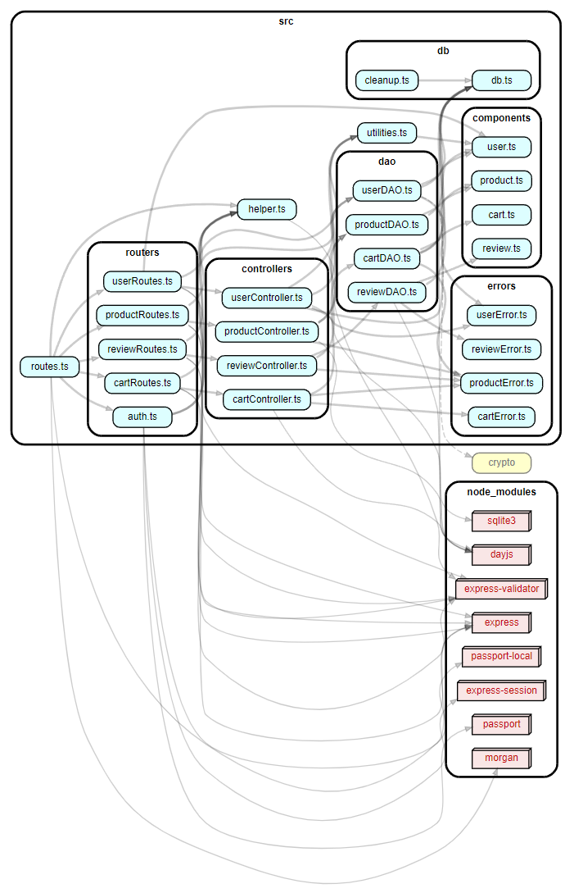
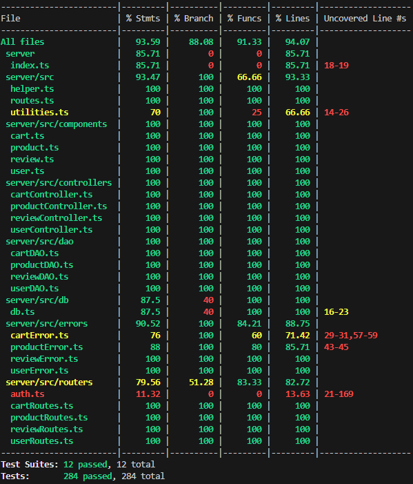

# Test Report

<The goal of this document is to explain how the application was tested, detailing how the test cases were defined and what they cover>

# Contents

- [Test Report](#test-report)
- [Contents](#contents)
- [Dependency graph](#dependency-graph)
- [Integration approach](#integration-approach)
- [Tests](#tests)
- [Coverage](#coverage)
  - [Coverage of FR](#coverage-of-fr)
  - [Coverage white box](#coverage-white-box)

# Dependency graph

  

# Integration approach

    We adopted bottom up integration sequence:

    Step 1: DAO + DB

    Step 2: Controller + DAO + DB

    Step 3: Route + Controller + DAO + DB (API testing)

# Tests

<in the table below list the test cases defined For each test report the object tested, the test level (API, integration, unit) and the technique used to define the test case (BB/ eq partitioning, BB/ boundary, WB/ statement coverage, etc)> <split the table if needed>

| Test case name | Object(s) tested | Test level | Technique used |
| :------------: | :--------------: | :--------: | :------------: |
| UserController > createUser > It should return true | `UserController.createUser` | Unit | White-Box statement/branch/function coverage |
| UserController > getUsers > It should return all users | `UserController.getUsers` | Unit | White-Box statement/branch/function coverage |
| UserController > getUsers > It should return an error | `UserController.getUsers` | Unit | White-Box statement/branch/function coverage |
| UserController > getUsersByRole > It should return all users with a specific role | `UserController.getUsersByRole` | Unit | White-Box statement/branch/function coverage |
| UserController > getUsersByRole > It should return an error | `UserController.getUsers` | Unit | White-Box statement/branch/function coverage |
| UserController > getUserByUsername > It should return the user with a specific username (admin)| `UserController.getUserByUsername` | Unit | White-Box statement/branch/function coverage |
| UserController > getUserByUsername > It should return the user with a specific username (customer)| `UserController.getUserByUsername` | Unit | White-Box statement/branch/function coverage |
| UserController > getUserByUsername > It should return UserNotFoundError | `UserController.getUserByUsername` | Unit | White-Box statement/branch/function coverage |
| UserController > getUserByUsername > It should return UnauthorizedUserError (manager) | `UserController.getUserByUsername` | Unit | White-Box statement/branch/function coverage |
| UserController > getUserByUsername > It should return UnauthorizedUserError (customer) | `UserController.getUserByUsername` | Unit | White-Box statement/branch/function coverage |
| UserController > deleteUser > It should return true (admin) | `UserController.deleteUser` | Unit | White-Box statement/branch/function coverage |
| UserController > deleteUser > It should return true (self-delete) | `UserController.deleteUser` | Unit | White-Box statement/branch/function coverage |
| UserController > deleteUser > It should return UserNotFoundError | `UserController.deleteUser` | Unit | White-Box statement/branch/function coverage |
| UserController > deleteUser > It should return UnauthorizedUserError (manager) | `UserController.deleteUser` | Unit | White-Box statement/branch/function coverage |
| UserController > deleteUser > It should return UnauthorizedUserError (customer) | `UserController.deleteUser` | Unit | White-Box statement/branch/function coverage |
| UserController > deleteUser > It should return UserIsAdminError | `UserController.deleteUser` | Unit | White-Box statement/branch/function coverage |
| UserController > deleteAll > It should return true | `UserController.deleteAll` | Unit | White-Box statement/branch/function coverage |
| UserController > updateUserInfo > It should return the updated user (self-update) | `UserController.updateUserInfo` | Unit | White-Box statement/branch/function coverage |
| UserController > updateUserInfo > It should return the updated user (admin update) | `UserController.updateUserInfo` | Unit | White-Box statement/branch/function coverage |
| UserController > updateUserInfo > It should return UserNotFoundError | `UserController.updateUserInfo` | Unit | White-Box statement/branch/function coverage |
| UserController > updateUserInfo > It should return UnauthorizedUserError (customer update another customer) | `UserController.updateUserInfo` | Unit | White-Box statement/branch/function coverage |
| UserController > updateUserInfo > It should return DateError | `UserController.updateUserInfo` | Unit | White-Box statement/branch/function coverage |
| UserController > updateUserInfo > It should return UnauthorizedUserError (manager update customer) | `UserController.updateUserInfo` | Unit | White-Box statement/branch/function coverage |
| UserController > updateUserInfo > It should return UserIsAdminError | `UserController.updateUserInfo` | Unit | White-Box statement/branch/function coverage |
| UserDAO > getIsUserAuthenticated > It should resolve true | `UserDAO.getIsUserAuthenticated` | Unit | White-Box statement/branch/function coverage |
| UserDAO > getIsUserAuthenticated > It should resolve false | `UserDAO.getIsUserAuthenticated` | Unit | White-Box statement/branch/function coverage |
| UserDAO > getIsUserAuthenticated > It should return an error | `UserDAO.getIsUserAuthenticated` | Unit | White-Box statement/branch/function coverage |
| UserDAO > createUser > It should resolve true | `UserDAO.createUser` | Unit | White-Box statement/branch/function coverage |
| UserDAO > createUser > It should reject UserAlreadyExistsError | `UserDAO.createUser` | Unit | White-Box statement/branch/function coverage |
| UserDAO > getUserByUsername > Should return the user with a specific username | `UserDAO.getUserByUsername` | Unit | White-Box statement/branch/function coverage |
| UserDAO > getUserByUsername > Should reject with an error | `UserDAO.getUserByUsername` | Unit | White-Box statement/branch/function coverage |
| UserDAO > getUserByUsername > Should reject UserNotFoundError | `UserDAO.getUserByUsername` | Unit | White-Box statement/branch/function coverage |
| UserDAO > getUsers > Should return all users | `UserDAO.getUsers` | Unit | White-Box statement/branch/function coverage |
| UserDAO > getUsersByRole > Should return all users with a specific role | `UserDAO.getUsersByRole` | Unit | White-Box statement/branch/function coverage |
| UserDAO > deleteUser > Should delete the user | `UserDAO.deleteUser` | Unit | White-Box statement/branch/function coverage |
| UserDAO > deleteUser > Should reject with an error | `UserDAO.deleteUser` | Unit | White-Box statement/branch/function coverage |
| UserDAO > deleteAll > Should delete all users | `UserDAO.deleteAll` | Unit | White-Box statement/branch/function coverage |
| UserDAO > deleteAll > Should reject with an error | `UserDAO.deleteAll` | Unit | White-Box statement/branch/function coverage |
| UserDAO > userExist > Should return true | `UserDAO.userExist` | Unit | White-Box statement/branch/function coverage |
| UserDAO > userExist > Should reject with an error | `UserDAO.userExist` | Unit | White-Box statement/branch/function coverage |
| UserDAO > updateUserInfo > Should update user info | `UserDAO.updateUserInfo` | Unit | White-Box statement/branch/function coverage |
| UserDAO > updateUserInfo > Should reject with an error | `UserDAO.updateUserInfo` | Unit | White-Box statement/branch/function coverage |
| POST /users > It should return a 200 success code                                | `UserRoutes POST ezelectronics/users`                 | Unit         | White-Box statement/branch/function coverage |
| POST /users > It should return a 422 error code (invalid body)                    | `UserRoutes POST ezelectronics/users`                 | Unit         | White-Box statement/branch/function coverage |
| GET /users > It should return an array of all users                               | `UserRoutes GET ezelectronics/users`                  | Unit         | White-Box statement/branch/function coverage |
| GET /users > It should return an error                                            | `UserRoutes GET ezelectronics/users`                  | Unit         | White-Box statement/branch/function coverage |
| GET /users > It should return a 401 error code (user is not an admin)             | `UserRoutes GET ezelectronics/users`                  | Unit         | White-Box statement/branch/function coverage |
| GET /users/roles/:role > It should return an array of users with a specific role  | `UserRoutes GET ezelectronics/users/roles/:role`      | Unit         | White-Box statement/branch/function coverage |
| GET /users/roles/:role > It should return an error                                | `UserRoutes GET ezelectronics/users/roles/:role`      | Unit         | White-Box statement/branch/function coverage |
| GET /users/roles/:role > It should return a 401 error code (user is not an admin) | `UserRoutes GET ezelectronics/users/roles/:role`      | Unit         | White-Box statement/branch/function coverage |
| GET /users/:username > It should return the user with a specific username        | `UserRoutes GET ezelectronics/users/:username`             | Unit         | White-Box statement/branch/function coverage |
| GET /users/:username > It should return an error                                  | `UserRoutes GET ezelectronics/users/:username`             | Unit         | White-Box statement/branch/function coverage |
| GET /users/:username > It should return a 401 error code (user is not logged in) | `UserRoutes GET ezelectronics/users/:username`             | Unit         | White-Box statement/branch/function coverage |
| DELETE /users/:username > It should return a 200 success code                     | `UserRoutes DELETE ezelectronics/users/:username`          | Unit         | White-Box statement/branch/function coverage |
| DELETE /users/:username > It should return an error                               | `UserRoutes DELETE ezelectronics/users/:username`          | Unit         | White-Box statement/branch/function coverage |
| DELETE /users/:username > It should return a 401 error code (user is not logged in)| `UserRoutes DELETE ezelectronics/users/:username`          | Unit         | White-Box statement/branch/function coverage |
| DELETE /users > It should return a 200 success code                              | `UserRoutes DELETE ezelectronics/users`                    | Unit         | White-Box statement/branch/function coverage |
| DELETE /users > It should return an error                                        | `UserRoutes DELETE ezelectronics/users`                    | Unit         | White-Box statement/branch/function coverage |
| DELETE /users > It should return a 401 error code (user is not an admin)          | `UserRoutes DELETE ezelectronics/users`                    | Unit         | White-Box statement/branch/function coverage |
| PATCH /users/:username > It should return the updated user                      | `UserRoutes PATCH ezelectronics/users/:username`          | Unit         | White-Box statement/branch/function coverage |
| PATCH /users/:username > It should return an error                               | `UserRoutes PATCH ezelectronics/users/:username`          | Unit         | White-Box statement/branch/function coverage |
| PATCH /users/:username > It should return a 401 error code (user is not logged in)| `UserRoutes PATCH ezelectronics/users/:username`          | Unit         | White-Box statement/branch/function coverage |
| PATCH /users/:username > It should return a 422 error code (invalid body)       | `UserRoutes PATCH ezelectronics/users/:username`          | Unit         | White-Box statement/branch/function coverage |
| POST /sessions > It should return the logged in user                            | `UserRoutes POST ezelectronics/sessions`                                      | Unit         | White-Box statement/branch/function coverage |
| POST /sessions > It should return a 422 error code (invalid body)               | `UserRoutes POST ezelectronics/sessions`                                      | Unit         | White-Box statement/branch/function coverage |
| POST /sessions > It should return an error                                       | `UserRoutes POST ezelectronics/sessions`                                      | Unit         | White-Box statement/branch/function coverage |
| DELETE /sessions/current > It should return a 200 status code                    | `UserRoutes DELETE ezelectronics/sessions/current`                                     | Unit         | White-Box statement/branch/function coverage |
| DELETE /sessions/current > It should return an error                    | `UserRoutes DELETE ezelectronics/sessions/current`                                     | Unit         | White-Box statement/branch/function coverage |
| GET /sessions/current > It should return the logged user                         | `UserRoutes GET ezelectronics/sessions/current`                                 | Unit         | White-Box statement/branch/function coverage |
| GET /sessions/current > It should return a 401 error code (user is not logged in)| `UserRoutes GET ezelectronics/sessions/current`                                 | Unit         | White-Box statement/branch/function coverage |
| UserDAO-DB > createUser > It should return true                 | `UserDAO.createUser` `Database`       | Integration | Black-Box, Boundary            |
| UserDAO-DB > getUserByUsername > It should return the user with a specific username | `UserDAO.getUserByUsername` `Database` | Integration | Black-Box, Boundary            |
| UserDAO-DB > getUsers > It should return all users               | `UserDAO.getUsers` `Database`          | Integration | Black-Box, Random              |
| UserDAO-DB > getUsersByRole > It should return all users of a specific role | `UserDAO.getUsersByRole` `Database`    | Integration | Black-Box, Boundary            |
| UserDAO-DB > deleteUser > It should return true                  | `UserDAO.deleteUser` `Database`        | Integration | Black-Box, Boundary            |
| UserDAO-DB > userExist > It should return true                   | `UserDAO.userExist` `Database`         | Integration | Black-Box, Boundary            |
| UserDAO-DB > userExist > It should return false                  | `UserDAO.userExist` `Database`         | Integration | Black-Box, Boundary            |
| UserDAO-DB > updateUserInfo > It should update a specific user info | `UserDAO.updateUserInfo` `Database`    | Integration | Black-Box, Boundary            |
| UserDAO-DB > deleteAll > It should return true                   | `UserDAO.deleteAll` `Database`         | Integration | Black-Box            |
| UserController-UserDAO-DB > createUser > It should add a new user to the database                        | `UserController.createUser` `Database`           | Integration | Black-Box, Boundary |
| UserController-UserDAO-DB > getUsers > It should return all users                                        | `UserController.getUsers` `Database`             | Integration | Black-Box, Random   |
| UserController-UserDAO-DB > getUsersByRole > It should return all users of a specific role               | `UserController.getUsersByRole` `Database`       | Integration | Black-Box, Boundary |
| UserController-UserDAO-DB > getUserByUsername > It should return the user with a specific username | `UserController.getUserByUsername` `Database` | Integration | Black-Box, Boundary |
| UserController-UserDAO-DB > getUserByUsername > It should return UserNotFoundError                  | `UserController.getUserByUsername` `Database` | Integration | Black-Box, Boundary |
| UserController-UserDAO-DB > getUserByUsername > It should return UnauthorizedUserError (manager)     | `UserController.getUserByUsername` `Database` | Integration | Black-Box, Boundary |
| UserController-UserDAO-DB > getUserByUsername > It should return UnauthorizedUserError (customer)    | `UserController.getUserByUsername` `Database` | Integration | Black-Box, Boundary |
| UserController-UserDAO-DB > updateUserInfo > It should return UserNotFoundError                           | `UserController.updateUserInfo` `Database`      | Integration | Black-Box, Boundary |
| UserController-UserDAO-DB > updateUserInfo > It should return UnauthorizedUserError (customer update another customer) | `UserController.updateUserInfo` `Database`      | Integration | Black-Box, Boundary |
| UserController-UserDAO-DB > updateUserInfo > It should return UnauthorizedUserError (manager update customer) | `UserController.updateUserInfo` `Database`      | Integration | Black-Box, Boundary |
| UserController-UserDAO-DB > updateUserInfo > It should return DateError                                  | `UserController.updateUserInfo` `Database`      | Integration | Black-Box, Boundary |
| UserController-UserDAO-DB > deleteUser > It should return UnauthorizedUserError (manager)                 | `UserController.deleteUser` `Database`           | Integration | Black-Box, Boundary |
| UserController-UserDAO-DB > deleteUser > It should return UnauthorizedUserError (customer)                | `UserController.deleteUser` `Database`           | Integration | Black-Box, Boundary |
| UserController-UserDAO-DB > deleteUser > It should return UnauthorizedUserError (self-delete)             | `UserController.deleteUser` `Database`           | Integration | Black-Box, Boundary |
| UserController-UserDAO-DB > deleteUser > It should return UserIsAdminError                               | `UserController.deleteUser` `Database`           | Integration | Black-Box, Boundary |
| UserController-UserDAO-DB > deleteUser > It should delete a specific user from the database              | `UserController.deleteUser` `Database`           | Integration | Black-Box, Boundary |
| UserController-UserDAO-DB > deleteAll > It should delete all users from the database                       | `UserController.deleteAll` `Database`            | Integration | Black-Box            |
| UserRoute-UserController-UserDAO-DB > POST /users > It should return a 200 success code                | `UserRoutes POST /users`                      | API | Black-Box, Boundary   |
| UserRoute-UserController-UserDAO-DB > POST /users > It should return a 422 error code (invalid body)   | `UserRoutes POST /users`                      | API | Black-Box, Boundary   |
| UserRoute-UserController-UserDAO-DB > POST /users > It should return a 409 error code if username already exists   | `UserRoutes POST /users`                      | API | Black-Box, Boundary   |
| UserRoute-UserController-UserDAO-DB > POST /sessions > It should log in a user and return it           | `UserRoutes POST /sessions`                   | API | Black-Box, Boundary   |
| UserRoute-UserController-UserDAO-DB > POST /sessions > It should return a 422 error code (invalid body)| `UserRoutes POST /sessions`                   | API | Black-Box, Boundary   |
| UserRoute-UserController-UserDAO-DB > POST /sessions > It should return a 401 error code if username or password are wrong| `UserRoutes POST /sessions`                   | API | Black-Box, Boundary   |
| UserRoute-UserController-UserDAO-DB > GET /sessions/current > It should return the logged in user      | `UserRoutes GET /sessions/current`            | API | Black-Box, Boundary   |
| UserRoute-UserController-UserDAO-DB > GET /sessions/current > It should return a 401 error code if the user is not logged in | `UserRoutes GET /sessions/current` | API | Black-Box, Boundary   |
| UserRoute-UserController-UserDAO-DB > GET /users > It should return an array of users                  | `UserRoutes GET /users`                       | API | Black-Box, Random  |
| UserRoute-UserController-UserDAO-DB > GET /users > It should return a 401 error code if the user is not an Admin | `UserRoutes GET /users`             | API | Black-Box, Random   |
| UserRoute-UserController-UserDAO-DB > DELETE /sessions/current > It should log out a user              | `UserRoutes DELETE /sessions/current`         | API | Black-Box, Boundary   |
| UserRoute-UserController-UserDAO-DB > DELETE /sessions/current > It should return a 401 error code if the user is not logged in | `UserRoutes DELETE /sessions/current` | API | Black-Box, Boundary   |
| UserRoute-UserController-UserDAO-DB > GET /users/roles/:role > It should return an array of users with a specific role | `UserRoutes GET /users/roles/:role` | API | Black-Box, Boundary   |
| UserRoute-UserController-UserDAO-DB > GET /users/roles/:role > It should fail if the role is not valid | `UserRoutes GET /users/roles/:role`          | API | Black-Box, Boundary   |
| UserRoute-UserController-UserDAO-DB > GET /users/roles/:role > It should return a 401 error code if the user is not an Admin | `UserRoutes GET /users/roles/:role` | API | Black-Box, Boundary   |
| UserRoute-UserController-UserDAO-DB > GET /users/:username > It should return a user with a specific username | `UserRoutes GET /users/:username` | API | Black-Box, Boundary   |
| UserRoute-UserController-UserDAO-DB > GET /users/:username > It should return a 401 error code if the user is not logged in | `UserRoutes GET /users/:username` | API | Black-Box, Boundary   |
| UserRoute-UserController-UserDAO-DB > GET /users/:username > It should return a 404 error code if the user does not exist | `UserRoutes GET /users/:username` | API | Black-Box, Boundary   |
| UserRoute-UserController-UserDAO-DB > GET /users/:username > It should return a 401 error code if user (no Admin) is not the logged one | `UserRoutes GET /users/:username` | API | Black-Box, Boundary   |
| UserRoute-UserController-UserDAO-DB > PATCH /users/:username > It should update a specific user info and return it | `UserRoutes PATCH /users/:username` | API | Black-Box, Boundary   |
| UserRoute-UserController-UserDAO-DB > PATCH /users/:username > It should return a 401 error code if the user is not logged in | `UserRoutes PATCH /users/:username` | API | Black-Box, Boundary   |
| UserRoute-UserController-UserDAO-DB > PATCH /users/:username > It should return a 422 error code if at least one request body parameter is empty/missing | `UserRoutes PATCH /users/:username` | API | Black-Box, Boundary   |
| UserRoute-UserController-UserDAO-DB > PATCH /users/:username > It should return a 400 error code if date is invalid | `UserRoutes PATCH /users/:username` | API | Black-Box, Boundary   |
| UserRoute-UserController-UserDAO-DB > PATCH /users/:username > It should return a 404 error code if the user does not exist | `UserRoutes PATCH /users/:username` | API | Black-Box, Boundary   |
| UserRoute-UserController-UserDAO-DB > PATCH /users/:username > It should return a 401 error code if user is not the logged one | `UserRoutes PATCH /users/:username` | API | Black-Box, Boundary   |
| UserRoute-UserController-UserDAO-DB > DELETE /users/:username > It should return a 200 success code and delete a specific user | `UserRoutes DELETE /users/:username` | API | Black-Box, Boundary   |
| UserRoute-UserController-UserDAO-DB > DELETE /users/:username > It should return a 401 error code if the user is not logged in | `UserRoutes DELETE /users/:username` | API | Black-Box, Boundary   |
| UserRoute-UserController-UserDAO-DB > DELETE /users/:username > It should return a 404 error code if the user does not exist | `UserRoutes DELETE /users/:username` | API | Black-Box, Boundary   |
| UserRoute-UserController-UserDAO-DB > DELETE /users/:username > It should return a 401 error code if user (no Admin) is not the logged one | `UserRoutes DELETE /users/:username` | API | Black-Box, Boundary   |
| UserRoute-UserController-UserDAO-DB > DELETE /users/:username > It should return a 401 error code if an Admin wants to delete another Admin | `UserRoutes DELETE /users/:username` | API | Black-Box, Boundary   |
| UserRoute-UserController-UserDAO-DB > DELETE /users > It should return a 200 success code and delete all users | `UserRoutes DELETE /users`              | API | Black-Box   |
| UserRoute-UserController-UserDAO-DB > DELETE /users > It should return a 401 error code if the user is not an Admin | `UserRoutes DELETE /users`           | API | Black-Box   |
| CartController > addToCart > Should return true (product not already in cart)           | `CartController.addToCart`     | Unit       | White-Box statement/branch/function coverage |
| CartController > addToCart > Should return true (product already in cart)          | `CartController.addToCart`     | Unit       | White-Box statement/branch/function coverage |
| CartController > addToCart > Should return true (user doesn't have a cart)          | `CartController.addToCart`     | Unit       | White-Box statement/branch/function coverage |
| CartController > addToCart > Should return EmptyProductStockError          | `CartController.addToCart`     | Unit       | White-Box statement/branch/function coverage |
| CartController > addToCart > Should return ProductNotFoundError          | `CartController.addToCart`     | Unit       | White-Box statement/branch/function coverage |
| CartController > addToCart > Should return an error          | `CartController.addToCart`     | Unit       | White-Box statement/branch/function coverage |
| CartController > getCart > Should return the cart          | `CartController.getCart`     | Unit       | White-Box statement/branch/function coverage |
| CartController > getCart > Should return an empty cart           | `CartController.getCart`     | Unit       | White-Box statement/branch/function coverage |
| CartController > getCart > Should return an error          | `CartController.getCart`     | Unit       | White-Box statement/branch/function coverage |
| CartController > checkoutCart > Should return true          | `CartController.checkoutCart`     | Unit       | White-Box statement/branch/function coverage  |
| CartController > checkoutCart > Should return CartNotFoundError          | `CartController.checkoutCart`     | Unit       | White-Box statement/branch/function coverage  |
| CartController > checkoutCart > Should return EmptyCartError          | `CartController.checkoutCart`     | Unit       | White-Box statement/branch/function coverage  |
| CartController > checkoutCart > Should return EmptyProductStockError          | `CartController.checkoutCart`     | Unit       | White-Box statement/branch/function coverage  |
| CartController > checkoutCart > Should return LowProductStockError          | `CartController.checkoutCart`     | Unit       | White-Box statement/branch/function coverage  |
| CartController > checkoutCart > Should return an error          | `CartController.checkoutCart`     | Unit       | White-Box statement/branch/function coverage  |
| CartController > getCustomerCarts > Should return the carts          | `CartController.getCustomerCarts`     | Unit       | White-Box statement/branch/function coverage  |
| CartController > getCustomerCarts > Should return an empty array          | `CartController.getCustomerCarts`     | Unit       | White-Box statement/branch/function coverage  |
| CartController > getCustomerCarts > Should return an error          | `CartController.getCustomerCarts`     | Unit       | White-Box statement/branch/function coverage  |
| CartController > removeProductFromCart > Should return true          | `CartController.removeProductFromCart`     | Unit       | White-Box statement/branch/function coverage  |
| CartController > removeProductFromCart > Should return ProductNotInCartError          | `CartController.removeProductFromCart`     | Unit       | White-Box statement/branch/function coverage  |
| CartController > removeProductFromCart > Should return CartNotFoundError          | `CartController.removeProductFromCart`     | Unit       | White-Box statement/branch/function coverage  |
| CartController > removeProductFromCart > Should return an error          | `CartController.removeProductFromCart`     | Unit       | White-Box statement/branch/function coverage  |
| CartController > clearCart > Should return true          | `CartController.clearCart`     | Unit       | White-Box statement/branch/function coverage  |
| CartController > clearCart > Should return CartNotFoundError          | `CartController.clearCart`     | Unit       | White-Box statement/branch/function coverage  |
| CartController > clearCart > Should return an error          | `CartController.clearCart`     | Unit       | White-Box statement/branch/function coverage  |
| CartController > deleteAllCarts > Should return true          | `CartController.deleteAllCarts`     | Unit       | White-Box statement/branch/function coverage  |
| CartController > deleteAllCarts > Should return an error          | `CartController.deleteAllCarts`     | Unit       | White-Box statement/branch/function coverage  |
| CartController > getAllCarts > Should return the carts          | `CartController.getAllCarts`     | Unit       | White-Box statement/branch/function coverage  |
| CartController > getAllCarts > Should return an empty array          | `CartController.getAllCarts`     | Unit       | White-Box statement/branch/function coverage  |
| CartController > getAllCarts > Should return an error          | `CartController.getAllCarts`     | Unit       | White-Box statement/branch/function coverage  |
| CartDAO > getPaidCarts > Should return a list of paid carts          | `CartDAO.getPaidCarts`     | Unit       | White-Box statement/branch/function coverage  |
| CartDAO > getPaidCarts > Should reject with an error          | `CartDAO.getPaidCarts`     | Unit       | White-Box statement/branch/function coverage  |
| CartDAO > getProduct > Should return a product          | `CartDAO.getProduct`     | Unit       | White-Box statement/branch/function coverage  |
| CartDAO > getProduct > Should return a product          | `CartDAO.getProduct`     | Unit       | White-Box statement/branch/function coverage  |
| CartDAO > hasCurrCart > Should return true          | `CartDAO.hasCurrCart`     | Unit       | White-Box statement/branch/function coverage  |
| CartDAO > hasCurrCart > Should return false          | `CartDAO.hasCurrCart`     | Unit       | White-Box statement/branch/function coverage  |
| CartDAO > hasCurrCart > Should reject with an error          | `CartDAO.hasCurrCart`     | Unit       | White-Box statement/branch/function coverage  |
| CartDAO > addEmptyCart > Should add an empty cart          | `CartDAO.addEmptyCart`     | Unit       | White-Box statement/branch/function coverage  |
| CartDAO > addEmptyCart > Should reject with an error          | `CartDAO.addEmptyCart`     | Unit       | White-Box statement/branch/function coverage  |
| CartDAO > getCurrCart > Should return the current cart          | `CartDAO.getCurrCart`     | Unit       | White-Box statement/branch/function coverage  |
| CartDAO > getCurrCart > Should return an empty cart          | `CartDAO.getCurrCart`     | Unit       | White-Box statement/branch/function coverage  |
| CartDAO > getCurrCart > Should reject with an error          | `CartDAO.getCurrCart`     | Unit       | White-Box statement/branch/function coverage  |
| CartDAO > getCurrCartId > Should return the cart id          | `CartDAO.getCurrCartId`     | Unit       | White-Box statement/branch/function coverage  |
| CartDAO > getCurrCartId > Should reject with an error          | `CartDAO.getCurrCartId`     | Unit       | White-Box statement/branch/function coverage  |
| CartDAO > addProductInCart > Should add a product to the cart          | `CartDAO.addProductInCart`     | Unit       | White-Box statement/branch/function coverage  |
| CartDAO > addProductInCart > Should reject with an error          | `CartDAO.addProductInCart`     | Unit       | White-Box statement/branch/function coverage  |
| CartDAO > emptyCart > Should empty the cart          | `CartDAO.emptyCart`     | Unit       | White-Box statement/branch/function coverage  |
| CartDAO > emptyCart > Should reject with an error          | `CartDAO.emptyCart`     | Unit       | White-Box statement/branch/function coverage  |
| CartDAO > updateQuantity > Should update the quantity of a product in the cart          | `CartDAO.updateQuantity`     | Unit       | White-Box statement/branch/function coverage  |
| CartDAO > updateQuantity > Should reject with an error          | `CartDAO.updateQuantity`     | Unit       | White-Box statement/branch/function coverage  |
| CartDAO > updateTotal > Should update the total of the cart          | `CartDAO.updateTotal`     | Unit       | White-Box statement/branch/function coverage  |
| CartDAO > updateTotal > Should reject with an error          | `CartDAO.updateTotal`     | Unit       | White-Box statement/branch/function coverage  |
| CartDAO > isProductInCart > Should return true          | `CartDAO.isProductInCart`     | Unit       | White-Box statement/branch/function coverage  |
| CartDAO > isProductInCart > Should return false          | `CartDAO.isProductInCart`     | Unit       | White-Box statement/branch/function coverage  |
| CartDAO > isProductInCart > Should reject with an error          | `CartDAO.isProductInCart`     | Unit       | White-Box statement/branch/function coverage  |
| CartDAO > updateStock > Should update the stock of a product          | `CartDAO.updateStock`     | Unit       | White-Box statement/branch/function coverage  |
| CartDAO > updateStock > Should reject with an error          | `CartDAO.updateStock`     | Unit       | White-Box statement/branch/function coverage  |
| CartDAO > setPayment > Should update the stock of a product          | `CartDAO.setPayment`     | Unit       | White-Box statement/branch/function coverage  |
| CartDAO > setPayment > Should reject with an error          | `CartDAO.setPayment`     | Unit       | White-Box statement/branch/function coverage  |
| CartDAO > deleteCarts > Should delete all carts          | `CartDAO.deleteCarts`     | Unit       | White-Box statement/branch/function coverage  |
| CartDAO > deleteCarts > Should reject with an error          | `CartDAO.deleteCarts`     | Unit       | White-Box statement/branch/function coverage  |
| CartDAO > getCarts > Should return a list of carts          | `CartDAO.getCarts`     | Unit       | White-Box statement/branch/function coverage  |
| CartDAO > getCarts > Should reject with an error          | `CartDAO.getCarts`     | Unit       | White-Box statement/branch/function coverage  |
| GET /carts > It should return a 200 success code          | `CartRoutes GET ezelectronics/carts`     | Unit       | White-Box statement/branch/function coverage  |
| GET /carts > It should return a 401 error code (user not logged in)          | `CartRoutes GET ezelectronics/carts`     | Unit       | White-Box statement/branch/function coverage  |
| GET /carts > It should return a 401 error code (user is not a customer)          | `CartRoutes GET ezelectronics/carts`     | Unit       | White-Box statement/branch/function coverage  |
| GET /carts > It should return an error          | `CartRoutes GET ezelectronics/carts`     | Unit       | White-Box statement/branch/function coverage  |
| POST /carts > It should return a 200 success code          | `CartRoutes POST ezelectronics/carts`     | Unit       | White-Box statement/branch/function coverage  |
| POST /carts > It should return a 401 error code (user not logged in)          | `CartRoutes POST ezelectronics/carts`     | Unit       | White-Box statement/branch/function coverage  |
| POST /carts > It should return a 401 error code (user is not a customer)          | `CartRoutes POST ezelectronics/carts`     | Unit       | White-Box statement/branch/function coverage  |
| POST /carts > It should return a 422 error code (missing model)          | `CartRoutes POST ezelectronics/carts`     | Unit       | White-Box statement/branch/function coverage  |
| POST /carts > It should return an error          | `CartRoutes POST ezelectronics/carts`     | Unit       | White-Box statement/branch/function coverage  |
| PATCH /carts > It should return a 200 success code          | `CartRoutes PATCH ezelectronics/carts`     | Unit       | White-Box statement/branch/function coverage  |
| PATCH /carts > It should return a 401 error code (user not logged in)          | `CartRoutes PATCH ezelectronics/carts`     | Unit       | White-Box statement/branch/function coverage  |
| PATCH /carts > It should return a 401 error code (user is not a customer)          | `CartRoutes PATCH ezelectronics/carts`     | Unit       | White-Box statement/branch/function coverage  |
| PATCH /carts > It should return an error          | `CartRoutes PATCH ezelectronics/carts`     | Unit       | White-Box statement/branch/function coverage  |
| GET /carts/history > It should return a 200 success code          | `CartRoutes GET ezelectronics/carts/history`     | Unit       | White-Box statement/branch/function coverage  |
| GET /carts/history > It should return a 401 error code (user not logged in)          | `CartRoutes GET ezelectronics/carts/history`     | Unit       | White-Box statement/branch/function coverage  |
| GET /carts/history > It should return a 401 error code (user is not a customer)          | `CartRoutes GET ezelectronics/carts/history`     | Unit       | White-Box statement/branch/function coverage  |
| GET /carts/history > It should return an error          | `CartRoutes GET ezelectronics/carts/history`     | Unit       | White-Box statement/branch/function coverage  |
| DELETE /carts/products/:model > It should return a 200 success code| `CartRoutes DELETE ezelectronics/carts/products/:model`     | Unit       | White-Box statement/branch/function coverage  |
| DELETE /carts/products/:model > It should return a 401 error code (user not logged in)| `CartRoutes DELETE ezelectronics/carts/products/:model`     | Unit       | White-Box statement/branch/function coverage  |
| DELETE /carts/products/:model > It should return a 401 error code (user is not a customer)| `CartRoutes DELETE ezelectronics/carts/products/:model`     | Unit       | White-Box statement/branch/function coverage  |
| DELETE /carts/products/:model > It should return an error| `CartRoutes DELETE ezelectronics/carts/products/:model`     | Unit       | White-Box statement/branch/function coverage  |
| DELETE /carts/current > It should return a 200 success code| `CartRoutes DELETE ezelectronics/carts/current`     | Unit       | White-Box statement/branch/function coverage  |
| DELETE /carts/current > It should return a 401 error code (user not logged in)| `CartRoutes DELETE ezelectronics/carts/current`     | Unit       | White-Box statement/branch/function coverage  |
| DELETE /carts/current > It should return a 401 error code (user is not a customer)| `CartRoutes DELETE ezelectronics/carts/current`     | Unit       | White-Box statement/branch/function coverage  |
| DELETE /carts/current > It should return an error| `CartRoutes DELETE ezelectronics/carts/current`     | Unit       | White-Box statement/branch/function coverage  |
| DELETE /carts > It should return a 200 success code | `CartRoutes DELETE ezelectronics/carts`     | Unit       | White-Box statement/branch/function coverage  |
| DELETE /carts > It should return a 401 error code (user not logged in) | `CartRoutes DELETE ezelectronics/carts`     | Unit       | White-Box statement/branch/function coverage  |
| DELETE /carts > It should return a 401 error code (user is not a manager or admin) | `CartRoutes DELETE ezelectronics/carts`     | Unit       | White-Box statement/branch/function coverage  |
| DELETE /carts > It should return an error | `CartRoutes DELETE ezelectronics/carts`     | Unit       | White-Box statement/branch/function coverage  |
| GET /carts/all > It should return a 200 success code          | `CartRoutes GET ezelectronics/carts/all`     | Unit       | White-Box statement/branch/function coverage  |
| GET /carts/all > It should return a 401 error code (user not logged in)          | `CartRoutes GET ezelectronics/carts/all`     | Unit       | White-Box statement/branch/function coverage  |
| GET /carts/all > It should return a 401 error code (user is not a manager or admin)          | `CartRoutes GET ezelectronics/carts/all`     | Unit       | White-Box statement/branch/function coverage  |
| GET /carts/all > It should return an error          | `CartRoutes GET ezelectronics/carts/all`     | Unit       | White-Box statement/branch/function coverage  |
| CartDAO-DB > getPaidCarts > No paid carts| `cartDAO.getPaidCarts` `Database` | Integration | Black box random |
| CartDAO-DB > getPaidCarts > Should return a cart list| `cartDAO.getPaidCarts` `Database` | Integration | Black box boundary |
| CartDAO-DB > getProduct > Should return a product| `cartDAO.getProduct` `Database` | Integration | Black box random |
| CartDAO-DB > getProduct > Should return a ProductNotFoundError| `cartDAO.getProduct` `Database` | Integration | Black box boundary |
| CartDAO-DB > hasCurrCart > Should return true| `cartDAO.hasCurrCart` `Database` | Integration | Black box random |
| CartDAO-DB > hasCurrCart > Should return false| `cartDAO.hasCurrCart` `Database` | Integration | Black box random |
| CartDAO-DB > getCurrCart > Should return the current cart| `cartDAO.getCurrCart` `Database` | Integration | Black box random |
| CartDAO-DB > getCurrCart > Should return an empty cart| `cartDAO.getCurrCart` `Database` | Integration | Black box boundary |
| CartDAO-DB > addEmptyCart > Should add an empty cart| `cartDAO.addEmptyCart` `cartDAO.hasCurrCart` `Database` | Integration | Black box random |
| CartDAO-DB > getCurrCartId > Should return the cart id | `cartDAO.getCurrCartId` `Database` | Integration | Black box random |
| CartDAO-DB > addProductInCart > Should add a product to the cart| `cartDAO.addProductInCart` `cartDAO.isProductInCart` `Database` | Integration | Black box random |
| CartDAO-DB > emptyCart > Should empty the cart| `cartDAO.emptyCart` `cartDAO.isProductInCart` `Database` | Integration | Black box random |
| CartDAO-DB > updateQuantity > Should update the quantity of a product in the cart| `cartDAO.updateQuantity` `cartDAO.getCurrCart` `Database` | Integration | Black box random |
| CartDAO-DB > updateTotal > Should update the total of the cart| `cartDAO.updateTotal` `cartDAO.getCurrCart` `Database` | Integration | Black box random |
| CartDAO-DB > isProductInCart > Should return true| `cartDAO.isProductInCart` `Database` | Integration | Black box random |
| CartDAO-DB > isProductInCart > Should return false| `cartDAO.isProductInCart` `Database` | Integration | Black box random |
| CartDAO-DB > checkoutCart > Should update the stock of a product| `cartDAO.updateStock` `cartDAO.setPayment` `cartDAO.hasCurrCart` `cartDAO.getPaidCarts` `Database` | Integration | Black box random |
| CartDAO-DB > getCarts > Should return a list of carts| `cartDAO.getCarts` `Database` | Integration | Black box boundary |
| CartDAO-DB > deleteCarts > Should delete all carts| `cartDAO.deleteCarts` `cartDAO.getCarts` `Database` | Integration | Black box |
| CartController-CartDAO-DB > Add products to the cart | `cartController.addToCart` `cartController.getCart` `CartDAO` `Database`| Integration | Black box random |
| CartController-CartDAO-DB > Add the same product to the cart | `cartController.addToCart` `cartController.getCart` `CartDAO` `Database`| Integration | Black box boundary|
| CartController-CartDAO-DB > Add a product with no stock to the cart | `cartController.addToCart` | Integration | Black box boundary|
| CartController-CartDAO-DB > Checkout the cart | `cartController.checkoutCart` `cartController.getCart` `cartController.getCustomerCarts` `CartDAO` `Database`| Integration | Black box random|
| CartController-CartDAO-DB > Checkout a non-existing cart | `cartController.checkoutCart` `CartDAO` `Database`| Integration | Black box boundary|
| CartController-CartDAO-DB > Checkout an empty cart |`cartController.checkoutCart` `cartController.addToCart` `cartController.clearCart` `CartDAO` `Database`| Integration | Black box boundary|
| CartController-CartDAO-DB > Checkout a cart with product quantity greater than stock |`cartController.checkoutCart` `cartController.addToCart` `CartDAO` `Database` | Integration | Black box boundary|
| CartController-CartDAO-DB > Remove a product from the cart | `cartController.removeProductFromCart` `cartController.addToCart` `cartController.getCart` `CartDAO` `Database`| Integration | Black box random|
| CartController-CartDAO-DB > Remove a non-existing product from the cart | `cartController.removeProductFromCart` `CartDAO` `Database`| Integration | Black box boundary|
| CartController-CartDAO-DB > Remove a product that is not in the cart | `cartController.removeProductFromCart` `cartController.addToCart` `CartDAO` `Database`| Integration | Black box boundary|
| CartController-CartDAO-DB > Remove a product from an empty cart | `cartController.removeProductFromCart` `cartController.clearCart` `CartDAO` `Database`| Integration | Black box boundary|
| CartController-CartDAO-DB > Remove product from a non-existing cart |`cartController.removeProductFromCart` `CartDAO` `Database` | Integration | Black box boundary|
| CartController-CartDAO-DB > Clear cart that does not exist | `cartController.clearCart` `CartDAO` `Database`| Integration | Black box boundary|
| CartController-CartDAO-DB > Get all carts | `cartController.getAllCarts` `CartDAO` `Database`| Integration | Black box random|
| CartController-CartDAO-DB > Delete all carts | `cartController.deleteAllCarts` `cartController.getAllCarts` `CartDAO` `Database`| Integration | Black box |
| CartRoutes-CartController-CartDAO-DB > POST /carts > Expect 200 success code and cart insertion | `CartRoutes POST /carts` `CartController` `CartDAO` `Database` | API | Black box random|
| CartRoutes-CartController-CartDAO-DB > POST /carts > Expect 401 unauthorized code (admin) | `CartRoutes POST /carts` `CartController` `CartDAO` `Database` | API | Black box boundary |
| CartRoutes-CartController-CartDAO-DB > POST /carts > Expect 401 unauthorized code (manager) | `CartRoutes POST /carts` `CartController` `CartDAO` `Database` | API | Black box boundary |
| CartRoutes-CartController-CartDAO-DB > POST /carts > Expect 401 unauthorized code (not logged in) | `CartRoutes POST /carts` `CartController` `CartDAO` `Database` | API | Black box boundary |
| CartRoutes-CartController-CartDAO-DB > POST /carts > Expect 404 error | `CartRoutes POST /carts` `CartController` `CartDAO` `Database` | API | Black box boundary |
| CartRoutes-CartController-CartDAO-DB > POST /carts > Expect 409 error | `CartRoutes POST /carts` `CartController` `CartDAO` `Database` | API | Black box boundary |
| CartRoutes-CartController-CartDAO-DB > GET /carts > Expect 200 success code and the cart | `CartRoutes GET /carts` `CartController` `CartDAO` `Database` | API | Black box random |
| CartRoutes-CartController-CartDAO-DB > GET /carts > Expect 401 unauthorized code (admin) | `CartRoutes GET /carts` `CartController` `CartDAO` `Database` | API | Black box boundary |
| CartRoutes-CartController-CartDAO-DB > GET /carts > Expect 401 unauthorized code (manager) | `CartRoutes GET /carts` `CartController` `CartDAO` `Database` | API | Black box boundary |
| CartRoutes-CartController-CartDAO-DB > GET /carts > Expect 401 unauthorized code (not logged in) | `CartRoutes GET /carts` `CartController` `CartDAO` `Database` | API | Black boxboundary  |
| CartRoutes-CartController-CartDAO-DB > GET /carts > Expect 200 success code and empty cart | `CartRoutes GET /carts` `CartController` `CartDAO` `Database` | API | Black box boundary |
| CartRoutes-CartController-CartDAO-DB > PATCH /carts > Expect 200 success code and cart checkout | `CartRoutes PATCH /carts` `CartController` `CartDAO` `Database` | API | Black box random|
| CartRoutes-CartController-CartDAO-DB > PATCH /carts > Expect 401 unauthorized code (admin) | `CartRoutes PATCH /carts` `CartController` `CartDAO` `Database` | API | Black box boundary |
| CartRoutes-CartController-CartDAO-DB > PATCH /carts > Expect 401 unauthorized code (manager) | `CartRoutes PATCH /carts` `CartController` `CartDAO` `Database` | API | Black box boundary |
| CartRoutes-CartController-CartDAO-DB > PATCH /carts > Expect 401 unauthorized code (not logged in) | `CartRoutes PATCH /carts` `CartController` `CartDAO` `Database` | API | Black box boundary |
| CartRoutes-CartController-CartDAO-DB > PATCH /carts > Expect 404 error | `CartRoutes PATCH /carts` `CartController` `CartDAO` `Database` | API | Black box boundary |
| CartRoutes-CartController-CartDAO-DB > PATCH /carts > Expect 400 error | `CartRoutes PATCH /carts` `CartController` `CartDAO` `Database` | API | Black box boundary |
| CartRoutes-CartController-CartDAO-DB > PATCH /carts > Expect 409 error | `CartRoutes PATCH /carts` `CartController` `CartDAO` `Database` | API | Black box boundary |
| CartRoutes-CartController-CartDAO-DB > GET /carts/history > Expect 200 success code and the cart history | `CartRoutes GET /carts/history` `CartController` `CartDAO` `Database` | API | Black box random|
| CartRoutes-CartController-CartDAO-DB > GET /carts/history > Expect 401 unauthorized code (admin) | `CartRoutes GET /carts/history` `CartController` `CartDAO` `Database` | API | Black box boundary |
| CartRoutes-CartController-CartDAO-DB > GET /carts/history > Expect 401 unauthorized code (manager) | `CartRoutes GET /carts/history` `CartController` `CartDAO` `Database` | API | Black box boundary |
| CartRoutes-CartController-CartDAO-DB > GET /carts/history > Expect 401 unauthorized code (not logged in) | `CartRoutes GET /carts/history` `CartController` `CartDAO` `Database` | API | Black box boundary |
| CartRoutes-CartController-CartDAO-DB > DELETE /carts/current > Expect 200 success code and cart deletion | `CartRoutes DELETE /carts/current` `CartController` `CartDAO` `Database` | API | Black box random|
| CartRoutes-CartController-CartDAO-DB > DELETE /carts/current > Expect 401 unauthorized code (admin) | `CartRoutes DELETE /carts/current` `CartController` `CartDAO` `Database` | API | Black box boundary |
| CartRoutes-CartController-CartDAO-DB > DELETE /carts/current > Expect 401 unauthorized code (manager) | `CartRoutes DELETE /carts/current` `CartController` `CartDAO` `Database` | API | Black box boundary |
| CartRoutes-CartController-CartDAO-DB > DELETE /carts/current > Expect 401 unauthorized code (not logged in) | `CartRoutes DELETE /carts/current` `CartController` `CartDAO` `Database` | API | Black box boundary |
| CartRoutes-CartController-CartDAO-DB > DELETE /carts/current > Expect 404 error | `CartRoutes DELETE /carts/current` `CartController` `CartDAO` `Database` | API | Black box boundary |
| CartRoutes-CartController-CartDAO-DB > DELETE /carts/products/:model > Expect 200 success code and product deletion | `CartRoutes DELETE /carts/products/:model` `CartController` `CartDAO` `Database` | API | Black box random |
| CartRoutes-CartController-CartDAO-DB > DELETE /carts/products/:model > Expect 401 unauthorized code (admin) | `CartRoutes DELETE /carts/products/:model` `CartController` `CartDAO` `Database` | API | Black box boundary |
| CartRoutes-CartController-CartDAO-DB > DELETE /carts/products/:model > Expect 401 unauthorized code (manager) | `CartRoutes DELETE /carts/products/:model` `CartController` `CartDAO` `Database` | API | Black box boundary |
| CartRoutes-CartController-CartDAO-DB > DELETE /carts/products/:model > Expect 401 unauthorized code (not logged in) | `CartRoutes DELETE /carts/products/:model` `CartController` `CartDAO` `Database` | API | Black box boundary |
| CartRoutes-CartController-CartDAO-DB > DELETE /carts/products/:model > Expect 404 error (product not in cart) | `CartRoutes DELETE /carts/products/:model` `CartController` `CartDAO` `Database` | API | Black box |
| CartRoutes-CartController-CartDAO-DB > DELETE /carts/products/:model > Expect 404 error (product that doesn't exist) | `CartRoutes DELETE /carts/products/:model` `CartController` `CartDAO` `Database` | API | Black box boundary |
| CartRoutes-CartController-CartDAO-DB > DELETE /carts/products/:model > Expect 404 error (no current cart) | `CartRoutes DELETE /carts/products/:model` `CartController` `CartDAO` `Database` | API | Black box boundary |
| CartRoutes-CartController-CartDAO-DB > GET /carts/all > Expect 200 success code and all carts | `CartRoutes GET /carts/all` `CartController` `CartDAO` `Database` | API | Black box random|
| CartRoutes-CartController-CartDAO-DB > GET /carts/all > Expect 401 unauthorized code (customer) | `CartRoutes GET /carts/all` `CartController` `CartDAO` `Database` | API | Black box boundary |
| CartRoutes-CartController-CartDAO-DB > GET /carts/all > Expect 401 unauthorized code (not logged in) | `CartRoutes GET /carts/all` `CartController` `CartDAO` `Database` | API | Black box boundary |
| CartRoutes-CartController-CartDAO-DB > DELETE /carts > Expect 200 success code and all carts deletion | `CartRoutes DELETE /carts` `CartController` `CartDAO` `Database` | API | Black box random|
| CartRoutes-CartController-CartDAO-DB > DELETE /carts > Expect 401 unauthorized code (customer) | `CartRoutes DELETE /carts` `CartController` `CartDAO` `Database` | API | Black box boundary |
| CartRoutes-CartController-CartDAO-DB > DELETE /carts > Expect 401 unauthorized code (not logged in) | `CartRoutes DELETE /carts` `CartController` `CartDAO` `Database` | API | Black box boundary |
| ProductController > registerProducts > should add a new product (product non already in the list) | `ProductController.registerProducts` | Unit | White-Box statement/branch/function coverage |
| ProductController > registerProducts > should return ProductAlreadyExistsError | `ProductController.registerProducts` | Unit | White-Box statement/branch/function coverage |
| ProductController > registerProducts > should return DateError | `ProductController.registerProducts` | Unit | White-Box statement/branch/function coverage |
| ProductController > registerProducts > should assign current date if arrivalDate is null | `ProductController.registerProducts` | Unit | White-Box statement/branch/function coverage |
| ProductController > registerProducts > should return an Error | `ProductController.registerProducts` | Unit | White-Box statement/branch/function coverage |
| ProductController > changeProductQuantity > should return the new available quantity (date inserted) | `ProductController.changeProductQuantity` | Unit | White-Box statement/branch/function coverage |
| ProductController > changeProductQuantity > should return the new available quantity (date not inserted) | `ProductController.changeProductQuantity` | Unit | White-Box statement/branch/function coverage |
| ProductController > changeProductQuantity > should return ProductNotFoundError | `ProductController.changeProductQuantity` | Unit | White-Box statement/branch/function coverage |
| ProductController > changeProductQuantity > should return DateError | `ProductController.changeProductQuantity` | Unit | White-Box statement/branch/function coverage |
| ProductController > changeProductQuantity > should return an Error | `ProductController.changeProductQuantity` | Unit | White-Box statement/branch/function coverage |
| ProductController > sellProduct > should return the new available quantity (date inserted) | `ProductController.sellProduct` | Unit | White-Box statement/branch/function coverage |
| ProductController > sellProduct > should return the new available quantity (date not inserted) | `ProductController.sellProduct` | Unit | White-Box statement/branch/function coverage |
| ProductController > sellProduct > should return ProductNotFoundError | `ProductController.sellProduct` | Unit | White-Box statement/branch/function coverage |
| ProductController > sellProduct > should return DateError | `ProductController.sellProduct` | Unit | White-Box statement/branch/function coverage |
| ProductController > sellProduct > should return LowProductStockError | `ProductController.sellProduct` | Unit | White-Box statement/branch/function coverage |
| ProductController > sellProduct > should return an Error | `ProductController.sellProduct` | Unit | White-Box statement/branch/function coverage |
| ProductController > getProducts > should return all products (grouping=null, category=null, model=null) | `ProductController.getProducts` | Unit | White-Box statement/branch/function coverage |
| ProductController > getProducts > should return all products filtered by category (grouping=category, category=Smartphone, model=null) | `ProductController.getProducts` | Unit | White-Box statement/branch/function coverage |
| ProductController > getProducts > should return the product with the specified model (grouping=model, category=null, model=Iphone 13, model exist) | `ProductController.getProducts` | Unit | White-Box statement/branch/function coverage |
| ProductController > getProducts > should return ProductNotFoundError (grouping=model, category=null, model=Iphone 14, model not exist) | `ProductController.getProducts` | Unit | White-Box statement/branch/function coverage |
| ProductController > getProducts > should return an Error | `ProductController.getProducts` | Unit | White-Box statement/branch/function coverage |
| ProductController > getAvailableProducts > should return all available products (grouping=null, category=null, model=null) | `ProductController.getAvailableProducts` | Unit | White-Box statement/branch/function coverage |
| ProductController > getAvailableProducts > should return an Error | `ProductController.getAvailableProducts` | Unit | White-Box statement/branch/function coverage |
| ProductController > deleteAllProducts > should return true | `ProductController.deleteAllProducts` | Unit | White-Box statement/branch/function coverage |
| ProductController > deleteAllProducts > should return an Error | `ProductController.deleteAllProducts` | Unit | White-Box statement/branch/function coverage |
| ProductController > deleteProduct > should return true | `ProductController.deleteProduct` | Unit | White-Box statement/branch/function coverage |
| ProductController > deleteProduct > should return ProductNotFoundError | `ProductController.deleteProduct` | Unit | White-Box statement/branch/function coverage |
| ProductController > deleteProduct > should return an Error | `ProductController.deleteProduct` | Unit | White-Box statement/branch/function coverage |
| ProductDAO > getProduct > It should return a Product | `ProductDAO.getProduct` | Unit | White-Box statement/branch/function coverage |
| ProductDAO > getProduct > Should reject with an error | `ProductDAO.getProduct` | Unit | White-Box statement/branch/function coverage |
| ProductDAO > isProductInDB > It should return true if the product is in the database | `ProductDAO.isProductInDB` | Unit | White-Box statement/branch/function coverage |
| ProductDAO > isProductInDB > It should return false if the product is not in the database | `ProductDAO.isProductInDB` | Unit | White-Box statement/branch/function coverage |
| ProductDAO > isProductInDB > Should reject with an error | `ProductDAO.isProductInDB` | Unit | White-Box statement/branch/function coverage |
| ProductDAO > registerProducts > It should resolve if the product is already in the database | `ProductDAO.registerProducts` | Unit | White-Box statement/branch/function coverage |
| ProductDAO > registerProducts > It should resolve if the product is not in the database | `ProductDAO.registerProducts` | Unit | White-Box statement/branch/function coverage |
| ProductDAO > registerProducts > Should reject with an error | `ProductDAO.registerProducts` | Unit | White-Box statement/branch/function coverage |
| ProductDAO > registerProducts > Should reject with an error (reject inside update quantity) | `ProductDAO.registerProducts` | Unit | White-Box statement/branch/function coverage |
| ProductDAO > registerProducts > Should reject with an error (reject inside insert product) | `ProductDAO.registerProducts` | Unit | White-Box statement/branch/function coverage |
| ProductDAO > changeProductQuantity > It should resolve if the product quantity is changed | `ProductDAO.changeProductQuantity` | Unit | White-Box statement/branch/function coverage |
| ProductDAO > changeProductQuantity > Should reject with an error | `ProductDAO.changeProductQuantity` | Unit | White-Box statement/branch/function coverage |
| ProductDAO > sellProduct > It should resolve if the product is sold | `ProductDAO.sellProduct` | Unit | White-Box statement/branch/function coverage |
| ProductDAO > sellProduct > Should reject with an error | `ProductDAO.sellProduct` | Unit | White-Box statement/branch/function coverage |
| ProductDAO > getAllProducts > It should return an array of Products | `ProductDAO.getAllProducts` | Unit | White-Box statement/branch/function coverage |
| ProductDAO > getAllProducts > Should reject with an error | `ProductDAO.getAllProducts` | Unit | White-Box statement/branch/function coverage |
| ProductDAO > deleteProducts > It should resolve if the products are deleted | `ProductDAO.deleteProducts` | Unit | White-Box statement/branch/function coverage |
| ProductDAO > deleteProducts > Should reject with an error | `ProductDAO.deleteProducts` | Unit | White-Box statement/branch/function coverage |
| ProductDAO > deleteProduct > It should resolve if the product is deleted | `ProductDAO.deleteProduct` | Unit | White-Box statement/branch/function coverage |
| ProductDAO > deleteProduct > Should reject with an error | `ProductDAO.deleteProduct` | Unit | White-Box statement/branch/function coverage |
| POST /products > It should return a 200 success code                                | `ProductRoutes POST ezelectronics/products`                 | Unit         | White-Box statement/branch/function coverage |
| POST /products > It should fail if the user is not an admin or a manager            | `ProductRoutes POST ezelectronics/products`                 | Unit         | White-Box statement/branch/function coverage |
| POST /products > It should return an error if something fails                        | `ProductRoutes POST ezelectronics/products`                 | Unit         | White-Box statement/branch/function coverage |
| PATCH /products/:model > It should return a 200 success code                          | `ProductRoutes PATCH ezelectronics/products/Dell XPS 13`     | Unit         | White-Box statement/branch/function coverage |
| PATCH /products/:model > It should return an error if something fails                  | `ProductRoutes PATCH ezelectronics/products/Dell XPS 13`     | Unit         | White-Box statement/branch/function coverage |
| PATCH /products/:model/sell/ > It should return a 200 success code                   | `ProductRoutes PATCH ezelectronics/products/Dell XPS 13/sell`     | Unit         | White-Box statement/branch/function coverage |
| PATCH /products/:model/sell/ > It should return an error if something fails           | `ProductRoutes PATCH ezelectronics/products/Dell XPS 13/sell`     | Unit         | White-Box statement/branch/function coverage |
| GET /products > It should return a 200 success code                                     | `ProductRoutes GET ezelectronics/products`                         | Unit         | White-Box statement/branch/function coverage |
| GET /products > It should return a 200 success code (grouping=category, model=null, category!=null) | `ProductRoutes GET ezelectronics/products?grouping=category&category=Laptop` | Unit         | White-Box statement/branch/function coverage |
| GET /products > It should return an error if one condition is not met (grouping=category, model=null, category=null) | `ProductRoutes GET ezelectronics/products?grouping=category`            | Unit         | White-Box statement/branch/function coverage |
| GET /products > It should return an error if one condition is not met (grouping=model, model=null, category=null) | `ProductRoutes GET ezelectronics/products?grouping=model`                | Unit         | White-Box statement/branch/function coverage |
| GET /products > It should return an error if something fails                             | `ProductRoutes GET ezelectronics/products`                         | Unit         | White-Box statement/branch/function coverage |
| GET /products/available > It should return a 200 success code                                      | `ProductRoutes GET ezelectronics/products/available`                     | Unit         | White-Box statement/branch/function coverage |
| GET /products/available > It should return a 200 success code (grouping=category, model=null, category!=null) | `ProductRoutes GET ezelectronics/products/available?grouping=category&category=Laptop` | Unit         | White-Box statement/branch/function coverage |
| GET /products/available > It should return an error if one condition is not met (grouping=category, model=null, category=null) | `ProductRoutes GET ezelectronics/products/available?grouping=category`   | Unit         | White-Box statement/branch/function coverage |
| GET /products/available > It should return an error if one condition is not met (grouping=model, model=null, category=null) | `ProductRoutes GET ezelectronics/products/available?grouping=model`      | Unit         | White-Box statement/branch/function coverage |
| GET /products/available > It should return an error if something fails                              | `ProductRoutes GET ezelectronics/products/available`                     | Unit         | White-Box statement/branch/function coverage |
| DELETE /products > It should return a 200 success code       | `ProductRoutes DELETE ezelectronics/products`       | Unit  | White-Box statement/branch/function coverage |
| DELETE /products > It should return an error if something fails | `ProductRoutes DELETE ezelectronics/products`       | Unit  | White-Box statement/branch/function coverage |
| DELETE /products/:model > It should return a 200 success code       | `ProductRoutes DELETE ezelectronics/products/:model`  | Unit  | White-Box statement/branch/function coverage |
| DELETE /products/:model > It should return an error if something fails | `ProductRoutes DELETE ezelectronics/products/:model`  | Unit  | White-Box statement/branch/function coverage |
| ProductDAO-DB > getProduct > Should return the product                    | `ProductDAO.getProduct` `Database`         | Integration | Black-Box, Boundary            |
| ProductDAO-DB > isProductInDB > Should return true                          | `ProductDAO.isProductInDB` `Database`      | Integration | Black-Box, Boundary            |
| ProductDAO-DB > isProductInDB > Should return false                         | `ProductDAO.isProductInDB` `Database`      | Integration | Black-Box, Boundary            |
| ProductDAO-DB > registerProducts > Should insert a new product                           | `ProductDAO.registerProducts` `Database`  | Integration | Black-Box, Boundary            |
| ProductDAO-DB > registerProducts > Should update an existing product                     | `ProductDAO.registerProducts` `Database`  | Integration | Black-Box, Boundary            |
| ProductDAO-DB > changeProductQuantity > Should increase the quantity                      | `ProductDAO.changeProductQuantity` `Database`  | Integration | Black-Box, Boundary            |
| ProductDAO-DB > sellProduct > Should decrease the quantity                      | `ProductDAO.sellProduct` `Database`  | Integration | Black-Box, Boundary            |
| ProductDAO-DB > getAllProducts > Should return all visible products | `ProductDAO.getAllProducts` `Database` | Integration | Black-Box, Random              |
| ProductDAO-DB > deleteProduct > Should delete one product | `ProductDAO.deleteProduct` `Database` | Integration | Black-Box, Boundary            |
| ProductDAO-DB > deleteProducts > Should delete all products | `ProductDAO.deleteProducts` `Database` | Integration | Black-Box, Boundary            |
| ProductController-ProductDAO-DB > registerProducts > Should insert a new product              | `ProductController.registerProducts` `Database`       | Integration | Black-Box, Boundary |
| ProductController-ProductDAO-DB > registerProducts > Should return an error if the product is already in the database | `ProductController.registerProducts` `Database`       | Integration | Black-Box, Boundary |
| ProductController-ProductDAO-DB > registerProducts > Should insert a new product with default arrival date | `ProductController.registerProducts` `Database`       | Integration | Black-Box, Boundary |
| ProductController-ProductDAO-DB > registerProducts > Should return an error if the arrival date is in the future | `ProductController.registerProducts` `Database`       | Integration | Black-Box, Boundary |
| ProductController-ProductDAO-DB > changeProductQuantity > Should increase the quantity of the product | `ProductController.changeProductQuantity` `Database`   | Integration | Black-Box, Boundary |
| ProductController-ProductDAO-DB > changeProductQuantity > Should return an error if the product is not in the database | `ProductController.changeProductQuantity` `Database`   | Integration | Black-Box, Boundary |
| ProductController-ProductDAO-DB > changeProductQuantity > Should return an error if the arrival date is in the future | `ProductController.changeProductQuantity` `Database`   | Integration | Black-Box, Boundary |
| ProductController-ProductDAO-DB > sellProduct > Should decrease the quantity of the product | `ProductController.sellProduct` `Database`   | Integration | Black-Box, Boundary |
| ProductController-ProductDAO-DB > sellProduct > Should return an error if the product is not in the database | `ProductController.sellProduct` `Database`   | Integration | Black-Box, Boundary |
| ProductController-ProductDAO-DB > sellProduct > Should return an error if the quantity is greater than the available quantity | `ProductController.sellProduct` `Database`   | Integration | Black-Box, Boundary |
| ProductController-ProductDAO-DB > sellProduct > Should return an error if the arrival date is in the future | `ProductController.sellProduct` `Database`   | Integration | Black-Box, Boundary |
| ProductController-ProductDAO-DB > getProducts > Should return all products in the database (grouping=null, category=null, model=null) | `ProductController.getProducts` `Database` | Integration | Black-Box, Boundary |
| ProductController-ProductDAO-DB > getProducts > Should return only the product with the specified model (grouping=model, category=null, model='iphone14') | `ProductController.getProducts` `Database` | Integration | Black-Box, Boundary |
| ProductController-ProductDAO-DB > getProducts > Should return only the products with the specified category (grouping=category, category='Smartphone', model=null) | `ProductController.getProducts` `Database` | Integration | Black-Box, Boundary |
| ProductController-ProductDAO-DB > getProducts > Should return an error if the model is not in the database | `ProductController.getProducts` `Database` | Integration | Black-Box, Boundary |
| ProductController-ProductDAO-DB > getAvailableProducts > Should return all available products in the database (grouping=null, category=null, model=null) | `ProductController.getAvailableProducts` `Database` | Integration | Black-Box, Boundary |
| ProductController-ProductDAO-DB > getAvailableProducts > Should return only the available product with the specified model (grouping=model, category=null, model='iphone14') | `ProductController.getAvailableProducts` `Database` | Integration | Black-Box, Boundary |
| ProductController-ProductDAO-DB > getAvailableProducts > Should return only the available products with the specified category (grouping=category, category='Smartphone', model=null) | `ProductController.getAvailableProducts` `Database` | Integration | Black-Box, Boundary |
| ProductController-ProductDAO-DB > deleteProduct > Should delete one product                 | `ProductController.deleteProduct` `Database` | Integration | Black-Box, Boundary |
| ProductController-ProductDAO-DB > deleteProduct > Should return an error if the product is not in the database | `ProductController.deleteProduct` `Database` | Integration | Black-Box, Boundary |
| ProductController-ProductDAO-DB > deleteAllProducts > Should delete all products | `ProductController.deleteAllProducts` `Database` | Integration | Black-Box, Boundary |
| ProductRoute-ProductController-ProductDAO-DB > GET /products > Should return all products             | `ProductRoutes GET /products`                     | API | Black-Box, Boundary |
| ProductRoute-ProductController-ProductDAO-DB > GET /products > Should return all products filtered by category | `ProductRoutes GET /products`                     | API | Black-Box, Boundary |
| ProductRoute-ProductController-ProductDAO-DB > GET /products > Should return the product with the specified model | `ProductRoutes GET /products`                     | API | Black-Box, Boundary |
| ProductRoute-ProductController-ProductDAO-DB > GET /products > It should return a 404 error if the product does not exist | `ProductRoutes GET /products`                     | API | Black-Box, Boundary |
| ProductRoute-ProductController-ProductDAO-DB > GET /products > It should return a 422 error if at least one request query is invalid | `ProductRoutes GET /products`                     | API | Black-Box, Boundary |
| ProductRoute-ProductController-ProductDAO-DB > GET /products > It should return a 401 error if the user is not logged in, Admin or Manager | `ProductRoutes GET /products`                     | API | Black-Box, Boundary |
| ProductRoute-ProductController-ProductDAO-DB > POST /products > Should add a new product                      | `ProductRoutes POST /products`                    | API | Black-Box, Boundary |
| ProductRoute-ProductController-ProductDAO-DB > POST /products > Should return a 422 error if at least one request body parameter is empty/missing | `ProductRoutes POST /products`                    | API | Black-Box, Boundary |
| ProductRoute-ProductController-ProductDAO-DB > POST /products > Should return a 409 error if the product already exists | `ProductRoutes POST /products`                    | API | Black-Box, Boundary |
| ProductRoute-ProductController-ProductDAO-DB > POST /products > It should return a 401 error if the user is not logged in, Admin or Manager | `ProductRoutes POST /products`                    | API | Black-Box, Boundary |
| ProductRoute-ProductController-ProductDAO-DB > POST /products > It should return a 400 error if arrivalDate is after the current date | `ProductRoutes POST /products`                    | API | Black-Box, Boundary |
| ProductRoute-ProductController-ProductDAO-DB > PATCH /products/:model > Should increase the quantity of the product  | `ProductRoutes PATCH /products/:model`            | API | Black-Box, Boundary |
| ProductRoute-ProductController-ProductDAO-DB > PATCH /products/:model > Should return a 422 error if the request body parameter is empty/missing | `ProductRoutes PATCH /products/:model`            | API | Black-Box, Boundary |
| ProductRoute-ProductController-ProductDAO-DB > PATCH /products/:model > Should return a 401 error if the user is not logged in, Admin or Manager | `ProductRoutes PATCH /products/:model`            | API | Black-Box, Boundary |
| ProductRoute-ProductController-ProductDAO-DB > PATCH /products/:model > Should return a 404 error if the product does not exist | `ProductRoutes PATCH /products/:model`            | API | Black-Box, Boundary |
| ProductRoute-ProductController-ProductDAO-DB > PATCH /products/:model > Should return a 400 error if changeDate is after the current date or before the arrival date | `ProductRoutes PATCH /products/:model`            | API | Black-Box, Boundary |
| ProductRoute-ProductController-ProductDAO-DB > PATCH /products/:model/sell > Should decrease the quantity of the product    | `ProductRoutes PATCH /products/:model/sell`            | API | Black-Box, Boundary |
| ProductRoute-ProductController-ProductDAO-DB > PATCH /products/:model/sell > Should return a 404 error if the product does not exist | `ProductRoutes PATCH /products/:model/sell`            | API | Black-Box, Boundary |
| ProductRoute-ProductController-ProductDAO-DB > PATCH /products/:model/sell > Should return a 400 error if sellingDate is after the current date or before the arrival date | `ProductRoutes PATCH /products/:model/sell`            | API | Black-Box, Boundary |
| ProductRoute-ProductController-ProductDAO-DB > PATCH /products/:model/sell > Should return a 422 error if the request body parameter is empty/missing | `ProductRoutes PATCH /products/:model/sell`            | API | Black-Box, Boundary |
| ProductRoute-ProductController-ProductDAO-DB > PATCH /products/:model/sell > Should return a 409 error if the product is out of stock or the product quantity is lower than the requested quantity | `ProductRoutes PATCH /products/:model/sell`            | API | Black-Box, Boundary |
| ProductRoute-ProductController-ProductDAO-DB > PATCH /products/:model/sell > Should return a 401 error if the user is not logged in, Admin or Manager | `ProductRoutes PATCH /products/:model/sell`            | API | Black-Box, Boundary |
| ProductRoute-ProductController-ProductDAO-DB > GET /products/available > Should return all available products               | `ProductRoutes GET /products/available`                 | API | Black-Box, Boundary |
| ProductRoute-ProductController-ProductDAO-DB > GET /products/available > Should return all available products filtered by category | `ProductRoutes GET /products/available?grouping=category&category=Smartphone` | API | Black-Box, Boundary |
| ProductRoute-ProductController-ProductDAO-DB > GET /products/available > Should return the available product with the specified model | `ProductRoutes GET /products/available?grouping=model&model=asus rog`     | API | Black-Box, Boundary |
| ProductRoute-ProductController-ProductDAO-DB > GET /products/available > It should return a 404 if the product does not exist   | `ProductRoutes GET /products/available?grouping=model&model=iphone15`     | API | Black-Box, Boundary |
| ProductRoute-ProductController-ProductDAO-DB > GET /products/available > It should return a 422 if at least one request query is invalid | `ProductRoutes GET /products/available?grouping=category&category=Smartphone&model=iphone14` | API | Black-Box, Boundary |
| ProductRoute-ProductController-ProductDAO-DB > GET /products/available > It should return a 401 if the user is not logged in   | `ProductRoutes GET /products/available`                                 | API | Black-Box, Boundary |
| ProductRoute-ProductController-ProductDAO-DB > DELETE /products/:model > Should delete the product                       | `ProductRoutes DELETE /products/:model`                 | API | Black-Box, Boundary |
| ProductRoute-ProductController-ProductDAO-DB > DELETE /products/:model > It should return a 401 error if the user is not logged in, Admin or Manager | `ProductRoutes DELETE /products/:model`                 | API | Black-Box, Boundary |
| ProductRoute-ProductController-ProductDAO-DB > DELETE /products/:model > It should return a 404 error if the product does not exist | `ProductRoutes DELETE /products/:model`                 | API | Black-Box, Boundary |
| ProductRoute-ProductController-ProductDAO-DB > DELETE /products > Should delete all products                       | `ProductRoutes DELETE /products`                 | API | Black-Box, Boundary |
| ProductRoute-ProductController-ProductDAO-DB > DELETE /products > It should return a 401 error if the user is not logged in, Admin or Manager | `ProductRoutes DELETE /products`                 | API | Black-Box, Boundary |
| ReviewController-ReviewDAO-DB > addReview > Should add a review to a product | `ReviewController.addReview` `Database` | Integration | Black-Box, Boundary |
| ReviewController-ReviewDAO-DB > addReview > Should return an error if the product does not exist | `ReviewController.addReview` `Database` | Integration | Black-Box, Boundary |
| ReviewController-ReviewDAO-DB > addReview > Should return an error if the review already exists | `ReviewController.addReview` `Database` | Integration | Black-Box, Boundary |
| ReviewController-ReviewDAO-DB > getProductReviews > Should retrieve all reviews of a product | `ReviewController.getProductReviews` `Database` | Integration | Black-Box, Boundary |
| ReviewController-ReviewDAO-DB > getProductReviews > Should return a void list if the product does not exist | `ReviewController.getProductReviews` `Database` | Integration | Black-Box, Boundary |
| ReviewController-ReviewDAO-DB > deleteReview > Should delete the review made by a user for one product | `ReviewController.deleteReview` `Database` | Integration | Black-Box, Boundary |
| ReviewController-ReviewDAO-DB > deleteReview > Should return an error if the product does not exist | `ReviewController.deleteReview` `Database` | Integration | Black-Box, Boundary |
| ReviewController-ReviewDAO-DB > deleteReview > Should return an error if the review does not exist | `ReviewController.deleteReview` `Database` | Integration | Black-Box, Boundary |
| ReviewController-ReviewDAO-DB > deleteReviewsOfProduct > Should delete all reviews for a product | `ReviewController.deleteReviewsOfProduct` `Database` | Integration | Black-Box, Boundary |
| ReviewController-ReviewDAO-DB > deleteReviewsOfProduct > Should return an error if the product does not exist | `ReviewController.deleteReviewsOfProduct` `Database` | Integration | Black-Box, Boundary |
| ReviewController-ReviewDAO-DB > deleteAllReviews > Should delete all reviews of all products | `ReviewController.deleteAllReviews` `Database` | Integration | Black-Box, Boundary |
| ReviewRoute-ReviewController-ReviewDAO-DB > POST /reviews/:model > Should return 200 for a valid review | `ReviewRoutes POST /reviews/:model` | API | Black-Box, Random |
| ReviewRoute-ReviewController-ReviewDAO-DB > POST /reviews/:model > Should return 422 for a review with a score greater than 5 | `ReviewRoutes POST /reviews/:model` | API | Black-Box, Boundary |
| ReviewRoute-ReviewController-ReviewDAO-DB > POST /reviews/:model > Should return 422 for a review with a score less than 1 | `ReviewRoutes POST /reviews/:model` | API | Black-Box, Boundary |
| ReviewRoute-ReviewController-ReviewDAO-DB > POST /reviews/:model > Should return 422 for a review with an empty comment | `ReviewRoutes POST /reviews/:model` | API | Black-Box, Boundary |
| ReviewRoute-ReviewController-ReviewDAO-DB > POST /reviews/:model > Should return 401 for a manager trying to post a review | `ReviewRoutes POST /reviews/:model` | API | Black-Box, Boundary |
| ReviewRoute-ReviewController-ReviewDAO-DB > POST /reviews/:model > Should return 401 for an admin trying to post a review | `ReviewRoutes POST /reviews/:model` | API | Black-Box, Boundary |
| ReviewRoute-ReviewController-ReviewDAO-DB > POST /reviews/:model > Should return 401 for a user not logged in trying to post a review | `ReviewRoutes POST /reviews/:model` | API | Black-Box, Boundary |
| ReviewRoute-ReviewController-ReviewDAO-DB > POST /reviews/:model > Should return 404 for a review of a non-existing product | `ReviewRoutes POST /reviews/:model` | API | Black-Box, Random |
| ReviewRoute-ReviewController-ReviewDAO-DB > GET /reviews/:model > Should return 200 for a valid request (Customer) | `ReviewRoutes GET /reviews/:model` | API | Black-Box, Random |
| ReviewRoute-ReviewController-ReviewDAO-DB > GET /reviews/:model > Should return 200 for a valid request (Manager) | `ReviewRoutes GET /reviews/:model` | API | Black-Box, Random |
| ReviewRoute-ReviewController-ReviewDAO-DB > GET /reviews/:model > Should return 200 for a valid request (Admin) | `ReviewRoutes GET /reviews/:model` | API | Black-Box, Random |
| ReviewRoute-ReviewController-ReviewDAO-DB > GET /reviews/:model > Should return 401 for a user not logged in | `ReviewRoutes GET /reviews/:model` | API | Black-Box, Boundary |
| ReviewRoute-ReviewController-ReviewDAO-DB > GET /reviews/:model > Should return 200 for a product with no reviews | `ReviewRoutes GET /reviews/:model` | API | Black-Box, Random |
| ReviewRoute-ReviewController-ReviewDAO-DB > GET /reviews/:model > Should return 200 for a non-existing product | `ReviewRoutes GET /reviews/:model` | API | Black-Box, Random |
| ReviewRoute-ReviewController-ReviewDAO-DB > DELETE /reviews/:model > Should return 200 for a valid request | `ReviewRoutes DELETE /reviews/:model` | API | Black-Box, Random |
| ReviewRoute-ReviewController-ReviewDAO-DB > DELETE /reviews/:model > Should return 401 for a user not logged in | `ReviewRoutes DELETE /reviews/:model` | API | Black-Box, Boundary |
| ReviewRoute-ReviewController-ReviewDAO-DB > DELETE /reviews/:model > Should return 401 for a manager | `ReviewRoutes DELETE /reviews/:model` | API | Black-Box, Boundary |
| ReviewRoute-ReviewController-ReviewDAO-DB > DELETE /reviews/:model > Should return 401 for an admin | `ReviewRoutes DELETE /reviews/:model` | API | Black-Box, Boundary |
| ReviewRoute-ReviewController-ReviewDAO-DB > DELETE /reviews/:model > Should return 404 for a non-existing product | `ReviewRoutes DELETE /reviews/:model` | API | Black-Box, Random |
| ReviewRoute-ReviewController-ReviewDAO-DB > DELETE /reviews/:model > Should return 404 if user doesn't have a review for that product | `ReviewRoutes DELETE /reviews/:model` | API | Black-Box, Random |
| ReviewRoute-ReviewController-ReviewDAO-DB > DELETE /reviews/:model/all > Should return 200 for a valid request (manager) | `ReviewRoutes DELETE /reviews/:model/all` | API | Black-Box, Random |
| ReviewRoute-ReviewController-ReviewDAO-DB > DELETE /reviews/:model/all > Should return 200 for a valid request (admin) | `ReviewRoutes DELETE /reviews/:model/all` | API | Black-Box, Random |
| ReviewRoute-ReviewController-ReviewDAO-DB > DELETE /reviews/:model/all > Should return 401 for a user not logged in | `ReviewRoutes DELETE /reviews/:model/all` | API | Black-Box, Boundary |
| ReviewRoute-ReviewController-ReviewDAO-DB > DELETE /reviews/:model/all > Should return 401 for a customer | `ReviewRoutes DELETE /reviews/:model/all` | API | Black-Box, Boundary |
| ReviewRoute-ReviewController-ReviewDAO-DB > DELETE /reviews/:model/all > Should return 404 for a non-existing product | `ReviewRoutes DELETE /:model/all` | API | Black-Box, Random |
| ReviewRoute-ReviewController-ReviewDAO-DB > DELETE /reviews > Should return 200 for a valid request (Manager) | `ReviewRoutes DELETE /reviews` | API | Black-Box, Random |
| ReviewRoute-ReviewController-ReviewDAO-DB > DELETE /reviews > Should return 200 for a valid request (Admin) | `ReviewRoutes DELETE /reviews` | API | Black-Box, Random |
| ReviewRoute-ReviewController-ReviewDAO-DB > DELETE /reviews > Should return 401 for a user not logged in | `ReviewRoutes DELETE /reviews` | API | Black-Box, Boundary |
| ReviewRoute-ReviewController-ReviewDAO-DB > DELETE /reviews > Should return 401 for a customer | `ReviewRoutes DELETE /reviews` | API | Black-Box, Boundary |
|||||
| ReviewDAO > getProductReviews > Should return a list of reviews by model | `ReviewDAO.getProductReviews` | Unit | White-Box statement/branch/function/coverage |
| ReviewDAO > getProductReviews > Should reject with an error | `ReviewDAO.getProductReviews` | Unit | White-Box statement/branch/function/coverage |
| ReviewDAO > deleteAllReviews > Should delete all reviews of all products | `ReviewDAO.deleteAllReviews` | Unit | White-Box statement/branch/function/coverage |
| ReviewDAO > deleteAllReviews > Should reject with an error | `ReviewDAO.deleteAllReviews` | Unit | White-Box statement/branch/function/coverage |
| ReviewDAO > deleteReviewsOfProduct > Should delete all reviews for a specific model | `ReviewDAO.deleteReviewsOfProduct` | Unit | White-Box statement/branch/function/coverage |
| ReviewDAO > deleteReviewsOfProduct > Should reject with an error | `ReviewDAO.deleteReviewsOfProduct` | Unit | White-Box statement/branch/function/coverage |
| ReviewDAO > deleteReview > Should delete review for a product made by a specific user | `ReviewDAO.deleteReview` | Unit |White-Box statement/branch/function/coverage |
| ReviewDAO > deleteReview > Should reject with an error | `ReviewDAO.deleteReview` | Unit | White-Box statement/branch/function/coverage |
| ReviewDAO > addReview > Should add a new review | `ReviewDAO.addReview` | Unit |White-Box statement/branch/function/coverage |
| ReviewDAO > addReview > Should reject ExistingReviewError | `ReviewDAO.addReview` | Unit | White-Box statement/branch/function/coverage |
| ReviewDAO > addReview > Should reject with an error | `ReviewDAO.addReview` | Unit | White-Box statement/branch/function/coverage |
| ReviewDAO > existReview > Should check if a review exists | `ReviewDAO.existReview` | Unit | White-Box statement/branch/function/coverage |
| ReviewDAO > existReview > Should reject a NoReviewProductError | `ReviewDAO.existReview` | Unit | White-Box statement/branch/function/coverage |
| ReviewDAO > existReview > Should reject with an error | `ReviewDAO.existReview` | Unit | White-Box statement/branch/function/coverage |
|||||
| POST /reviews/:model > It should return a 200 status code | `ReviewRoutes POST ezelectronics/reviews/:model` | Unit | White-Box statement/branch/function coverage |
| POST /reviews/:model > It should return a 401 error code (user not logged in) | `ReviewRoutes POST ezelectronics/reviews/:model` | Unit | White-Box statement/branch/function coverage |
| POST /reviews/:model > It should return a 401 error code (user is not a customer) | `ReviewRoutes POST ezelectronics/reviews/:model` | Unit | White-Box statement/branch/function coverage |
| POST /reviews/:model > It should return an error | `ReviewRoutes POST ezelectronics/reviews/:model` | Unit | White-Box statement/branch/function coverage |
| GET /reviews/:model > It should return an array of reviews | `ReviewRoutes GET ezelectronics/reviews/:model` | Unit | White-Box statement/branch/function coverage |
| GET /reviews/:model > It should return a 401 error code (user not logged in) | `ReviewRoutes GET ezelectronics/reviews/:model` | Unit | White-Box statement/branch/function coverage |
| GET /reviews/:model > It should return an error | `ReviewRoutes GET ezelectronics/reviews/:model` | Unit | White-Box statement/branch/function coverage |
| DELETE /reviews/:model > It should return a 200 success code | `ReviewRoutes DELETE ezelectronics/reviews/:model` | Unit | White-Box statement/branch/function coverage |
| DELETE /reviews/:model > It should return a 401 error code (user not logged in) | `ReviewRoutes DELETE ezelectronics/reviews/:model` | Unit | White-Box statement/branch/function coverage |
| DELETE /reviews/:model > It should return a 401 error code (user is not a customer) | `ReviewRoutes DELETE ezelectronics/reviews/:model` | Unit | White-Box statement/branch/function coverage |
| DELETE /reviews/:model > It should return an error | `ReviewRoutes DELETE ezelectronics/reviews/:model` | Unit | White-Box statement/branch/function coverage |
| DELETE /reviews/:model/all > It should return a 200 success code | `ReviewRoutes DELETE ezelectronics/reviews/:model/all` | Unit | White-Box statement/branch/function coverage |
| DELETE /reviews/:model/all > It should return a 401 error code (user not logged in) | `ReviewRoutes DELETE ezelectronics/reviews/:model/all` | Unit | White-Box statement/branch/function coverage |
| DELETE /reviews/:model/all > It should return a 401 error code (user is not a manager or admin) | `ReviewRoutes DELETE ezelectronics/reviews/:model/all` | Unit | White-Box statement/branch/function coverage |
| DELETE /reviews/:model/all > It should return an error | `ReviewRoutes DELETE ezelectronics/reviews/:model/all` | Unit | White-Box statement/branch/function coverage |
| DELETE /reviews > It should return a 200 success code | `ReviewRoutes DELETE ezelectronics/reviews` | Unit | White-Box statement/branch/function coverage |
| DELETE /reviews > It should return a 401 error code (user not logged in) | `ReviewRoutes DELETE ezelectronics/reviews` | Unit | White-Box statement/branch/function coverage |
| DELETE /reviews > It should return a 401 error code (user is not a manager or admin) | `ReviewRoutes DELETE ezelectronics/reviews` | Unit | White-Box statement/branch/function coverage |
| DELETE /reviews > It should return an error | `ReviewRoutes DELETE ezelectronics/reviews` | Unit | White-Box statement/branch/function coverage |
|||||
| Review controller > addReview > Should add product to cart, with product in DB | `ReviewController.addReview` | Unit | White-Box statement/branch/function coverage |
| Review controller > addReview > Should return ProductNotFoundError | `ReviewController.addReview` | Unit | White-Box statement/branch/function coverage |
| Review controller > addReview > Should return an error | `ReviewController.addReview` | Unit | White-Box statement/branch/function coverage |
| Review controller > getProductReviews > Should return a list of product reviews | `ReviewController.getProductReviews` | Unit | White-Box statement/branch/function coverage |
| Review controller > getProductReviews > Should return an error | `ReviewController.getProductReviews` | Unit | White-Box statement/branch/function coverage |
| Review controller > deleteReview > Should delete reviews by user and model | `ReviewController.deleteReview` | Unit | White-Box statement/branch/function coverage |
| Review controller > deleteReview > Should return a ProductNotFoundError | `ReviewController.deleteReview` | Unit | White-Box statement/branch/function coverage |
| Review controller > deleteReview > Should return an error | `ReviewController.deleteReview` | Unit | White-Box statement/branch/function coverage |
| Review controller > deleteReviewsOfProduct > Should delete reviews of product | `ReviewController.deleteReviewsOfProduct` | Unit | White-Box statement/branch/function coverage |
| Review controller > deleteReviewsOfProduct > Should return a ProductNotFoundError | `ReviewController.deleteReviewsOfProduct` | Unit | White-Box statement/branch/function coverage |
| Review controller > deleteReviewsOfProduct > Should return an error | `ReviewController.deleteReviewsOfProduct` | Unit | White-Box statement/branch/function coverage |
| Review controller > deleteAllReviews > Should delete all reviews | `ReviewController.deleteAllReviews` | Unit | White-Box statement/branch/function coverage |
| Review controller > deleteAllReviews > Should return an error | `ReviewController.deleteAllReviews` | Unit | White-Box statement/branch/function coverage |

# Coverage

## Coverage of FR

<Report in the following table the coverage of functional requirements and scenarios(from official requirements) >

| Functional Requirement or scenario | Test(s) |
| :--------------------------------: | :-----: |
|                FR1.1                 |    `POST /sessions` `UserRoute-UserController-UserDAO-DB > POST /sessions`    |
|                FR1.2                 |   `UserRoute-UserController-UserDAO-DB > DELETE /sessions/current` `DELETE /sessions/current`     |
|                FR1.3                 |    `UserController > createUser` `UserDAO > createUser` `UserDAO-DB > createUser` `UserController-UserDAO-DB > createUser` `POST /users` `UserRoute-UserController-UserDAO-DB > POST /users`  |
|                FR2.1                 |   `UserController > getUsers` `UserDAO > getUsers` `GET /users` `UserDAO-DB > getUsers` `UserController-UserDAO-DB > getUsers` `UserRoute-UserController-UserDAO-DB > GET /users`  |
|                FR2.2                 |   `UserController > getUsersByRole` `UserDAO > getUsersByRole` `GET /users/roles/:role` `UserDAO-DB > getUsersByRole` `UserController-UserDAO-DB > getUsersByRole` `UserRoute-UserController-UserDAO-DB > GET /users`  |
|                FR2.3                 |   `UserController > getUserByUsername` `UserDAO > getUserByUsername` `GET /users/:username` `UserDAO-DB > getUserByUsername` `UserController-UserDAO-DB > getUserByUsername` `UserRoute-UserController-UserDAO-DB > GET /users/:username`  |
|                FR2.4                 |   `UserController > updateUserInfo` `UserDAO > updateUserInfo` `PATCH /users/:username` `UserDAO-DB > updateUserInfo` `UserController-UserDAO-DB > updateUserInfo` `UserRoute-UserController-UserDAO-DB > PATCH /users/:username`  |
|                FR2.5                 |   `UserController > deleteUser` `UserDAO > deleteUser` `DELETE /users/:username` `UserDAO-DB > deleteUser` `UserController-UserDAO-DB > deleteUser` `UserRoute-UserController-UserDAO-DB > DELETE /users/:username`  |
|                FR2.6                 |   `UserController > deleteAll` `UserDAO > deleteAll` `DELETE /users` `UserDAO-DB > deleteAll` `UserController-UserDAO-DB > deleteAll` `UserRoute-UserController-UserDAO-DB > DELETE /users`  |
|                FR3.1                 |   `POST /products` `ProductController > registerProducts` `ProductDAO > registerProducts` `ProductRoutes-ProductController-ProductDAO-DB > POST /products` `ProductController-ProductDAO-DB > registerProducts` `ProductDAO-DB > registerProducts`  |
|                FR3.2                 |   `PATCH /products/:model` `ProductController > changeProductQuantity` `ProductDAO > changeProductQuantity` `ProductRoutes-ProductController-ProductDAO-DB > PATCH /products/:model` `ProductController-ProductDAO-DB > changeProductQuantity` `ProductDAO-DB > changeProductQuantity`  |
|                FR3.3                 |   `PATCH /products/:model/sell` `ProductController > sellProduct` `ProductDAO > sellProduct` `ProductRoutes-ProductController-ProductDAO-DB > PATCH /products/:model/sell` `ProductController-ProductDAO-DB > sellProduct` `ProductDAO-DB > sellProduct`  |
|                FR3.4                |   `GET /products` `ProductController > getProducts > should return all products (grouping=null, category=null, model=null)` `ProductDAO > getProducts ` `ProductRoutes-ProductController-ProductDAO-DB > GET /products` `ProductController-ProductDAO-DB > getProducts` `ProductDAO-DB > getProducts`  |
|                FR3.4.1                |   `GET /products/available` `ProductController > getAvailableProducts > should return all available products (grouping=null, category=null, model=null)` `ProductDAO > getAvailableProducts` `ProductRoutes-ProductController-ProductDAO-DB > GET /products/available` `ProductController-ProductDAO-DB > getAvailableProducts` `ProductDAO-DB > getAvailableProducts`  |
|                FR3.5                |   `GET /products` `ProductController > getProducts > should return all products filtered by category` `ProductDAO > getProducts ` `ProductRoutes-ProductController-ProductDAO-DB > GET /products` `ProductController-ProductDAO-DB > getProducts` `ProductDAO-DB > getProducts`  |
|                FR3.5.1                |   `GET /products/available` `ProductController > getAvailableProducts` `ProductDAO > getAvailableProducts` `ProductRoutes-ProductController-ProductDAO-DB > GET /products/available` `ProductController-ProductDAO-DB > getAvailableProducts` `ProductDAO-DB > getAvailableProducts`  |
|                FR3.7                 |   `DELETE /products/:model` `ProductController > deleteProduct` `ProductDAO > deleteProduct` `ProductRoutes-ProductController-ProductDAO-DB > DELETE /products/:model` `ProductController-ProductDAO-DB > deleteProduct` `ProductDAO-DB > deleteProduct`  |
|                FR3.8               |   `DELETE /products` `ProductController > deleteAllProducts` `ProductDAO > deleteProducts` `ProductRoutes-ProductController-ProductDAO-DB > DELETE /products` `ProductController-ProductDAO-DB > deleteAllProducts` `ProductDAO-DB > deleteProducts`  |
|FR 4.1                               | `POST /reviews/:model` `ReviewController > addReview ` `ReviewDAO > addReview ` `ReviewRoutes-ReviewController-ReviewsDAO-DB > POST /reviews/:model` `ReviewController-ReviewDAO-DB addReview` `ReviewDAO-DB > addReview`|
|FR 4.2                              | `GET /reviews/:model` `ReviewController > getProductReviews ` `ReviewDAO > getProductReviews ` `ReviewRoutes-ReviewController-ReviewsDAO-DB > GET /reviews/:model` `ReviewController-ReviewDAO-DB getProductReviews` `ReviewDAO-DB > getProductReviews`|
|FR 4.3                               | `DELETE /reviews/:model` `ReviewController > deleteReview ` `ReviewDAO > deleteReview ` `ReviewRoutes-ReviewController-ReviewsDAO-DB > DELETE /reviews/:model` `ReviewController-ReviewDAO-DB deleteReview` `ReviewDAO-DB > deleteReview`|
|FR 4.4                               | `DELETE /reviews/:model/all` `ReviewController > deleteReviewsOfProduct ` `ReviewDAO > deleteReviewsOfProduct ` `ReviewRoutes-ReviewController-ReviewsDAO-DB > DELET /reviews/:model/all` `ReviewController-ReviewDAO-DB deleteReviewsOfProduct` `ReviewDAO-DB > deleteReviewsOfProduct`|
|FR 4.5                               | `DELETE /reviews` `ReviewController > deleteAllReviews ` `ReviewDAO > deleteAllReviews ` `ReviewRoutes-ReviewController-ReviewsDAO-DB > DELETE /reviews` `ReviewController-ReviewDAO-DB deleteAllReviews` `ReviewDAO-DB > deleteAllReviews`|
|  FR5.1  | `GET /carts` `CartController > getCart` `CartDAO > getCurrCart` `CartRoutes-CartController-CartDAO-DB > GET /carts` `CartDAO-DB > getCurrCart`     |
|  FR5.2  | `POST /carts` `CartController > addToCart` `CartDAO > addProductInCart` `CartRoutes-CartController-CartDAO-DB > POST /carts` `CartController-CartDAO-DB > Add products to the cart` `CartController-CartDAO-DB > Add the same product to the cart` `CartController-CartDAO-DB > Add a product with no stock to the cart` `CartDAO-DB > addProductInCart`     |
|  FR5.3  |  `PATCH /carts` `CartController > checkoutCart` `CartDAO > updateStock` `CartDAO > setPayment` `CartRoutes-CartController-CartDAO-DB > PATCH /carts` `CartController-CartDAO-DB > Checkout the cart` `CartController-CartDAO-DB > Checkout a non-existing cart` `CartController-CartDAO-DB > Checkout an empty cart` `CartController-CartDAO-DB > Checkout a cart with product quantity greater than stock`  `CartDAO-DB > updateStock` `CartDAO-DB > setPayment`                  |
|  FR5.4  |  `GET /carts/history` `CartController > getCustomerCarts` `CartDAO > getPaidCarts` `CartRoutes-CartController-CartDAO-DB > GET /carts/history` `CartDAO-DB > getPaidCarts`     |
|  FR5.5  |   `DELETE /carts/products/:model` `CartController > updateQuantity` `CartDAO > getPaidCarts` `CartRoutes-CartController-CartDAO-DB > DELETE /carts/products/:model` `CartController-CartDAO-DB > Remove a product from the cart` `CartController-CartDAO-DB > Remove a non-existing product from the cart` `CartController-CartDAO-DB > Remove a product that is not in the cart` `CartController-CartDAO-DB > Remove a product from an empty cart` `CartController-CartDAO-DB > Remove product from a non-existing cart` `CartDAO-DB > updateQuantity`    |
|  FR5.6  |   `DELETE /carts/current` `CartController > clearCart` `CartDAO > emptyCart` `CartRoutes-CartController-CartDAO-DB > DELETE /carts/current` `CartController-CartDAO-DB > Clear cart that does not exist` `CartDAO-DB > emptyCart`    |
|  FR5.7  |  `GET /carts/all` `CartController > getAllCarts` `CartDAO > getCarts` `CartRoutes-CartController-CartDAO-DB > GET /carts/all` `CartController-CartDAO-DB > Get all carts` `CartDAO-DB > getCarts` |
|  FR5.8  |  `DELETE /carts` `CartController > deleteAllCarts` `CartDAO > deleteCarts` `CartRoutes-CartController-CartDAO-DB > DELETE /carts` `CartController-CartDAO-DB > Delete all carts` `CartDAO-DB > deleteCarts`  |

## Coverage white box

