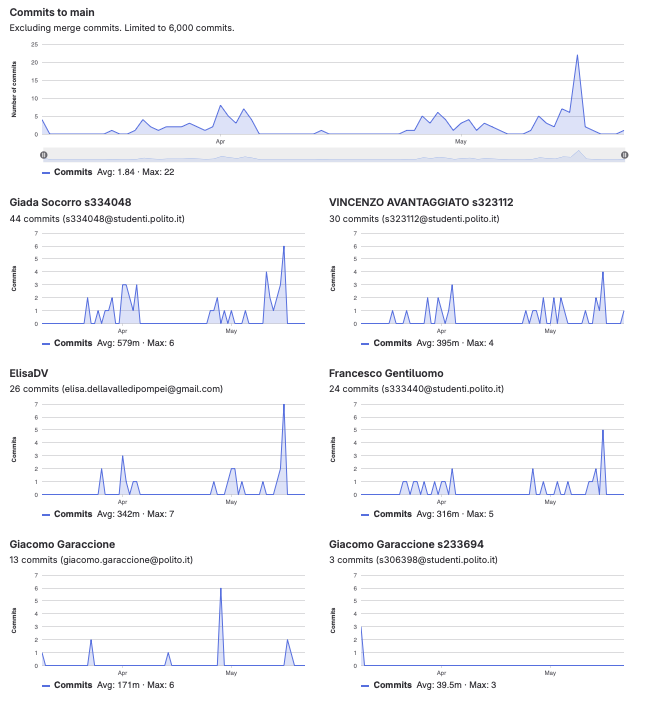

# Gruppo 4

## Valutazione deliverable V1

| gruppo | context diagram | business model | stakeholder | stories | interface | FR | NFR | use cases diagram | use cases | scenario | Glossary | DeploymentDiagram | functionality | estimation doc | precisione valori estimation | valutazione |
| --- | --- | --- | --- | --- | --- | --- | --- | --- | --- | --- | --- | --- | --- | --- | --- | --- |
| - | 1 | 0.5 | 0.5 | 1 | 1 | 3 | 3 | 1 | 5 | 5 | 5 | 2 | 1 | 2 | 2 | 33 |
| 4 | 100 | 100 | 95 | 90 | 100 | 100 | 90 | 100 | 100 | 100 | 75 | 100 | 100 | 95 | 91.03 | 95.61 |

## Valutazione deliverable V2

| gruppo | context diagram | business model | stakeholder | stories | interface | FR | NFR | ACCESS RIGHTS | use cases diagram | use cases | scenario | Glossary | DeploymentDiagram | functionality | estimation | precisione valori estimation | valutazione |
| --- | --- | --- | --- | --- | --- | --- | --- | --- | --- | --- | --- | --- | --- | --- | --- | --- | --- |
| - | 1 | 0.5 | 0.5 | 1 | 1 | 3 | 2 | 1 | 1 | 5 | 5 | 5 | 2 | 1 | 2 | 2 | 33 |
| 4 | 100 | 100 | 80 | 100 | 100 | 100 | 100 | 100 | 100 | 100 | 100 | 75 | 90 | 100 | 100 | 91.04 | 95.99 |

Le percentuali di v2 sono state riscalate in quanto la media pesata delle percentuali portava alcuni gruppi oltre al 100%.

## Valutazione codice e test (V2 + V3)

| Test Unit Totali | Test Unit Passati | Statement Coverage Unit | Branch Coverage Unit | Function Coverage Unit | Line Coverage Unit | Test Integration Totali | Test Integration Falliti | Statement Coverage Integration | Branch Coverage Integration | Function Coverage Integration | Line Coverage Integration | Correttezza V2 | Correttezza V3 | valutazione |
| --- | --- | --- | --- | --- | --- | --- | --- | --- | --- | --- | --- | --- | --- | --- |
| 1 | 0.5 | 2 | 2 | 1 | 1 | 1 | 0.5 | 2 | 2 | 1 | 1 | 16 | 2 | 33 |
| 75 | 100 | 100 | 100 | 100 | 100 | 100 | 100 | 100 | 75 | 100 | 100 | 99.1596638655462 | 100 | 97.32 |

 Unit e integration test prodotti dai gruppi sono stati eseguiti con la versione V2 del codice.

## Risultati Progetto

| Deliverable | Punteggio | Peso |
| --- | --- | --- |
| **Documenti V1** | 95.61% | 6 |
| **Documenti V2** | 94.7% | 2 |
| **Codice e Test** | 97.32% | 22 |
| **Timesheet** | 66.66% | 3 |
| **Valutazione** | 31.04 | 33 |
| **Valutazione** | 12.42 | 13.2 |

## Calcolo pesi progetto per singolo studente

| cognome | nome | email | gruppo | commit studente | commit totali | commit sul totale | coefficiente catme | coefficiente pesato | coefficiente progetto |
| --- | --- | --- | --- | --- | --- | --- | --- | --- | --- |
| AVANTAGGIATO | VINCENZO | s323112@studenti.polito.it | 4 | 30 | 124 | 0.24 | 1.05 | 0.89 | 0.98 |
| DELLA VALLE DI POMPEI | ELISA | s324696@studenti.polito.it | 4 | 26 | 124 | 0.21 | 0.80 | 0.68 | 0.76 |
| GENTILUOMO | FRANCESCO | s333440@studenti.polito.it | 4 | 24 | 124 | 0.19 | 1.04 | 0.87 | 0.96 |
| SOCORRO | GIADA | s334048@studenti.polito.it | 4 | 44 | 124 | 0.35 | 1.04 | 0.90 | 1.00 |

 I pesi del progetto sono ottenuti per l'80% dal valore calcolato da CATME e per il 20% dalla percentuale dei commit del singolo studente sul totale dei commit effettuati dagli studenti dello stesso gruppo. Il risultato è stato poi riscalato in modo che il punteggio più alto del gruppo ottenesse 1.

## Studenti

| Nome | Matricola | Email | Bonus | Voto Primo Appello | Voto Secondo Appello | Voto Progetto | Voto Finale |
| --- | --- | --- | --- | --- | --- | --- | --- |
| FRANCESCO GENTILUOMO | 333440 | s333440@studenti.polito.it | 1 | 17.0 | | 11.98 | 30 |
| GIADA SOCORRO | 334048 | s334048@studenti.polito.it | 0 | 17.9 | | 12.42 | 30 |
| VINCENZO AVANTAGGIATO | 323112 | s323112@studenti.polito.it | 0 | 17.3 | | 12.22 | 30 |
| ELISA DELLA VALLE DI POMPEI | 324696 | s324696@studenti.polito.it | 0 |  | 14.7 | 9.38 | 24 |
